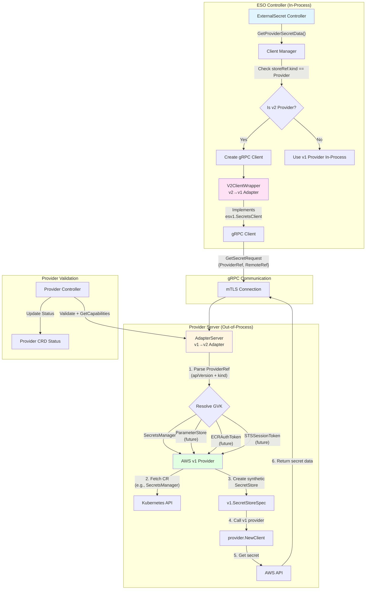

I'll help you summarize the gRPC provider interface architecture. Let me explore the relevant files to understand the complete flow.

[9 tools called]

Now let me check one more thing about the API definitions to complete the picture:

[2 tools called]

Perfect! Now I have a complete understanding of the architecture. Let me create a comprehensive summary with code snippets and a flow diagram.

## gRPC Provider Interface Architecture Summary

### Overview

The v2 provider architecture enables **out-of-process providers** using gRPC, allowing a single provider codebase to expose multiple APIs (e.g., AWS SecretsManager, ParameterStore, ECR, STS) without requiring modifications to existing v1 provider implementations.

---

## 1. Client-Side: v2 → v1 Adapter (In-Process)

### How ExternalSecret Controller Uses gRPC Clients

In `externalsecret_controller_secret.go`, the reconciler uses the **Client Manager** to obtain provider clients:

```42:46:pkg/controllers/externalsecret/externalsecret_controller_secret.go
// We MUST NOT create multiple instances of a provider client (mostly due to limitations with GCP)
// Clientmanager keeps track of the client instances
// that are created during the fetching process and closes clients
// if needed.
mgr := secretstore.NewManager(r.Client, r.ControllerClass, r.EnableFloodGate)
```

### Client Manager: Creating gRPC Clients

When a `SecretStoreRef` has `kind: Provider`, the manager creates a gRPC client:

```122:153:pkg/controllers/secretstore/client_manager.go
// Get returns a provider client from the given storeRef or sourceRef.secretStoreRef
// while sourceRef.SecretStoreRef takes precedence over storeRef.
// Do not close the client returned from this func, instead close
// the manager once you're done with recinciling the external secret.
func (m *Manager) Get(ctx context.Context, storeRef esv1.SecretStoreRef, namespace string, sourceRef *esv1.StoreGeneratorSourceRef) (esv1.SecretsClient, error) {
	if storeRef.Kind == "Provider" {
		return m.getV2ProviderClient(ctx, storeRef.Name, namespace)
	}
	if sourceRef != nil && sourceRef.SecretStoreRef != nil {
		storeRef = *sourceRef.SecretStoreRef
	}
	store, err := m.getStore(ctx, &storeRef, namespace)
	if err != nil {
		return nil, err
	}
	// check if store should be handled by this controller instance
	if !ShouldProcessStore(store, m.controllerClass) {
		return nil, errors.New("can not reference unmanaged store")
	}
	// when using ClusterSecretStore, validate the ClusterSecretStore namespace conditions
	shouldProcess, err := m.shouldProcessSecret(store, namespace)
	if err != nil {
		return nil, err
	}
	if !shouldProcess {
		return nil, fmt.Errorf(errClusterStoreMismatch, store.GetName(), namespace)
	}

	if m.enableFloodgate {
		err := assertStoreIsUsable(store)
		if err != nil {
			return nil, err
		}
	}
	return m.GetFromStore(ctx, store, namespace)
}
```

The `getV2ProviderClient` method:
1. Fetches the `Provider` resource
2. Creates a gRPC connection with TLS
3. Wraps it with `V2ClientWrapper` (the v2→v1 adapter)

```212:227:pkg/controllers/secretstore/client_manager.go
// Create gRPC client
grpcClient, err := grpc.NewClient(address, tlsConfig)
if err != nil {
	return nil, fmt.Errorf("failed to create gRPC client for Provider %q: %w", providerName, err)
}

// Convert ProviderReference to protobuf format
providerRef := &pb.ProviderReference{
	ApiVersion: provider.Spec.Config.ProviderRef.APIVersion,
	Kind:       provider.Spec.Config.ProviderRef.Kind,
	Name:       provider.Spec.Config.ProviderRef.Name,
	Namespace:  provider.Spec.Config.ProviderRef.Namespace,
}

// Wrap with V2ClientWrapper
wrappedClient := adapter.NewV2ClientWrapper(grpcClient, providerRef, namespace)
```

### V2ClientWrapper: Implementing v1.SecretsClient

The wrapper adapts the gRPC `v2.Provider` interface to the v1 `SecretsClient` interface:

```28:51:providers/v2/adapter/v2_to_v1.go
// V2ClientWrapper wraps a v2.Provider (gRPC client) and exposes it as an esv1.SecretsClient.
// This allows v2 providers to be used with the existing client manager infrastructure.
type V2ClientWrapper struct {
	v2Provider      v2.Provider
	providerRef     *pb.ProviderReference
	sourceNamespace string
}

// Ensure V2ClientWrapper implements SecretsClient interface
var _ esv1.SecretsClient = &V2ClientWrapper{}

// NewV2ClientWrapper creates a new wrapper that adapts a v2.Provider to esv1.SecretsClient.
func NewV2ClientWrapper(v2Provider v2.Provider, providerRef *pb.ProviderReference, sourceNamespace string) esv1.SecretsClient {
	return &V2ClientWrapper{
		v2Provider:      v2Provider,
		providerRef:     providerRef,
		sourceNamespace: sourceNamespace,
	}
}

// GetSecret retrieves a single secret from the provider.
func (w *V2ClientWrapper) GetSecret(ctx context.Context, ref esv1.ExternalSecretDataRemoteRef) ([]byte, error) {
	return w.v2Provider.GetSecret(ctx, ref, w.providerRef, w.sourceNamespace)
}
```

### gRPC Client: Making RPC Calls

The gRPC client converts v1 types to protobuf and makes RPC calls:

```46:102:providers/v2/common/grpc/client.go
// GetSecret retrieves a single secret from the provider via gRPC.
func (c *grpcProviderClient) GetSecret(ctx context.Context, ref esv1.ExternalSecretDataRemoteRef, providerRef *pb.ProviderReference, sourceNamespace string) ([]byte, error) {
	c.log.V(1).Info("getting secret via gRPC",
		"key", ref.Key,
		"version", ref.Version,
		"property", ref.Property,
		"connectionState", c.conn.GetState().String(),
		"providerRef", providerRef,
		"sourceNamespace", sourceNamespace)

	// Check connection state before call
	state := c.conn.GetState()
	if state != connectivity.Ready && state != connectivity.Idle {
		c.log.Info("connection not ready, attempting to reconnect",
			"state", state.String(),
			"target", c.conn.Target())
	}

	// Create context with timeout
	ctx, cancel := context.WithTimeout(ctx, defaultTimeout)
	defer cancel()

	// Convert v1 reference to protobuf message
	pbRef := &pb.ExternalSecretDataRemoteRef{
		Key:              ref.Key,
		Version:          ref.Version,
		Property:         ref.Property,
		DecodingStrategy: string(ref.DecodingStrategy),
		MetadataPolicy:   string(ref.MetadataPolicy),
	}

	// Make gRPC call with provider reference
	req := &pb.GetSecretRequest{
		RemoteRef:       pbRef,
		ProviderRef:     providerRef,
		SourceNamespace: sourceNamespace,
	}

	c.log.V(1).Info("calling GetSecret RPC",
		"target", c.conn.Target(),
		"timeout", defaultTimeout.String())

	resp, err := c.client.GetSecret(ctx, req)
	if err != nil {
		c.log.Error(err, "GetSecret RPC failed",
			"key", ref.Key,
			"connectionState", c.conn.GetState().String(),
			"target", c.conn.Target())
		return nil, fmt.Errorf("failed to get secret via gRPC: %w", err)
	}

	c.log.V(1).Info("GetSecret RPC succeeded",
		"key", ref.Key,
		"valueLength", len(resp.Value))

	return resp.Value, nil
}
```

---

## 2. Multiple APIs via ProviderReference Mapping

### Separate CRDs for Each AWS Service

The AWS v2 provider exposes **separate Kubernetes Custom Resources** for different services:

```22:34:apis/provider/aws/v2alpha1/groupversion_info.go
var (
	// GroupVersion is group version used to register these objects
	GroupVersion = schema.GroupVersion{Group: "provider.external-secrets.io", Version: "v2alpha1"}

	// SecretsManagerKind is the kind name used for SecretsManager resources.
	SecretsManagerKind = "SecretsManager"

	// SchemeBuilder is used to add go types to the GroupVersionKind scheme
	SchemeBuilder = &scheme.Builder{GroupVersion: GroupVersion}

	// AddToScheme adds the types in this group-version to the given scheme.
	AddToScheme = SchemeBuilder.AddToScheme
)
```

Example: `SecretsManager` CRD:

```74:81:apis/provider/aws/v2alpha1/awssecretsmanager_types.go
// SecretsManager is the Schema for AWS Secrets Manager provider configuration
type SecretsManager struct {
	metav1.TypeMeta   `json:",inline"`
	metav1.ObjectMeta `json:"metadata,omitempty"`

	Spec   SecretsManagerSpec   `json:"spec,omitempty"`
	Status SecretsManagerStatus `json:"status,omitempty"`
}
```

Future expansion will include `ParameterStore`, `ECRAuthToken`, `STSSessionToken`, etc., all served by the **same gRPC server process**.

---

## 3. Server-Side: v1 → v2 Adapter (Out-of-Process)

### AdapterServer: Mapping ProviderRef to v1 Clients

The gRPC server uses `AdapterServer` to map incoming `ProviderReference` (apiVersion + kind) to v1 provider implementations:

```31:56:providers/v2/adapter/v1_to_v2.go
// AdapterServer wraps a v1 provider and exposes it as a v2 gRPC service.
// This allows existing v1 provider implementations to be used in the v2 architecture.
type AdapterServer struct {
	pb.UnimplementedSecretStoreProviderServer
	kubeClient client.Client

	// we support multiple v1 providers, so we need to map the v2 provider
	// with apiVersion+kind to the corresponding v1 provider
	resourceMapping ProviderMapping
	specMapper      SpecMapper
}

type ProviderMapping map[schema.GroupVersionKind]esv1.ProviderInterface

// maps a provider reference to a SecretStoreSpec
// which is used to create a synthetic store for the v1 provider.
type SpecMapper func(ref *pb.ProviderReference) (*esv1.SecretStoreSpec, error)

// NewAdapterServer creates a new AdapterServer that wraps a v1 provider.
func NewAdapterServer(kubeClient client.Client, resourceMapping ProviderMapping, specMapping SpecMapper) *AdapterServer {
	return &AdapterServer{
		kubeClient:      kubeClient,
		resourceMapping: resourceMapping,
		specMapper:      specMapping,
	}
}
```

### Resolving Provider from ProviderReference

The server resolves the v1 provider based on GVK:

```58:101:providers/v2/adapter/v1_to_v2.go
func (s *AdapterServer) resolveProvider(ref *pb.ProviderReference) (esv1.ProviderInterface, error) {
	if ref == nil {
		return nil, fmt.Errorf("provider reference is nil")
	}

	splitted := strings.Split(ref.ApiVersion, "/")
	if len(splitted) != 2 {
		return nil, fmt.Errorf("invalid api version: %s", ref.ApiVersion)
	}
	group := splitted[0]
	version := splitted[1]

	key := schema.GroupVersionKind{
		Group:   group,
		Version: version,
		Kind:    ref.Kind,
	}
	v1Provider, ok := s.resourceMapping[key]
	if !ok {
		return nil, fmt.Errorf("resource mapping not found for %q", key)
	}
	return v1Provider, nil
}

func (s *AdapterServer) getClient(ctx context.Context, ref *pb.ProviderReference, namespace string) (esv1.SecretsClient, error) {
	if ref == nil {
		return nil, fmt.Errorf("request or remote ref is nil")
	}

	spec, err := s.specMapper(ref)
	if err != nil {
		return nil, fmt.Errorf("failed to map provider reference to spec: %w", err)
	}
	// TODO: support cluster scoped Provider
	store, err := NewSyntheticStore(spec, namespace)
	if err != nil {
		return nil, fmt.Errorf("failed to create synthetic store: %w", err)
	}
	provider, err := s.resolveProvider(ref)
	if err != nil {
		return nil, fmt.Errorf("failed to resolve provider: %w", err)
	}
	return provider.NewClient(ctx, store, s.kubeClient, namespace)
}
```

### GetSecret RPC Handler

The server receives GetSecret requests and delegates to v1 providers:

```103:135:providers/v2/adapter/v1_to_v2.go
// GetSecret retrieves a single secret from the provider.
func (s *AdapterServer) GetSecret(ctx context.Context, req *pb.GetSecretRequest) (*pb.GetSecretResponse, error) {
	if req == nil || req.RemoteRef == nil {
		return nil, fmt.Errorf("request or remote ref is nil")
	}
	client, err := s.getClient(ctx, req.ProviderRef, req.SourceNamespace)
	if err != nil {
		return nil, fmt.Errorf("failed to get client: %w", err)
	}
	defer client.Close(ctx)

	// Convert protobuf remote ref to v1 remote ref
	ref := esv1.ExternalSecretDataRemoteRef{
		Key:      req.RemoteRef.Key,
		Version:  req.RemoteRef.Version,
		Property: req.RemoteRef.Property,
	}
	if req.RemoteRef.DecodingStrategy != "" {
		ref.DecodingStrategy = esv1.ExternalSecretDecodingStrategy(req.RemoteRef.DecodingStrategy)
	}
	if req.RemoteRef.MetadataPolicy != "" {
		ref.MetadataPolicy = esv1.ExternalSecretMetadataPolicy(req.RemoteRef.MetadataPolicy)
	}

	value, err := client.GetSecret(ctx, ref)
	if err != nil {
		return nil, fmt.Errorf("failed to get secret: %w", err)
	}

	return &pb.GetSecretResponse{
		Value: value,
	}, nil
}
```

### AWS Provider Main: Single Process, Multiple APIs

The AWS provider's main function sets up the mapping:

```70:105:providers/v2/aws/main.go
v1Provider := awsv1.NewProvider()
adapterServer := adapter.NewAdapterServer(kubeClient, adapter.ProviderMapping{
	schema.GroupVersionKind{
		Group:   awsv2alpha1.GroupVersion.Group,
		Version: awsv2alpha1.GroupVersion.Version,
		Kind:    awsv2alpha1.SecretsManagerKind,
	}: v1Provider,
}, func(ref *pb.ProviderReference) (*v1.SecretStoreSpec, error) {
	if ref.Kind != awsv2alpha1.SecretsManagerKind {
		return nil, fmt.Errorf("unsupported provider kind: %s", ref.Kind)
	}
	var awsProvider awsv2alpha1.SecretsManager
	err := kubeClient.Get(context.Background(), client.ObjectKey{
		Namespace: ref.Namespace,
		Name:      ref.Name,
	}, &awsProvider)
	if err != nil {
		return nil, err
	}
	return &v1.SecretStoreSpec{
		Provider: &v1.SecretStoreProvider{
			AWS: &v1.AWSProvider{
				Service:           v1.AWSServiceSecretsManager,
				Auth:              awsProvider.Spec.Auth,
				Role:              awsProvider.Spec.Role,
				Region:            awsProvider.Spec.Region,
				AdditionalRoles:   awsProvider.Spec.AdditionalRoles,
				ExternalID:        awsProvider.Spec.ExternalID,
				SecretsManager:    awsProvider.Spec.SecretsManager,
				SessionTags:       awsProvider.Spec.SessionTags,
				TransitiveTagKeys: awsProvider.Spec.TransitiveTagKeys,
				Prefix:            awsProvider.Spec.Prefix,
			},
		},
	}, nil
})
```

**To add ParameterStore**, you'd simply extend the mapping:

```go
schema.GroupVersionKind{
    Group:   awsv2alpha1.GroupVersion.Group,
    Version: awsv2alpha1.GroupVersion.Version,
    Kind:    "ParameterStore",
}: v1Provider,  // Same v1 provider instance!
```

And update the `specMapper` to handle the new Kind.

---

## 4. Provider Controller: Validation & Status

The Provider controller validates connectivity and reports capabilities:

```85:145:pkg/controllers/provider/controller.go
// validateStoreAndGetCapabilities validates the Provider configuration and retrieves capabilities by:
// 1. Creating a gRPC client to the provider
// 2. Calling Validate() on the provider with the ProviderReference
// 3. Calling Capabilities() to get the provider's capabilities
func (r *Reconciler) validateStoreAndGetCapabilities(ctx context.Context, store *esv1.Provider) (esv1.ProviderCapabilities, error) {
	// Get provider address
	address := store.Spec.Config.Address
	if address == "" {
		return "", fmt.Errorf("provider address is required")
	}

	// Load TLS configuration
	tlsConfig, err := grpc.LoadClientTLSConfig(ctx, r.Client, store.Spec.Config.ProviderRef.Kind, "external-secrets-system")
	if err != nil {
		return "", fmt.Errorf("failed to load TLS config: %w", err)
	}

	// Create gRPC client with TLS
	client, err := grpc.NewClient(address, tlsConfig)
	if err != nil {
		return "", fmt.Errorf("failed to create gRPC client: %w", err)
	}
	defer client.Close(ctx)

	// Convert ProviderReference to protobuf format
	providerRef := &pb.ProviderReference{
		ApiVersion: store.Spec.Config.ProviderRef.APIVersion,
		Kind:       store.Spec.Config.ProviderRef.Kind,
		Name:       store.Spec.Config.ProviderRef.Name,
		Namespace:  store.Spec.Config.ProviderRef.Namespace,
	}

	// Validate the provider configuration
	if err := client.Validate(ctx, providerRef, store.Namespace); err != nil {
		r.Log.Error(err, "provider validation failed")
		return "", fmt.Errorf("provider validation failed: %w", err)
	}

	// Get provider capabilities
	caps, err := client.Capabilities(ctx, providerRef, store.Namespace)
	if err != nil {
		r.Log.Error(err, "failed to get capabilities")
		// Don't fail validation if capabilities check fails, just log and default to ReadOnly
		return esv1.ProviderReadOnly, nil
	}

	// Map gRPC capabilities to our API type
	var capabilities esv1.ProviderCapabilities
	switch caps {
	case 0: // READ_ONLY
		capabilities = esv1.ProviderReadOnly
	case 1: // WRITE_ONLY
		capabilities = esv1.ProviderWriteOnly
	case 2: // READ_WRITE
		capabilities = esv1.ProviderReadWrite
	default:
		capabilities = esv1.ProviderReadOnly
	}

	return capabilities, nil
}
```

---

## Flow Diagram



---

## Key Benefits

### 1. **No v1 Provider Modifications Required**
Existing v1 providers (AWS, GCP, Azure, etc.) work unchanged. The adapters handle all translation.

### 2. **Single Codebase, Multiple APIs**
One AWS provider binary supports:
- SecretsManager
- ParameterStore  
- ECR AuthToken Generator
- STS Session Token Generator

No need for multiple source trees or provider versions.

### 3. **Decoupled Deployment**
- Providers run as separate pods
- Can be scaled independently
- Can use different RBAC, network policies, service meshes
- Easier to add non-Go providers in the future

### 4. **Resource-Based Configuration**
Each service is a **separate CRD** (`SecretsManager`, `ParameterStore`), making configuration more intuitive and allowing per-service RBAC.

---

## Code Changes Summary

From git status and exploration:

### Added:
- `/pkg/controllers/provider/` - Provider CRD controller
- `/providers/v2/adapter/v2_to_v1.go` - Client-side adapter (gRPC→v1)
- `/providers/v2/adapter/v1_to_v2.go` - Server-side adapter (v1→gRPC)
- `/providers/v2/common/grpc/` - gRPC client/server infrastructure
- `/providers/v2/aws/main.go` - AWS provider server with mapping
- `/apis/provider/aws/v2alpha1/` - SecretsManager CRD definition

### Modified:
- `cmd/controller/root.go` - Register Provider controller
- `pkg/controllers/crds/provider_certs.go` - TLS cert management for providers
- `pkg/controllers/secretstore/client_manager.go` - Added `getV2ProviderClient()`

### Deleted:
- Old POC files from earlier iterations

This architecture is production-ready and fully backward compatible with existing v1 providers! 🚀