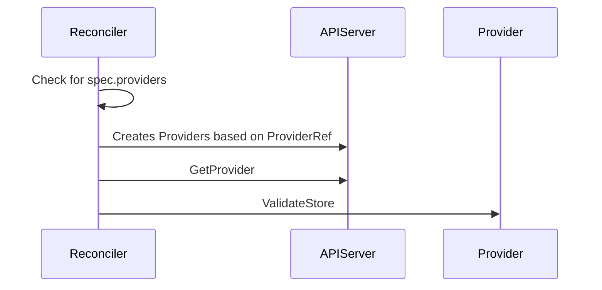
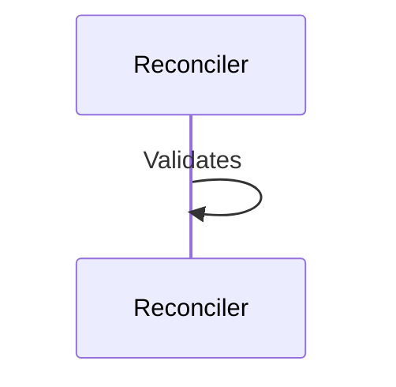
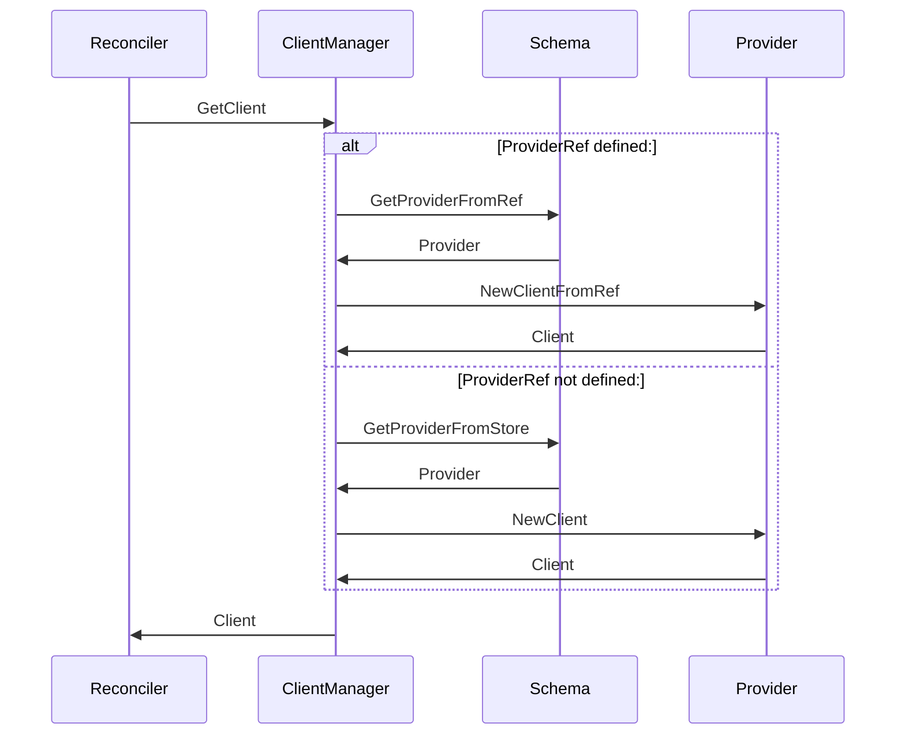

# Provider Separation on specific CRDs
```yaml
---
title: Provider Separation on specific CRDs
version: v1alpha1
authors: Gustavo Carvalho
creation-date: 2023-08-25
status: draft
---
```

WRT: https://github.com/external-secrets/external-secrets/issues/694

We want to separate provider configuration from the SecretStore, in a way that allows us to install providers only when needed. This also allows us to version provider fields accordingly to their maturity without impacting the SecretStore Manifest

### Proposed Changes
The changes to the code proposed are summarized below:
* Add a new CRD group called `providers` where all provider configuration will reside as individual CRD.
* Add a new Field `ProviderRef` to the SecretStore manifest.
* Add a new provider registry called `RefRegister`, which registers based on a provider `kind`.
* Add a new method `NewClientFromRef` on the provider interface
* Implements `NewClientFromRef` across all providers
* Alters ClientManager logic to support refering to `NewClientFromRef` if `ProviderRef` is set

The Following diagram shows how the new sequence would work:

## SecretStore Reconcilers

## Provider Reconcilers - Empty on purpose



## ExternalSecrets/PushSecrets Reconcilers (it excludes  generators logic)

An example of how this implementation would look like is available on [here](https://github.com/external-secrets/external-secrets/tree/feature/new-provider-structure)
### Benefits
* We can add providers gradually
* We can add conversion to provider versions gradually as well
* We can have multiple providers on different support versions (e.g. for community-maintained to be always on `v1alpha1`)
* Users can opt out of providers  they don't use, making the runtime footprint smaller.
* We delegate the decision of what to deprecate (SecretStore or SecretStore.spec.provider) to later on.

### Drawbacks
* Complexity
* We would need to duplicate validation across providers
* Referent Authentication would still need a ClusterSecretStore (if possible)
* Secrets Management is still done on the provider code.

