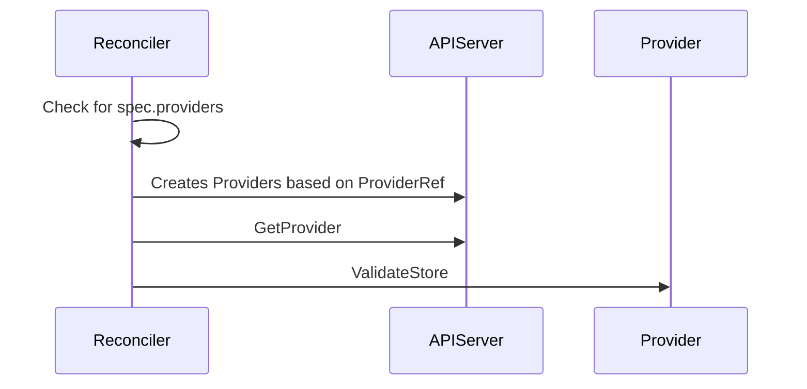
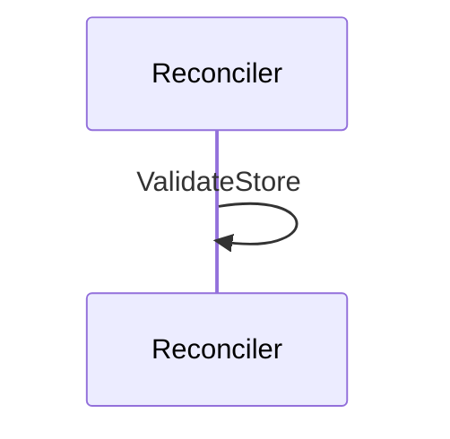
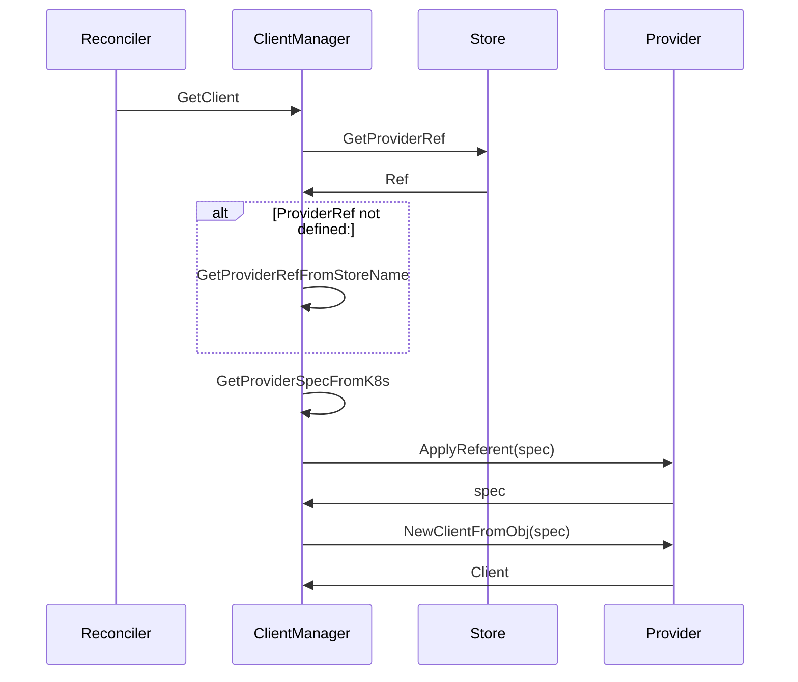

# Provider Separation on specific CRDs
```yaml
---
title: Provider Separation on specific CRDs
version: v1alpha1
authors: Gustavo Carvalho
creation-date: 2023-08-25
status: draft
---
```

WRT: https://github.com/external-secrets/external-secrets/issues/694

We want to separate provider configuration from the SecretStore, in a way that allows us to install providers only when needed. This also allows us to version provider fields accordingly to their maturity without impacting the SecretStore Manifest

### Proposed Changes
The changes to the code proposed are summarized below:
* Add a new CRD group called `providers` where all provider configuration will reside as individual CRD.
* Add a new CRD group called `cluster.providers` where all provider configuration will reside as individual CRD for ClusterScoped providers.
* Add a new Field `ProviderRef` to the SecretStore/ClusterSecretStore manifests.
* Add a new provider registry called `RefRegister`, which registers based on a provider `kind`.
* Update  `NewClient` to receive the provider interface
* Add new methods `Convert` and `ApplyReferent` on the provider interface, to be able to customize `SecretStore.provider` vs `provider.spec` differences, and apply Referent logic on Client Manager
* Change SecretStore/ClusterSecretStore reconcilers to create Provider/ClusterProvider based on the `spec.provider` field and on the `Convert` method
* Change ClientManager logic to use `providerRef` or to generate a `providerRef` from `spec.provider`.
* Make ClientManager handle namespace configuration for referentAuth.

The Following diagram shows how the new sequence would work:

## SecretStore Reconcilers


## Provider Reconcilers - Empty on purpose
This is a basic reconciler using APIDiscovery just to prepare if we decide to deprecate the whole SecretStore structure.
It could be a no-op as well.



## ExternalSecrets/PushSecrets Reconcilers (it excludes  generators logic)

An example of how this implementation would look like is available on [here](https://github.com/external-secrets/external-secrets/tree/feature/new-provider-structure) - This example still needs to be updated to take into account some SecretStore changes after community meeting discussions
### Example Implementations
Fake Provider Basic Convert function (very similar to other ):
```go
func (p *Provider) Convert(in esv1beta1.GenericStore) (client.Object, error) {
	out := &prov.Fake{}
	tmp := map[string]any{
		"spec": in.GetSpec().Provider.Fake,
	}
	d, err := json.Marshal(tmp)
	if err != nil {
		return nil, err
	}
	err = json.Unmarshal(d, out)
	if err != nil {
		return nil, fmt.Errorf("could not convert %v in a valid fake provider: %w", in.GetName(), err)
	}
	return out, nil
}
```

Gitlab Provider ApplyReferent Implementation:
```go
func (g *Provider) ApplyReferent(spec kclient.Object, caller esmeta.ReferentCallOrigin, namespace string) (kclient.Object, error) {
	conv, ok := spec.(*prov.Gitlab)
	if !ok {
		return nil, fmt.Errorf("could not convert spec %v onto a Gitlab Provider type: current type: %T", spec.GetName(), spec)
	}
	out := conv.DeepCopy()
	switch caller {
	case esmeta.ReferentCallSecretStore:
		out.Spec.Auth.SecretRef.AccessToken.Namespace = &namespace
	case esmeta.ReferentCallProvider:
		out.Spec.Auth.SecretRef.AccessToken.Namespace = &namespace
	case esmeta.ReferentCallClusterSecretStore:
	default:
	}
	return out, nil
}
```

Gitlab Provider new getAuth method:
```go
func (g *gitlabBase) getAuth(ctx context.Context) ([]byte, error) {
	credentialsSecret := &corev1.Secret{}
	credentialsSecretName := g.store.Auth.SecretRef.AccessToken.Name
	if credentialsSecretName == "" {
		return nil, fmt.Errorf(errGitlabCredSecretName)
	}

	objectKey := types.NamespacedName{
		Name:      credentialsSecretName,
		Namespace: g.namespace,
	}
	// If namespace is set, it means we must use it (non-referrent call either from local SecretStore or defined ClusterSecretStore)
	if g.store.Auth.SecretRef.AccessToken.Namespace != nil {
		objectKey.Namespace = *g.store.Auth.SecretRef.AccessToken.Namespace
	}

	err := g.kube.Get(ctx, objectKey, credentialsSecret)
	if err != nil {
		return nil, fmt.Errorf(errFetchSAKSecret, err)
	}

	credentials := credentialsSecret.Data[g.store.Auth.SecretRef.AccessToken.Key]
	if len(credentials) == 0 {
		return nil, errors.New(errMissingSAK)
	}
	return credentials, nil
}
```

Gitlab Provider NewClient implementations:
```go
func (g *Provider) NewClient(ctx context.Context, obj kclient.Object, kube kclient.Client, namespace string) (esv1beta1.SecretsClient, error) {
	prov, ok := obj.(*prov.Gitlab)
	if !ok {
		return nil, fmt.Errorf("could not convert spec %v onto a Gitlab Provider type: current type: %T", obj.GetName(), obj)
	}

	gl := &gitlabBase{
		kube:      kube,
		store:     &prov.Spec,
		namespace: namespace,
	}

	client, err := gl.getClient(ctx, &prov.Spec)
	if err != nil {
		return nil, err
	}
	gl.projectsClient = client.Projects
	gl.projectVariablesClient = client.ProjectVariables
	gl.groupVariablesClient = client.GroupVariables

	return gl, nil
}

```

Client Manager reconciler changes:

```go
func (m *Manager) GetProviderRefFromStore(store esv1beta1.GenericStore) (esv1beta1.ProviderRef, error) {
  providerRef := store.GetSpec().ProviderRef
  if providerRef != nil {
    return *providerRef, nil
  }
provider, err := esv1beta1.GetProvider(store)
  if err != nil {
    return esv1beta1.ProviderRef{}, err
  }
  providerRef := esv1beta1.GetProviderRefByProvider(provider)
  providerRef.Name = store.GetName()
  return *providerRef, nil
}

func (m *Manager) GetFromStore(ctx context.Context, store esv1beta1.GenericStore, namespace string) (esv1beta1.SecretsClient, error) {
	var storeProvider esv1beta1.Provider
	var err error
	var spec client.Object
  prov, err := GetProviderRefFromStore(store)
  if err != nil {
    return nil, err
  }
		storeProvider, _ = esv1beta1.GetProviderByRef(*prov)
		spec, err = m.getProviderSpec(ctx, prov, namespace)
		if err != nil {
			return nil, err
		}
	secretClient := m.getStoredClient(ctx, storeProvider, store)
	if secretClient != nil {
		return secretClient, nil
	}
	m.log.V(1).Info("creating new client",
		"provider", fmt.Sprintf("%T", storeProvider),
		"store", fmt.Sprintf("%s/%s", store.GetNamespace(), store.GetName()))
	caller := esmetav1.ReferentCallSecretStore
	storeKind := store.GetObjectKind().GroupVersionKind().Kind
	if storeKind == esv1beta1.ClusterSecretStoreKind {
		caller = esmetav1.ReferentCallClusterSecretStore
	}
	referredSpec, err := storeProvider.ApplyReferent(spec, caller, namespace)
	if err != nil {
		return nil, fmt.Errorf("could not apply referrent logic to spec on %v: %w", store.GetName(), err)
	}
	secretClient, err = storeProvider.NewClientFromObj(ctx, referredSpec, m.client, namespace)
	if err != nil {
		return nil, err
	}
	idx := storeKey(storeProvider)
	m.clientMap[idx] = &clientVal{
		client: secretClient,
		store:  store,
	}
	return secretClient, nil
}
```

### Benefits
* We can add providers gradually
* We can add conversion to provider versions gradually as well
* We can have multiple providers on different support versions (e.g. for community-maintained to be always on `v1alpha1`)
* Users can opt out of providers  they don't use, making the runtime footprint smaller.
* Referent Authentication setting is now ran by the Client Manager (easier to handle)
* We can manage separately provider versions via the `Convert` method
* We delegate the decision of what to deprecate (SecretStore or SecretStore.spec.provider) to later on.

### Drawbacks
* Complexity
* Secrets Management is still done on the provider code.

