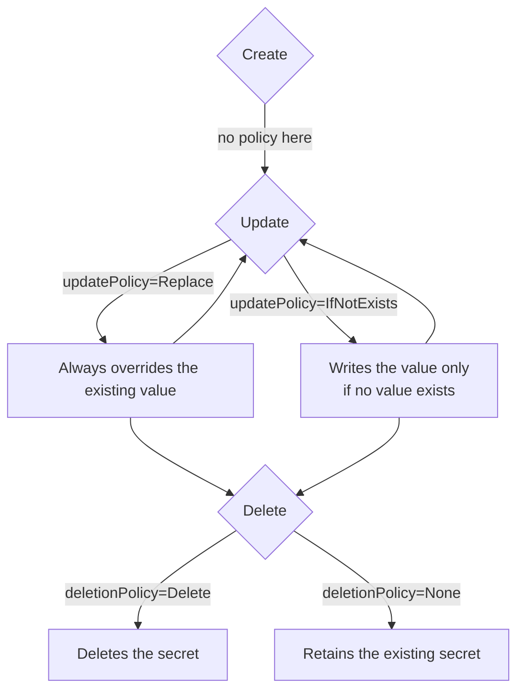

```yaml
---
title: PushSecret Update Policy
version: v1alpha1
authors: Moritz Johner
creation-date: 2023-08-25
status: draft
---
```

# PushSecret Update Policy

## Table of Contents

<!-- toc -->
// autogen please
<!-- /toc -->

## Summary

The PushSecret update procedure needs to be configurable so users can control its behaviour.

## Motivation

The motivation is to enhance the configurability of the PushSecret lifecycle within the External Secrets Operator (ESO).
Currently, there is a need for users to have more control over the behavior of PushSecret when updating values at the secret provider.

The use-case for `updatePolicy` is the following: Users would like to use ESO generate a password and store it in an external store. Once the password is generated and pushed, they want the secret store to become the source of truth, so that the password won't be overridden when ExternalSecret or Secret Resources are deleted and/or regenerated.

More context in #2643.

## Context

When ESO intends to push a secret to the provider, several cases need to be considered for managing the lifecycle:

1. **Ownership of Pre-existing Secret**: Should ESO take ownership over a pre-existing secret?
2. **Overwriting Existing Value**: Should ESO overwrite an existing value?
3. **Merging Values**: Should ESO merge structured data?

This design document concerns the second point.

The PushSecret lifecycle consists of these 3 parts:

* **create** the secret on the provider side
* **update** the secret value every `spec.refreshInterval`
* **delete** the secret

For each part we can apply a policy. For this design document the **update** part is relevant.
The following flowchart illustrates the decision-making process:



## Proposal

The proposed solution is to introduce an `updatePolicy` field within the PushSecret specification. This field allows users to configure the behavior of updates during the PushSecret lifecycle.

By default, the value of updatePolicy is set to `Replace`, meaning that the existing value will always be overridden. Alternatively, users can set the value to `IfNotExists`, which prevents a write operation if a value already exists.

```yaml
apiVersion: external-secrets.io/v1alpha1
kind: PushSecret
metadata:
  name: pushsecret-example
  namespace: default
spec:
  updatePolicy: Replace # Replace (default) or IfNotExists
  # ...
```

For the future we can consider adding more policies like `Merge` of needed.

## Consequences

* **Enhanced Flexibility**: Users gain more control over how updates are managed within the PushSecret lifecycle, providing greater customization.
* **Reduced Risk of Data Loss**: With clearer control over updates, the risk of unintended value overwrites or deletions is minimized.
* **Complexity for Users**: Users need to understand the implications of different updatePolicy settings to use the feature effectively.
* **Improved Value Management**: The feature aligns with the goal of efficiently managing secret values within Kubernetes environments.

## Acceptance Criteria

* implementation for all core providers (+issues tracking progress)
    * return `not implemented` error if specified but not implemented
    * ensure there is a fallback for an empty updatePolicy (for migration purposes)
* observability: a Status `SecretAlreadyExists` (as a pair of `SecretSynced`, `SecretDeleted` ) to indicate it.
* tests: controller tests for this new field should be sufficient
* the API changes need to be documented
    * API/CRD spec inline documentation
    * PushSecret API documentation
    * Guides section for PushSecret + `updatePolicy`
       * We need to be verbose on specifying that the use of `updatePolicy` breaks idempotency contracts, and that it should be used with care by the user.

