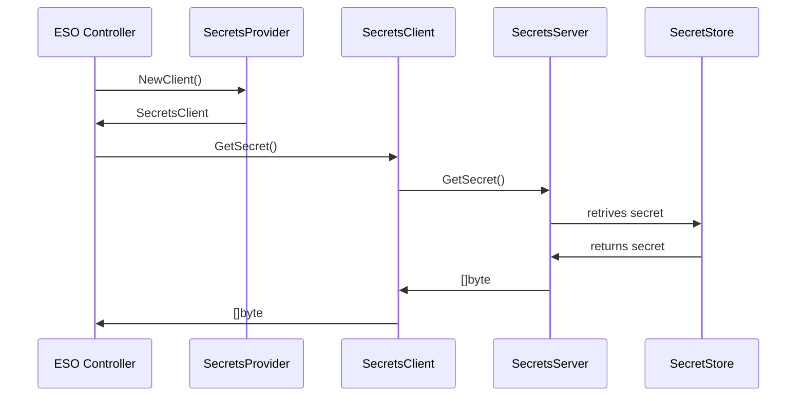

```yaml
---
title: Out of tree secret stores
version: v1alpha1
authors: Maciej Iwanowski
creation-date: 2024-06-27
status: draft
---
```

# Out of tree secret stores

## Table of Contents

<!-- toc -->
// autogen please
<!-- /toc -->


## Summary
This proposal aims to introduce possibility of using out of tree secret stores with External Secrets Operator (ESO).

## Motivation
The proposal is motivated by the need to use ESO with closed source secret stores, such as home-grown solutions used by
some companies. Upstreaming integrations with such secret stores is not feasible.

### Goals
What are the goals of this proposal, what's the problem we want to solve?

### Non-Goals
What are explicit non-goals of this proposal?

## Proposal
How does the proposal look like?

### User Stories
#### User story 1
As a user, I want to use ESO with my home-grown secret store and avoid maintaning a fork of ESO.

#### User story 2
As a user, I want to run ESO with minimal privileges and use a separate process to communicate with secret store.

### API
Following structures will be used at `SecretStore.Spec.Provider` field:

```go
type OutOfTreeProvider struct {
    // Name of the provider.
    Name string `json:"name"`

    // Host to connect using gRPC.
    Host string `json:"host"`

    // Port to connect using gRPC.
    Port int `json:"port"`

    // TLS authentication configuration.
    TLSSecretRef TLSSecretRef `json:"tlsSecretRef,omitempty"`
}

type TLSSecretRef struct {
    // Name of the Secret.
    Name string `json:"name"`

    // Namespace of the Secret.
    Namespace string `json:"namespace"`
}
```
Following schema will be used for communication between ESO and out of tree secret store:

```protobuf
syntax = "proto3";

enum ConverstionStrategy {
  DEFAULT = 0;
  UNICODE = 1;
}

enum DecodingStrategy {
  AUTO = 0;
  BASE64 = 1;
  BASE64URL = 2;
  NONE = 3;
}

message GetSecretRequest {
  string key = 1;
  optional string metadata_policy = 2;
  optional string property = 3;
  optional string version = 4;
  optional ConversionStrategy conversion_strategy = 5;
  optional DecodingStrategy decoding_strategy = 6;
}

service GetSecret(GetSecretRequest) returns (bytes);
```

### Behavior



### Drawbacks
If we implement this feature, what are drawbacks and disadvantages of this approach?

### Acceptance Criteria
What does it take to make this feature producation ready? Please take the time to think about:
* how would you rollout this feature and rollback if it causes harm?
* Test Roadmap: what kinds of tests do we want to ensure a good user experience?
* observability: Do users need to get insights into the inner workings of that feature?
* monitoring: How can users tell whether the feature is working as expected or not?
              can we provide dashboards, metrics, reasonable SLIs/SLOs
              or example alerts for this feature?
* troubleshooting: How would users want to troubleshoot this particular feature?
                   Think about different failure modes of this feature.

## Alternatives
What alternatives do we have and what are their pros and cons?


