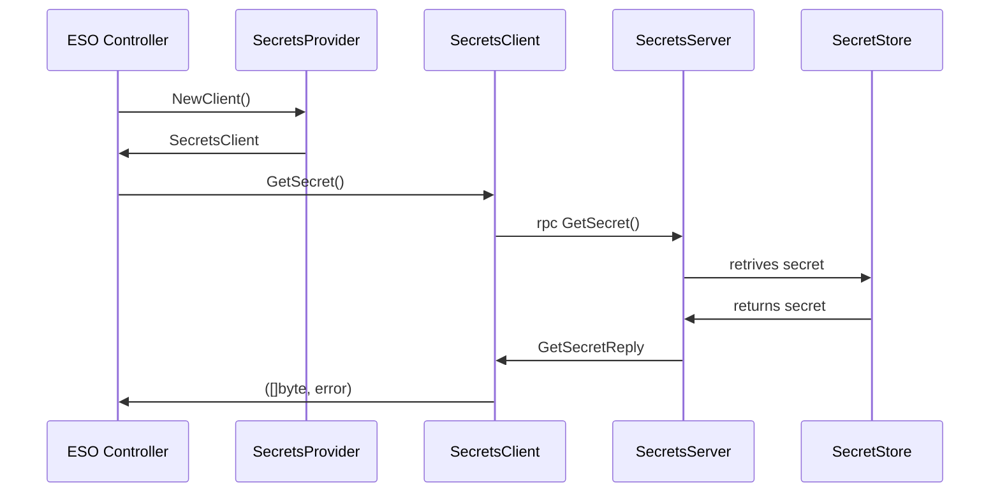
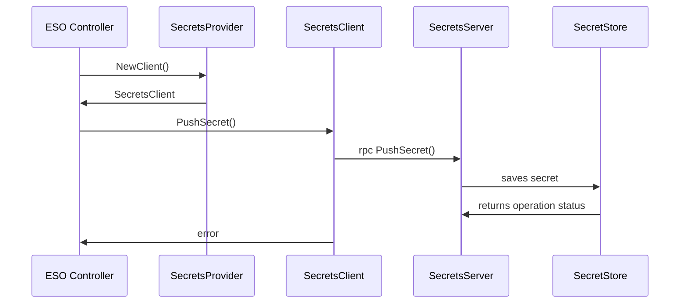
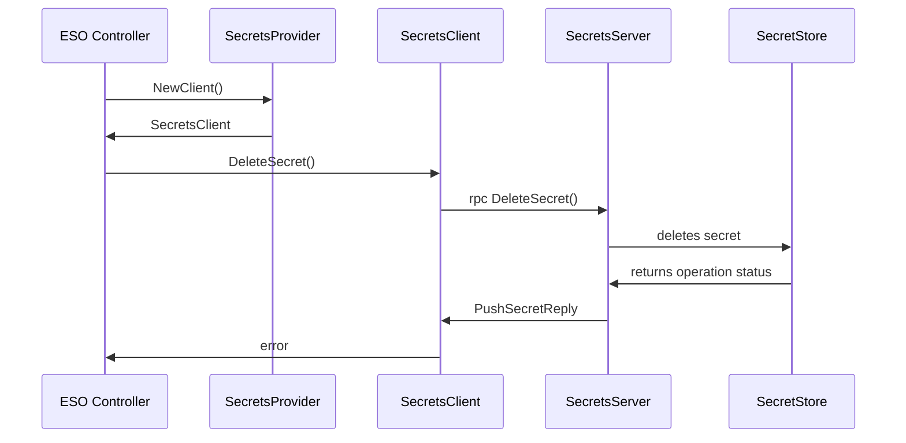
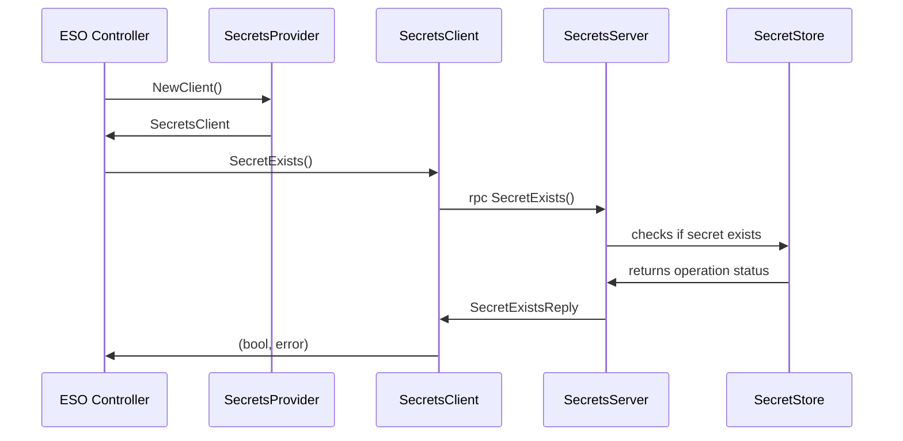

```yaml
---
title: Out of tree secret stores
version: v1alpha1
authors: Maciej Iwanowski
creation-date: 2024-06-27
status: draft
---
```

# Out of tree secret stores

## Table of Contents

<!-- toc -->
// autogen please
<!-- /toc -->


## Summary
This proposal aims to introduce possibility of using out of tree secret stores with External Secrets Operator (ESO).
This proposal builds on top of [Moritz Johner's work](https://github.com/external-secrets/external-secrets/compare/main...mj-provider-mod).

## Motivation
The proposal is motivated by the need to use ESO with closed source secret stores, such as home-grown solutions used by
some companies. Upstreaming integrations with such secret stores is not feasible.

### Goals
There are following goals of the proposal:

* Enabling out of tree providers to be integrated with ESO.

### Non-Goals
There are following non-goals of the proposal:

* Migrating all existing providers to client-server model, though the proposal would enable such step.
* Minimizing privileges that ESO pod runs with, though the proposal paves way towards such work in the future.

## Proposal
How does the proposal look like?

### User Stories
#### User story 1
As a user, I want to use ESO with my home-grown secret store and avoid maintaning a fork of ESO.

### API
Following structures will be used at `SecretStore.Spec.Provider` field:

```go
type GPRCProvider struct {
    // Name of the provider.
    URL string `json:"name"`

    // TLS authentication configuration.
    TLSSecretRef *TLSSecretRef `json:"tlsSecretRef,omitempty"`
}

type TLSSecretRef struct {
    // Name of the Secret.
    Name string `json:"name"`

    // Namespace of the Secret.
    Namespace string `json:"namespace"`
}
```

Following schema will be used for communication between ESO and out of tree secret store:

```protobuf
syntax = "proto3";

enum ConverstionStrategy {
  DEFAULT = 0;
  UNICODE = 1;
}

enum DecodingStrategy {
  AUTO = 0;
  BASE64 = 1;
  BASE64URL = 2;
  NONE = 3;
}

message GetSecretRequest {
  bytes store = 1;
  string namespace = 2;
  bytes objects = 3;
  RemoteRef remoteRef = 4;
}

message RemoteRef {
  string key = 1;
  string metadataPolicy = 2;
  string property = 3;
  string version = 4;
  ConverstionStrategy conversionStrategy = 5;
  DecodingStrategy decodingStrategy = 6;
}

message GetSecretReply {
  bytes secret = 1;
  string error = 2;
}

message PushSecretRequest {
  bytes store = 1;
  string namespace = 2;
  bytes objects = 3;
  bytes secret = 4;
  PushRemoteRef remoteRef = 5;
}

message PushRemoteRef {
  string remoteKey = 1;
  string property = 2;
}

message PushSecretReply { string error = 1; }

message DeleteSecretRequest {
  PushRemoteRef remoteRef = 1;
}

message DeleteSecretReply { string error = 1; }

message SecretExistsRequest {
  PushRemoteRef remoteRef = 1;
}

message SecretExistsReply {
  bool exists = 1;
  string error = 2;
}

service SecretsServer {
  rpc GetSecret(GetSecretRequest) returns (GetSecretReply);
  rpc PushSecret(PushSecretRequest) returns (PushSecretReply);
  rpc DeleteSecret(DeleteSecretRequest) returns (DeleteSecretReply);
  rpc SecretExists(SecretExistsRequest) returns (SecretExistsReply);
}
```

### Behavior

#### GetSecret



#### PushSecret



#### DeleteSecret



#### SecretExists



### Drawbacks
Following drawbacks must be considered:

* Running `SecretsServer` in separate pod means that gRPC communication between `SecretsClient` and `SecretsServer` will
  happen over the network rather than UNIX socket. All potential issues related to network communication must be considered
  (e.g. timeouts, slow responses, server unavailability, retries).
* Running `SecretsServer` in the same pod that ESO increases operational burden by making ESO Helm chart more complicated.

### Acceptance Criteria
What does it take to make this feature producation ready? Please take the time to think about:
* how would you rollout this feature and rollback if it causes harm?
* Test Roadmap: what kinds of tests do we want to ensure a good user experience?
* observability: Do users need to get insights into the inner workings of that feature?
* monitoring: How can users tell whether the feature is working as expected or not?
              can we provide dashboards, metrics, reasonable SLIs/SLOs
              or example alerts for this feature?
* troubleshooting: How would users want to troubleshoot this particular feature?
                   Think about different failure modes of this feature.

## Alternatives
What alternatives do we have and what are their pros and cons?


