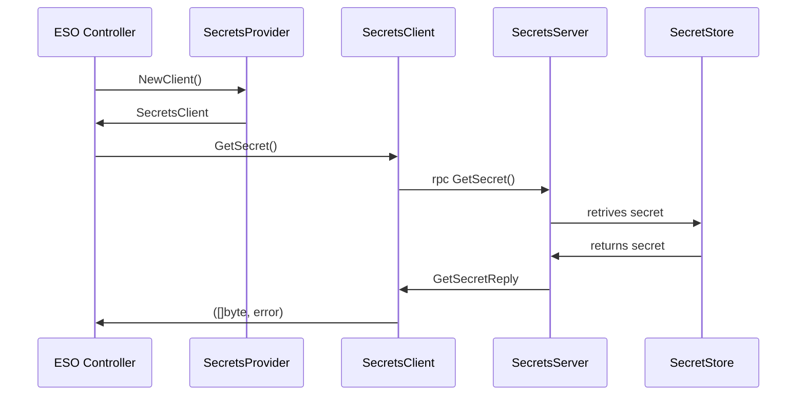
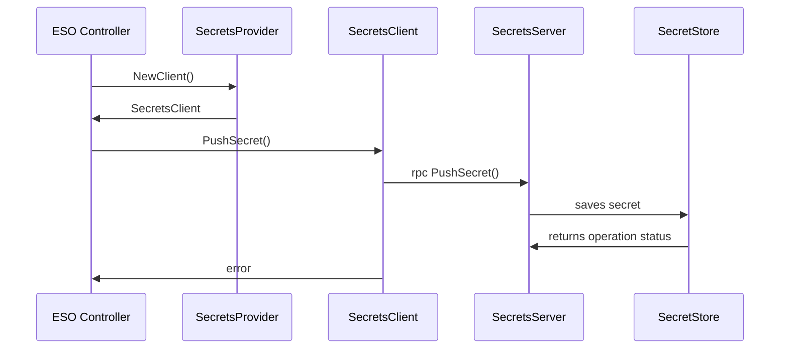
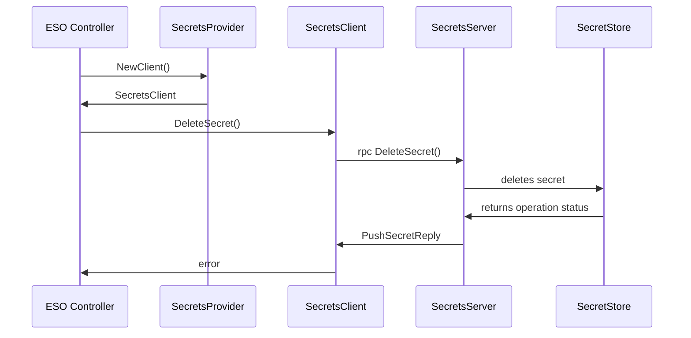
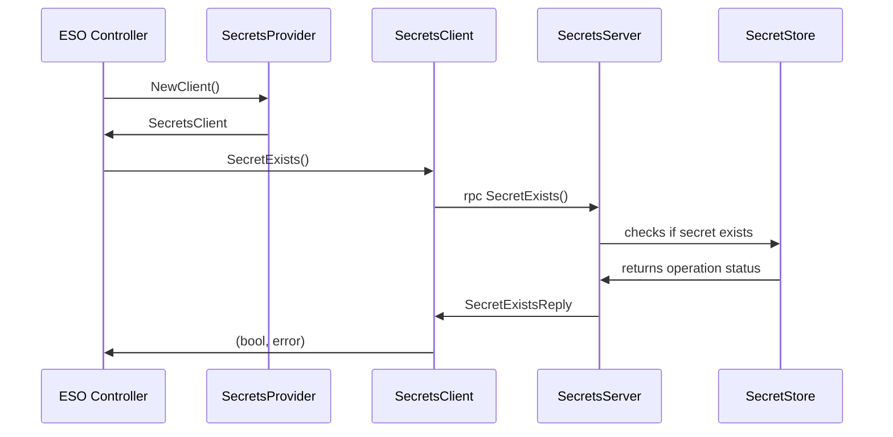

```yaml
---
title: Out of tree secret stores
version: v1alpha1
authors: Maciej Iwanowski
creation-date: 2024-06-27
status: draft
---
```

# Out of tree secret stores

## Table of Contents

<!-- toc -->
// autogen please
<!-- /toc -->

## Glossary

SecretsStore
: Third party application that safely stores secrets. External Secrets Operator (ESO) retrieves the secrets to create
Kubernetes `Secret` objects.

SecretsServer
: Implementation of gRPC server that communicate with `SecretsStore` to manage secret's lifecycle and read it.

SecretsClient
: implementation of `SecretsClient` interface that communicates with `SecretsServer` over gRPC.


## Summary
This proposal aims to introduce possibility of using out of tree secret stores with External Secrets Operator (ESO).
This proposal builds on top of [Moritz Johner's work](https://github.com/external-secrets/external-secrets/compare/main...mj-provider-mod).

## Motivation
The proposal is motivated by the need to use ESO with closed source secret stores, such as home-grown solutions used by
some companies. Upstreaming integrations with such secret stores is not feasible.

### Goals
There are following goals of the proposal:

* Enabling out of tree providers to be integrated with ESO.

### Non-Goals
There are following non-goals of the proposal:

* Migrating all existing providers to client-server model, though the proposal would enable such step.
* Minimizing privileges that ESO pod runs with, though the proposal paves way towards such work in the future.

## Proposal
How does the proposal look like?

### User Stories
#### User story 1
As a user, I want to use ESO with my home-grown secret store and avoid maintaining a fork of ESO.

### API
Following structures will be used at `SecretStore.Spec.Provider` field:

```go
type GPRCProvider struct {
    // Name of the provider.
    URL string `json:"name"`

    // TLS authentication configuration.
    TLSSecretRef *TLSSecretRef `json:"tlsSecretRef,omitempty"`
}

type TLSSecretRef struct {
    // Name of the Secret.
    Name string `json:"name"`

    // Namespace of the Secret.
    Namespace string `json:"namespace"`
}
```

Following schema will be used for communication between ESO and out of tree secret store:

```protobuf
syntax = "proto3";

enum ConverstionStrategy {
  DEFAULT = 0;
  UNICODE = 1;
}

enum DecodingStrategy {
  AUTO = 0;
  BASE64 = 1;
  BASE64URL = 2;
  NONE = 3;
}

message GetSecretRequest {
  bytes store = 1;
  string namespace = 2;
  bytes objects = 3;
  RemoteRef remoteRef = 4;
}

message RemoteRef {
  string key = 1;
  string metadataPolicy = 2;
  string property = 3;
  string version = 4;
  ConverstionStrategy conversionStrategy = 5;
  DecodingStrategy decodingStrategy = 6;
}

message GetSecretReply {
  bytes secret = 1;
  string error = 2;
}

message PushSecretRequest {
  bytes store = 1;
  string namespace = 2;
  bytes objects = 3;
  bytes secret = 4;
  PushRemoteRef remoteRef = 5;
}

message PushRemoteRef {
  string remoteKey = 1;
  string property = 2;
}

message PushSecretReply { string error = 1; }

message DeleteSecretRequest {
  PushRemoteRef remoteRef = 1;
}

message DeleteSecretReply { string error = 1; }

message SecretExistsRequest {
  PushRemoteRef remoteRef = 1;
}

message SecretExistsReply {
  bool exists = 1;
  string error = 2;
}

service SecretsServer {
  rpc GetSecret(GetSecretRequest) returns (GetSecretReply);
  rpc PushSecret(PushSecretRequest) returns (PushSecretReply);
  rpc DeleteSecret(DeleteSecretRequest) returns (DeleteSecretReply);
  rpc SecretExists(SecretExistsRequest) returns (SecretExistsReply);
}
```

### Behavior

#### GetSecret



#### PushSecret



#### DeleteSecret



#### SecretExists



### Drawbacks
Following drawbacks must be considered:

* Running `SecretsServer` in separate pod means that gRPC communication between `SecretsClient` and `SecretsServer` will
  happen over the network rather than UNIX socket. All potential issues related to network communication must be considered
  (e.g. timeouts, slow responses, server unavailability, retries).
* `SecretsServer` will run listening socket available within the cluster. Traffic should be encrypted and `SecretsClient`
  must be able to authenticate when sending requests to the server.
* Running `SecretsServer` in the same pod that ESO increases operational burden by making ESO Helm chart more complicated.
* Only one instance of gRPC `SecretsClient` will be able to run, due to structure of `SecretStore.Spec.Provider`.

### Acceptance Criteria
Rolling the feature out should bring no risk to existing users as it is purely additive. The feature can be reverted and
removed if necessary (e.g. if the implementation would harm ESO stability) without any effect for users not using it. It
should be released gradually, starting with alpha and promoted to beta when it matures enough.

Implementation must:
* Expose metrics for: median, p75, p90, p95 and p99 of communication latency between `SecretsClient` and `SecretsServer`.
* Use Distributed Tracing for communication between `SecretsClient` and `SecretsServer`.

Observability features of `SecretsServer` are left to discretion of implementing party.

In case of high latency between `SecretsClient` and `SecretsServer` user will be able to retrieve latency distribution
and analyze distributed traces to understand what went wrong. In case of lack of connectivity appropriate timeout (connect
timeout and connection timeout) must be set in `SecretsClient` so that connection is terminated. A service mesh can be
used to provide circuit breaker facility.

Unit tests must be provided to verify behaviour of `SecretsClient` in case of various responses from `SecretsServer`.
Responses must include erroneous ones, and they must ba handled gracefully by the client. Non-conformant response from
the server must not cause ESO to panic.

If integration tests were to be provided, them a mock `SecretsServer` should be used. The implementation of the mock server
should always return valid response. Erroneous scenarios must be tested with unit tests.

## Alternatives
Alternatively, we could allow code communicating with non-FOSS and non-public `SecretStores` to the codebase. It will be
impossible to fully test such integration, and it would provide no value for ESO end users. I recommend to reject such an
alternative.
