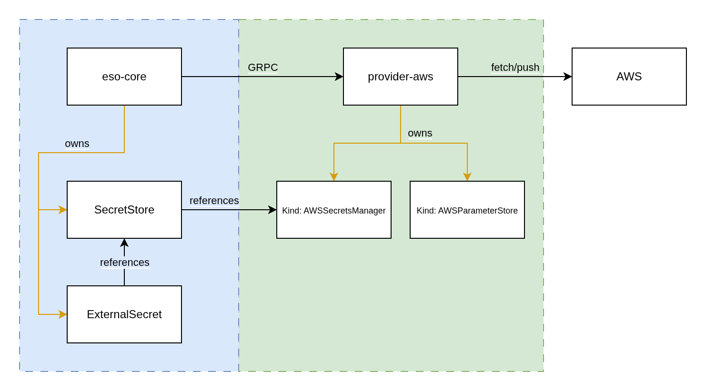

# SecretStores and Generators v2 (Out-of-Tree Providers)

<!-- toc -->
- [Summary](#summary)
- [Goals](#goals)
- [Proposal](#proposal)
  - [Overview](#overview)
  - [API Resources](#api-resources)
    - [SecretStore](#secretstore)
    - [ClusterSecretStore](#clustersecretstore)
    - [Generator](#generator)
    - [ClusterGenerator](#clustergenerator)
  - [Changes to ExternalSecret and PushSecret](#changes-to-externalsecret-and-pushsecret)
  - [New Provider Interfaces](#new-provider-interfaces)
  - [Out-of-Tree Providers Maintenance](#out-of-tree-providers-maintenance)
    - [Deployment](#deployment)
    - [Governance](#governance)
  - [Notes/Constraints/Caveats](#notesconstraintscaveats)
  - [Risks and Mitigations](#risks-and-mitigations)
- [Design Details](#design-details)
  - [Test Plan](#test-plan)
    - [Prerequisite testing updates](#prerequisite-testing-updates)
    - [Unit tests](#unit-tests)
    - [Integration tests](#integration-tests)
    - [e2e tests](#e2e-tests)
  - [Graduation Criteria](#graduation-criteria)
  - [Upgrade / Downgrade Strategy](#upgrade--downgrade-strategy)
  - [Monitoring Requirements](#monitoring-requirements)
  - [Troubleshooting](#troubleshooting)
- [Drawbacks](#drawbacks)
- [Alternatives](#alternatives)
<!-- /toc -->

## Summary

This proposes a v2 architecture and API for SecretStores and Generators in External Secrets Operator. The primary goals are to:

- Support out-of-tree providers as first-class citizens, allowing independent versioning and distribution.
- Unify feature sets of SecretStores and Generators (e.g. refresh, gating) under consistent CRDs and controllers.
- Make referent authentication modes explicit and easier to use.
- Allow users to install only the providers they need.
- reduce the dependency footprint of ESO to improve its security posture

There are several limitations in the current (v1) SecretStore and Generator architectures that hinder flexibility and maintainability:

- Different provider versioning is not possible.
- Out-of-tree providers are not first-class - they're only supported through the webhook provider.
- Users cannot easily install/uninstall only the desired providers.
- Referent authentication modes are implicit and hard to learn/use.

## Goals

- Implement new CRDs: SecretStore/v2alpha1, ClusterSecretStore/v2alpha1, Generator/v2alpha1, ClusterGenerator/v2alpha1.
- Enable ESO to run without in-tree providers; users install providers separately.
- Provide a provider configuration model that connects to out-of-tree providers via gRPC/TLS.
- Make referent authentication explicit (e.g., authentication scope for cluster-scoped resources).
- Add unified behaviors: refresh intervals, controller classes, retry settings, and gating policies.
- Maintain ExternalSecret/PushSecret compatibility via apiVersion on storeRef.
- Provide a migration path from v1 to v2, including a v1 plugin provider bridge and dedicated builds without v1 code.
- Deliver all providers (e.g., AWS/GCP/Vault) as out-of-tree projects.
- Migrate the existing end-to-end tests into the new out-of-tree structure
- Provide documentation to validate and explain the new model.

## Proposal

### Overview

ESO will run without bundled providers. Users deploy desired providers independently as separate services. ESO connects to providers over the network using secure gRPC/TLS.



### API Resources

#### SecretStore

Remove `spec.provider` and introduce `spec.providerConfig`, which contains the endpoint and authentication required to reach an out-of-tree provider, plus a provider-owned reference forwarded on requests.

```yaml
apiVersion: secretstore.external-secrets.io/v2alpha1
kind: SecretStore
metadata:
  name: my-aws-store
  namespace: default
spec:
  refreshInterval: 1m
  controller: dev
  # ESO reconciles only if the store is healthy or unknown
  gatingPolicy: Enabled # or Disabled
  retrySettings:
    maxRetries: 3
    retryInterval: 10s
  providerConfig:
    address: http+unix:///path/to/aws.sock
    auth:
      clientCertificate: {}
      serviceAccountRef: {}
    providerRef:
      name: my-aws-store
      namespace: default
      kind: AWSSecretManager
---
apiVersion: provider.secretstore.external-secrets.io/v2alpha1
kind: AWSSecretManager
metadata:
  name: my-aws-store
  namespace: default
spec:
  role: arn:aws:iam::123456789012:role/external-secrets
  region: eu-central-1
  auth:
    secretRef:
      accessKeyIDSecretRef:
        name: awssm-secret
        key: access-key
      secretAccessKeySecretRef:
        name: awssm-secret
        key: secret-access-key
status: {}
```

Notes:
- the resource referenced by `providerRef` is owned and managed by the provider and lives in a separate API group (`provider.secretstore.external-secrets.io`).

#### ClusterSecretStore

`ClusterSecretStore` makes referent authentication explicit via `authenticationScope`, selecting provider namespace or the manifest namespace for credentials. Cluster-scoped resources delegate to namespaced providers.

```yaml
apiVersion: secretstore.external-secrets.io/v2alpha1
kind: ClusterSecretStore
metadata:
  name: my-cluster-store
spec:
  refreshInterval: 1m
  controller: dev
  retrySettings:
    maxRetries: 3
    retryInterval: 10s
  providerConfig:
    address: http+unix:///path/to/socket.sock
    providerRef:
      name: my-aws-store
      namespace: default
      kind: AWSSecretManager
    auth: {}
  gatingPolicy: Enabled
  authenticationScope: ProviderNamespace # or ManifestNamespace
  conditions:
  - namespaceSelector: {}
    namespaces: []
    namespaceRegexes: []
```

#### Generator

Generators adopt `providerConfig` to delegate generation to out-of-tree providers and gain parity features.

- `providerConfig` to delegate to an out-of-tree provider.
- `gatingPolicy` to enable/disable floodgating for generators.

```yaml
apiVersion: generator.external-secrets.io/v2alpha1
kind: Generator
metadata:
  name: my-password
  namespace: default
spec:
  gatingPolicy: Enabled
  providerConfig:
    address: http+unix:///path/to/socket.sock
    providerRef:
      name: password-gen
      namespace: default
      kind: Password
---
apiVersion: provider.generator.external-secrets.io/v2alpha1
kind: Password
metadata:
  name: password-gen
  namespace: default
spec:
  digits: 5
  symbols: 5
  symbolCharacters: "-_$@"
  noUpper: false
  allowRepeat: true
```

#### ClusterGenerator

ClusterGenerators mirror ClusterSecretStores and extend namespaced Generators cluster-wide.

```yaml
apiVersion: generator.external-secrets.io/v2alpha1
kind: ClusterGenerator
metadata:
  name: my-cluster-generator
spec:
  refreshInterval: 1m
  controller: dev
  providerConfig:
    address: http+unix:///path/to/socket.sock
    providerRef:
      name: password-gen
      namespace: default
      kind: Password
  gatingPolicy: Enabled
  authenticationNamespace: ProviderReference # or ManifestReference
  conditions:
  - namespaceSelector: {}
    namespaces: []
    namespaceRegexes: []
```

### Changes to ExternalSecret and PushSecret

To maintain compatibility, `ExternalSecret` and `PushSecret` add `secretStoreRef.apiVersion`. Controllers use this field to decide whether to call v1 providers or v2 out-of-tree providers. No other changes are required.

### New Provider Interfaces

Provider and Generator interfaces are updated to pass full specs and enable provider-side processing.

```go
type ProviderV2 interface {
  GetSecret(SecretStoreSpec, ExternalSecretDataRemoteRef) ([]byte, error)
  PushSecret(SecretStoreSpec, *corev1.Secret, PushSecretData) error
  DeleteSecret(SecretStoreSpec, PushSecretRemoteRef) error
  SecretExists(SecretStoreSpec, PushSecretRemoteRef) (bool, error)
  GetAllSecrets(SecretStoreSpec, ExternalSecretFind) (map[string][]byte, error)
  Validate(SecretStoreSpec) (admission.Warnings, error)
  Capabilities(SecretStoreSpec) SecretStoreCapabilities
}

type GeneratorV2 interface {
  Generate(GeneratorSpec) (map[string][]byte, GeneratorProviderState, error)
  Cleanup(GeneratorSpec, GeneratorProviderState) error
}
```

### Out-of-Tree Providers Maintenance

#### Deployment

Out-of-tree providers are separate projects with their own repos, images, and Helm charts. Users deploy ESO and the providers they need. ESO connects to providers via a Kubernetes Service indicated by `providerConfig.address`. Co-locating providers as sidecars is **discouraged** to preserve isolation and scalability.

#### Governance

- One repo per "official" eso maintained provider (e.g., `provider-aws`).
- Promotion lifecycle (experimental → stable).
- CODEOWNERS and standard PR workflows per provider.
- A collective community repo `provider-contrib` for community-maintained providers.

### Notes/Constraints/Caveats

- Do not implement Unix domain sockets for sidecars; providers should run as independent deployments to ensure horizontal scalability, separate network policies, and stronger isolation.
- Cluster-scoped resources delegate to namespaced providers; referent authentication is explicit via `authenticationScope`.

### Risks and Mitigations

- Operational overhead: Users manage separate provider deployments 
    - mitigated by dedicated Helm charts and independent versioning per provider.
- Maintenance overhead: every provider needs similar infrastructure such as a helm chart, e2e test framework and test cases, a common library to bootstrap the provider's GRPC server, metrics, initialising clients etc.
    - mitigated by providing one or more `common` repos, e.g. `provider-common` which host the shared code among eso-core and all providers (similar to https://github.com/fluxcd/pkg).
- TLS management: someone needs to manage the TLS certs/keys: do we push it to the user or do we provide it ourselves?
    - mitigated by (1) implement certificate management with `cert-controller` and  provide an integration mechanism with cert-manager.

## Design Details

### Test Plan

This plan validates core changes in eso-core and out-of-tree providers, including security boundaries and migration flows.

#### Prerequisite testing updates
- Create a provider conformance test suite (library) that providers run against locally and in CI (covers GetSecret, GetAllSecrets, Push/Delete/Exists when implemented, error semantics, auth, TLS).
- Add a fake gRPC provider for tests to simulate success, latency, failures, and version skew.
- CI jobs: 
  - fast unit/integration on PR
  - extended e2e and conformance nightly
  - artifacts for v1 providerless build

#### Unit tests
- eso-core
  - Routing by secretStoreRef.apiVersion (v1 vs v2).
  - Validation of providerConfig and references; gating policy; retry/backoff.
  - Referent auth: deny cross-namespace access for namespaced SecretStores; respect ClusterSecretStore scope rules.
  - Metrics emission (.ObserveAPICall or provider-side equivalents) and labels.
  - Robust error mapping from provider responses to conditions/events.
- Providers (adapters and common libs)
  - gRPC client/server option wiring, TLS, timeouts, backoff and cancellation.
  - Auth resolvers from SecretRefs/ServiceAccounts, including namespace scoping.
  - Serialization of providerRef and request/response schemas.
- Generators
  - providerConfig passthrough, state persistence, and gating.

#### Integration tests
- envtest-based controller tests installing v2alpha1 CRDs (SecretStore/ClusterSecretStore/Generator/ClusterGenerator).
- In-process fake provider; verify refresh, target templates, dataFrom, GetAllSecrets, and error propagation.
- Security boundaries
  - Namespaced store cannot read Secret from another namespace; Cluster store may when allowed by selector/scope.
  - Conditions and namespace constraints on ClusterSecretStore resources are enforced.
- Migration
  - v1 plugin provider forwards to v2 provider; existing ExternalSecrets continue to sync; switch to v2 stores without data loss.
- Failure injection: DNS/TLS failures, expired certs, non-retryable vs retryable errors, deadline exceeded.
- Version skew: eso-core N with provider N-1/N+1 where compatible; reject incompatible versions with clear status.
- Run with -race; ensure no data races in reconcile paths.

#### e2e tests
- kind-based suites deploying:
  - eso-core (v1+plugin / v2-enabled) and all eso maintained out-of-tree providers.
  - Scenario matrix: namespaced and cluster stores, referent auth modes, gating on/off, refresh and templating.
  - Scale smoke: O(1000) ExternalSecrets across O(50) namespaces; measure sync latency and resource usage.
  - Disruption: roll provider Deployment/Service; TLS cert rotation; verify recovery without manual intervention.
  - Upgrade: v1-only -> mixed (v1 plugin + v2 provider) -> v2-only.
- Conformance suite executed against each supported provider repo (as optional gate for community providers).

### Graduation Criteria

Alpha
- v2alpha1 CRDs published; feature behind a feature gate and disabled by default in stable images.
- Unit/integration tests implemented; initial e2e with fake/sample provider green on 2 supported Kubernetes versions.
- Basic metrics and status/conditions wired; documentation draft and examples provided.

Beta
- Enabled by default (feature gate remains for rollback); docs complete; migration guide published.
- Provider conformance test suite v1.0 released; at least two providers pass the suite and run e2e in CI.
- Broad provider support: ≥3 major providers pass conformance and publish compatibility matrix.
- Security: referent auth boundaries verified by automated tests; fuzz tests for provider API payloads; TLS required by default.
- Version skew policy documented and tested (eso-core N with provider N-1/N+1 where contract allows).
- Performance baselines documented; scale e2e passing; no critical open bugs; user feedback from early adopters.

GA
- Feature gate removed (or defaulted on permanently); CRDs promoted (e.g., v2beta1->v2 or equivalent) without breaking API.
- Upgrade/downgrade and rollback procedures validated in CI; migration from v1 documented and tooling available.
- SLOs met (availability and sync latency); telemetry and dashboards documented.
- No known security gaps in namespace isolation/auth; passing periodic conformance in provider repos.

### Upgrade / Downgrade Strategy

A phased migration enables safe adoption from v1 to v2:

1) Early adoption via a v1 plugin provider
- Introduce a special `plugin` provider within `SecretStore/v1` that forwards requests to v2 out-of-tree providers. This allows testing v2 providers without changing existing v1 resources.

2) Dedicated builds
- Provide ESO builds without in-tree provider code to reduce footprint for fully migrated users.

3) Full migration
- Define v2 SecretStore and Generator CRDs pointing to out-of-tree provider deployments/CRs.
- Update `ExternalSecret` manifests to use `secretStoreRef.apiVersion: secretstore.external-secrets.io/v2alpha1` and reference v2 stores.
- Decommission v1 stores after all `ExternalSecret` resources are migrated.


### Monitoring Requirements
- Add GRPC-related metrics to eso-core (client-side) as well as on the provider (server) side
- Migrate metrics (`.ObserveAPICall()`) to the provider

### Troubleshooting
A user would have the same troubleshooting flow: 
- inspect Secret
- describe ExternalSecret
- describe SecretStore
- (new) describe provider-owned resource
- inspect logs of eso-core
- (new) inspect logs of provider pods

## Drawbacks

- Increased operational complexity and responsibility for users to deploy and manage provider lifecycles in addition to ESO.
- New CRDs introduce a learning curve and require updated documentation.
- Separate repositories, issue trackers, and release pipelines for each provider increase maintenance overhead.
- Distributed maintenance across community providers can fragment ownership.

## Alternatives

- just provide a GRPC plugin mechanism and move providers out of tree without a v2 SecretStore
- get rid of the SecretStore alltogether and directly point from a `ExternalSecret` at a `Kind=AWSSecretsManager`.
