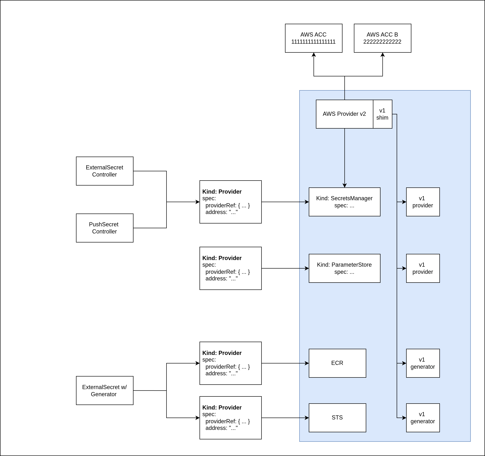
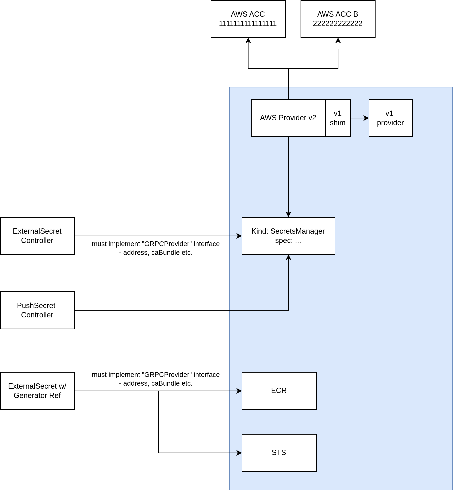

# API Design for Out-of-Process Providers

## Decision

How should ExternalSecret and PushSecret resources reference out-of-process providers?

## Context

Out-of-process providers run in separate pods and communicate with ESO Core via gRPC. We need an API design that enables:

- Service discovery: ESO Core must locate the provider's gRPC endpoint
- Provider-specific configuration: Each provider needs its own configuration (credentials, endpoints, etc.)
- Cluster-scoped and namespace-scoped resources
- Common provider behaviors (authentication scope, conditions, status)

## Options

### Option 1: Provider Indirection Layer

ExternalSecret references a `Provider` or `ClusterProvider` resource, which then references a provider-specific custom resource.

**Architecture:**
```
ExternalSecret
  ├─> secretStoreRef.kind: Provider
  └─> secretStoreRef.name: my-provider
        └─> Provider
              ├─> spec.address: grpc://provider-service:8080
              └─> spec.providerRef
                    ├─> kind: SecretsManager
                    └─> name: team-blue-eu-west-2
```



**Example:**
```yaml

apiVersion: external-secrets.io/v1
kind: ExternalSecret
metadata:
  name: database-credentials
  namespace: external-secrets-system
spec:
  refreshInterval: 1h
  secretStoreRef:
    kind: Provider
    name: aws-provider
```

**Pros:**
- Common fields and behaviors are defined once on `Provider`/`ClusterProvider`
- Service discovery is explicit via `spec.address`
- No need for cluster-scoped variants of provider-specific CRDs
- Clear separation: `Provider` handles connectivity, provider-specific CR handles configuration

**Cons:**
- Additional layer of indirection increases complexity
- Users must understand two resource types instead of one
- Naming and responsibilities may be unclear to new users
- More verbose configuration

### Option 2: Direct Reference

ExternalSecret directly references provider-specific custom resources.

**Architecture:**
```
ExternalSecret
  ├─> secretStoreRef.apiVersion: aws.provider.external-secrets.io/v2alpha1
  ├─> secretStoreRef.kind: SecretsManager
  └─> secretStoreRef.name: team-blue-eu-west-2
```



**Example:**

```yaml

apiVersion: external-secrets.io/v1
kind: ExternalSecret
metadata:
  name: database-credentials
  namespace: external-secrets-system
spec:
  refreshInterval: 1h
  secretStoreRef:
    apiVersion: aws.provider.external-secrets.io/v2alpha1
    kind: SecretsManager
    name: team-blue-eu-west-2

```

**Pros:**
- Simpler mental model: one reference instead of two
- Fewer resources to manage
- More intuitive for users familiar with Kubernetes patterns
- Cleaner YAML configuration

**Cons:**
- Each provider must implement cluster-scoped variants (e.g., `ClusterSecretsManager`, `ClusterParameterStore`)
- Significant boilerplate code for cluster-scoped resources
- Service discovery requires convention-based approach (e.g., labels on Service objects)
- Common fields must be duplicated across all provider CRDs
- No single place to configure authentication scope or shared behaviors
- ESO Core cannot interpret provider-specific fields

## Service Discovery

### Option 1: Explicit Address
The `Provider` resource contains `spec.address` pointing to the gRPC endpoint.

### Option 2: Convention-Based Discovery
ESO Core discovers services by:
- Label selectors on Service objects
- Naming conventions (e.g., `<provider-kind>-<name>`)
- Namespace discovery rules

## Trade-offs

| Aspect | Option 1: Indirection | Option 2: Direct Reference |
|--------|----------------------|----------------------------|
| User Experience | More complex | Simpler |
| Implementation | Less boilerplate | More boilerplate |
| Extensibility | Centralized common fields | Duplicated fields |
| Service Discovery | Explicit | Convention-based |
| Maintenance | Single controller pattern | Multiple cluster-scoped controllers |

## Recommendation

[To be filled in after discussion]

## Open Questions

1. How do we handle provider authentication? Should it be configured on the outer layer or provider-specific CR?
2. What happens when a provider needs to expose custom status conditions?
3. How do we version provider-specific APIs independently from ESO Core?
4. Can we provide a middle-ground solution that combines benefits of both approaches?

