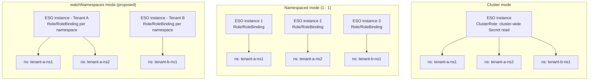
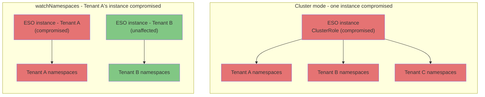

```yaml
---
title: Multi-Namespace ("Tenant") Mode
version: N/A
authors: asmaoune
creation-date: 2026-09-23
status: draft
---
```

# Multi-Namespace ("Tenant") Mode

## Table of Contents

<!-- toc -->
// autogen please
<!-- /toc -->

## Summary

This proposal introduces a new deployment mode for ESO, `watchNamespaces`, that lets a single
ESO instance manage a fixed, explicit list of namespaces using only namespace-scoped `Role`
and `RoleBinding` resources — no cluster-wide RBAC — with all cluster-scoped reconcilers
(`ClusterSecretStore`, `ClusterExternalSecret`, `ClusterPushSecret`) disabled.

The goal of this document is not just to pitch the feature, but to make explicit the design
decisions, trade-offs, and open problems raised during review of the initial implementation
([#6526](https://github.com/external-secrets/external-secrets/pull/6526)), so the team can make
a deliberate decision instead of growing this mode organically the way the existing
single-namespace mode did.

## Motivation

ESO today supports two deployment modes:

1. **Cluster mode** — one instance, cluster-wide RBAC, watches all namespaces.
2. **Namespaced mode** (`scopedNamespace` / `scopedRBAC` in the Helm chart) — one instance,
   one namespace, namespace-scoped RBAC only.

In a multi-tenant Kubernetes cluster, neither shape fits well once a tenant owns more than one
namespace:

- **Cluster mode** satisfies the "one instance per tenant" operational goal, but requires a
  `ClusterRole` (a tenant will never have cluster-wide permissions in a multi-tenancy
  environment) with cluster-wide read access to `Secret` resources for the ServiceAccount
  running the instance, regardless of whether the application logic actually respects namespace
  boundaries at runtime. This fails least-privilege/compliance requirements in several
  environments, and puts every tenant behind a single blast radius if that instance is ever
  compromised (CVE, credential leak, container escape, etc.).
- **Namespaced mode** satisfies isolation and least-privilege, but is strictly 1 instance : 1
  namespace. A tenant with, say, 100 namespaces requires 100 separately deployed and managed ESO
  instances. This is an **operational scalability problem**, not a functional or security one —
  namespaced mode works correctly, it just doesn't compose across multiple namespaces belonging
  to the same tenant without a linear increase in the number of instances to deploy, upgrade,
  and monitor.

`watchNamespaces` is meant to close that specific gap: group a tenant's namespaces under one
instance, while keeping RBAC namespace-scoped (one `Role`/`RoleBinding` per watched namespace,
no `ClusterRole`).

### Deployment Shapes at a Glance



*Cluster mode*: one instance, cluster-wide RBAC, all namespaces. *Namespaced mode*: perfect
isolation, but one instance per namespace — cost grows linearly with a tenant's namespace count.
*`watchNamespaces`*: one instance per tenant, RBAC still scoped per namespace, cost grows with
tenant count rather than namespace count.

### Goals

- Allow one ESO instance to watch an explicit, fixed list of namespaces.
- Keep RBAC strictly namespace-scoped: one `Role`/`RoleBinding` per watched namespace, no
  `ClusterRole` for `Secret`/`SecretStore` access.
- Reduce the number of ESO instances a tenant-per-namespace-group operator needs to deploy and
  operate, compared to strict 1 namespace : 1 instance.
- Preserve today's namespaced-mode behavior for cluster-scoped resources: when `watchNamespaces`
  is set, `ClusterSecretStore`, `ClusterExternalSecret`, and `ClusterPushSecret` reconcilers are
  disabled.

### Non-Goals

- This does **not** attempt to protect one namespace's workload from resource contention caused
  by another namespace watched by the *same* instance (the "noisy neighbor" case: one namespace
  with a very large number of secrets slowing down reconciliation for another namespace in the
  same instance). That failure mode is not addressed by cluster mode either, and is explicitly
  out of scope here — it is a trade-off inherent to grouping namespaces under one instance, and
  should be documented as a known limitation, not solved by this feature.
- This does not attempt to solve CRD version skew across tenants. CRDs are cluster-scoped, so
  all ESO instances in a cluster — regardless of mode — share the same installed CRD version.
  This should be called out as an explicit limitation of the feature for adopters who may want
  per-tenant CRD versions.

## Proposal

Add a `watchNamespaces` configuration (Helm value and controller flag) that accepts a list of
namespace names. When set:

- The controller manager restricts its informers/caches to the listed namespaces.
- The Helm chart renders one `Role`/`RoleBinding` per listed namespace instead of a
  `ClusterRole`/`ClusterRoleBinding`.
- Cluster-scoped reconcilers (`ClusterSecretStore`, `ClusterExternalSecret`,
  `ClusterPushSecret`) are disabled.
- Webhook behavior is unchanged: `watchNamespaces` inherits whatever webhook posture is already
  configured (webhooks remain optional, as they are today for `scopedNamespace`/`scopedRBAC`
  mode).

### User Stories

- **As a platform team offering ESO as a managed service**, for each tenant I want to deploy a
  single ESO instance covering all of that tenant's namespaces, instead of one instance per
  namespace, so that my operational overhead scales with the number of tenants rather than with
  the number of namespaces per tenant.
- **As a security/compliance reviewer**, I want the RBAC granted to an ESO ServiceAccount to be
  restricted to the exact namespaces it is meant to serve, so that an audit of granted
  permissions reflects the actual intended blast radius, not a cluster-wide grant justified only
  by application-level logic.
- **As a cluster operator**, if I mistakenly configure `watchNamespaces` together with a
  cluster-scoped feature flag (e.g. `--enable-cluster-store`), I want to be told about the
  conflict at startup, not have it fail silently or at runtime.

### API

Proposed shape (naming to be confirmed during review):

- Helm value: `watchNamespaces: []string` (list of namespace names).
- Controller flag: repeatable, e.g. `--namespaced-mode-watch-ns=<namespace-name>` (repeatable),
  gated behind an explicit top-level switch such as `--enable-namespaced-mode`, rather than
  inferring the mode implicitly from which flags are set.
- `--namespace` (today's single-namespace flag) would eventually need a documented deprecation
  path once/if the explicit flag lands.

Example `values.yaml` snippet:

```yaml
watchNamespaces:
  - tenant-a-ns1
  - tenant-a-ns2
```

Rationale: a single top-level "namespaced mode" switch is easier to reason about than several
independent flags whose combination determines behavior, and makes "all cluster-scoped features
are disabled in this mode" an explicit, centrally enforced rule rather than an implicit side
effect.

### Behavior

| Concern | Cluster mode | Namespaced mode (1:1) | `watchNamespaces` |
|---|---|---|---|
| ServiceAccount RBAC scope | Cluster-wide `ClusterRole` for Secret access | Namespace-scoped only | Namespace-scoped only, one Role/RoleBinding per watched namespace |
| Blast radius if instance compromised | All tenants in the cluster | Single namespace only | Only the namespaces assigned to that instance (i.e. one tenant) |
| Operational cost per tenant | Lowest (1 instance total) | Highest (1 instance per namespace) | Medium (1 instance per tenant, regardless of namespace count) |
| Protects against noisy-neighbor within a tenant's own namespaces | N/A (all tenants share it) | Yes (full isolation) | No — namespaces sharing an instance share its runtime |
| CRD version isolation per tenant | No | No (chart-wide) | No (chart-wide) |

#### Edge case: blast radius if an instance is compromised



In cluster mode, compromising the single instance exposes every tenant's secrets. With
`watchNamespaces`, a compromised instance only exposes the namespaces of the tenant it was
scoped to — other tenants' instances and RBAC are untouched.

#### Edge case: admission/conversion webhook dependency

ESO relies on `ValidatingWebhookConfiguration` and a CRD conversion webhook, both cluster-scoped
by nature, and the cert-controller that manages their certificates needs cluster-wide RBAC to do
so. This tension is **not introduced by `watchNamespaces`** — it already exists in today's
namespaced mode (`scopedRBAC`/`scopedNamespace`), and was never addressed or documented when
that mode was introduced. Webhooks are already optional today (see
[`values.yaml`](https://github.com/external-secrets/external-secrets/blob/main/deploy/charts/external-secrets/values.yaml)).

`watchNamespaces` inherits the existing webhook posture of namespaced mode as-is; it does not
change it. Separately, if the project wants to move towards ESO being fully webhook-independent,
that requires changes in **each provider** and test coverage guaranteeing correct behavior
without webhooks, and may be a breaking change for existing users relying on admission-time
validation. That decision should be scoped and discussed on its own, not implied by this
proposal.

#### Edge case: invalid mode combinations

Nothing today prevents setting `watchNamespaces` together with a cluster-scoped feature flag
(e.g. `--enable-cluster-store`), which currently fails at runtime instead of being rejected at
startup. This proposal adds explicit startup-time validation: if `watchNamespaces` (or a future
`--enable-namespaced-mode`) is set, reject configuration that also requests cluster-scoped
features, with a clear error message, instead of failing later at runtime.

#### Edge case: namespaces that don't exist

No validation exists today that the namespaces listed in `watchNamespaces` actually exist in the
cluster. This proposal adds fail-fast validation at startup rather than silently watching
nothing or failing later during reconciliation.

### Drawbacks

- Does not solve noisy-neighbor contention between namespaces sharing the same instance (see
  Non-Goals).
- Does not solve CRD version skew across tenants (see Non-Goals) — all instances in a cluster
  still share one CRD version.
- Inherits, rather than resolves, ESO's existing dependency on cluster-scoped admission/
  conversion webhooks; running fully webhook-independent remains untested and unsupported.
- Adds a new code path (namespace list handling, per-namespace Role/RoleBinding templating,
  startup validation) that needs to be maintained going forward, on top of today's namespaced
  mode.

### Acceptance Criteria

**Rollout / rollback**
- Additive, opt-in feature: `watchNamespaces` unset preserves current behavior exactly (no
  change to cluster mode or existing single-namespace mode).
- Rollback is simply unsetting the value/flag and redeploying with the previous mode.
- If the `--enable-namespaced-mode` flag proposal (see API) is adopted, `--namespace` needs a
  documented deprecation window rather than an immediate removal.

**Test roadmap**
- Unit/integration tests confirming that, with `watchNamespaces` set, only namespace-scoped
  `Role`/`RoleBinding` are rendered by the chart — no `ClusterRole`/`ClusterRoleBinding`.
- Tests confirming cluster-scoped reconcilers (`ClusterSecretStore`, `ClusterExternalSecret`,
  `ClusterPushSecret`) are inactive when `watchNamespaces` is set.
- Tests for the new startup-time guardrail (`watchNamespaces` + cluster-scoped flag rejected).
- Tests for namespace-existence validation at startup.
- As a parallel/prerequisite workstream: test coverage for ESO running correctly with webhooks
  disabled, since `watchNamespaces` makes that combination more likely in practice.

**Observability**
- Expose which namespaces a given instance is configured to watch (e.g. via a metric label or a
  status/log line at startup), so operators can confirm the effective scope of an instance.
- Metric/log for guardrail rejections (invalid mode combination, unknown namespace), so
  misconfiguration is visible rather than silent.

**Monitoring**
- No new dashboards are strictly required, but per-tenant deployments can now be monitored
  individually (reconcile error rate, queue depth) using existing ESO metrics, scoped by
  instance — which is itself an operational benefit of this mode over cluster mode.

**Troubleshooting**
- Common failure mode 1: instance fails to start because `watchNamespaces` lists a namespace
  that doesn't exist — should fail fast with a clear error naming the missing namespace.
- Common failure mode 2: instance configured with `watchNamespaces` and a cluster-scoped feature
  flag — should be rejected at startup with a clear error, not fail later at reconcile time.
- Common failure mode 3: a `SecretStore` in a watched namespace not reconciling — first thing to
  check is whether the target namespace is actually included in `watchNamespaces` for that
  instance.

## Alternatives

- **Cluster mode + correctly scoped SecretStores/RBAC.** Functionally isolates tenants (a
  `SecretStore` cannot reference resources outside its namespace by design), but does not
  satisfy least-privilege at the ServiceAccount/RBAC level, and puts all tenants behind one
  blast radius. Rejected as insufficient for compliance and security requirements in
  multi-tenant environments.
- **1 namespace : 1 controller (today's namespaced mode).** Provides the strongest isolation,
  including against noisy-neighbor effects, at the cost of one ESO instance per namespace. In a
  managed-service model where one ESO instance is already deployed per tenant, this becomes one
  instance per *namespace* instead — an operationally unbounded cost as a tenant's namespace
  count grows. Rejected as not scalable for tenants with many namespaces.
