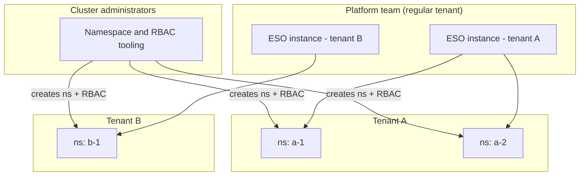

```yaml
---
title: Multi-Namespace Mode for ESO Operated Without Cluster-Wide Permissions
version: N/A
authors: asmaoune
creation-date: 2026-09-23
status: draft
---
```

# Multi-Namespace Mode for ESO Operated Without Cluster-Wide Permissions

## Table of Contents

<!-- toc -->
// autogen please
<!-- /toc -->

## Summary

Some organisations provide ESO as a **managed tool** to the tenants of a shared Kubernetes
cluster, operated by a platform team that is **itself a regular tenant**, without any
cluster-wide permission. In that setup, cluster mode and webhooks are not available, and the
existing namespaced mode (one instance, one namespace) does not match the unit of the managed
service, which is the tenant, not the namespace.

This document describes that use case, its constraints and its risk model, so that we can agree
on the problem before agreeing on a solution. It then proposes a way for one ESO instance to
serve an explicit list of namespaces with namespace-scoped RBAC only, and lists the alternatives
and open questions.

It follows the review of the initial implementation
([#6526](https://github.com/external-secrets/external-secrets/pull/6526)) and relates to
[#6490](https://github.com/external-secrets/external-secrets/issues/6490). The intent is to make
a deliberate decision on this deployment shape, rather than letting it grow organically the way
the single-namespace mode did.

## Context

This proposal comes from a common pattern in shared, multi-tenant clusters: tools such as ESO are
provided **as a managed service** to the tenants of the cluster, by a platform team that does not
administer the cluster itself.

### Operating model

The use case relies on three roles:

| Role | Permissions | Responsibilities |
|---|---|---|
| Cluster administrators | Cluster-admin | Install cluster-scoped resources, including the ESO CRDs. Own the tooling (Custom Kubernetes Operator) that creates tenant namespaces and grants RBAC in them. |
| Platform team (managed tools) | **Regular tenant**, no cluster-wide permission | Deploys and operates the managed tools, including one ESO instance per tenant. |
| Tenant | Its own namespaces only | Creates namespaced ESO resources in its namespaces. |

The key constraint for this document is the second row: the team that operates ESO **cannot
create any cluster-scoped resource**. No `ClusterRole`, no `ClusterRoleBinding`, no
`ValidatingWebhookConfiguration`, no CRD.

### Tenancy assumptions

- A tenant is **not a Kubernetes object**. It is a name stored in a database maintained by the
  cluster administrators, and nothing in the cluster represents it directly.
- A tenant owns one or more namespaces. The tenant cannot create namespaces through the
  Kubernetes API: it requests them through an API provided by the cluster administrators, and
  the actual namespace is then created in the cluster by the cluster administrators' tooling.
- There are **no shared resources between the namespaces of a tenant**, and nothing is shared
  between tenants.
- Tenants can only use namespaced ESO resources (`SecretStore`, `ExternalSecret`, `PushSecret`).
  Every namespace that uses ESO has its own `SecretStore`. Cluster-scoped ESO resources are not
  offered.

The trust boundary is therefore the **tenant**, not the namespace.

### How the managed instance is scoped

- Each tenant gets one managed ESO instance, running in a namespace owned by the platform team,
  which the tenant cannot access. The tenant cannot modify the controller, its configuration or
  its ServiceAccount.
- When a tenant namespace is created, the cluster administrators' tooling grants the tenant's ESO
  ServiceAccount a namespace-scoped `Role`/`RoleBinding` in it.
- The platform team's deployment tooling then adds the namespace to the instance's list of
  namespaces, which triggers a rollout.

The ESO instance never grants itself access to anything: its effective scope is decided by RBAC
provisioned by the cluster administrators.


```mermaid
graph TB
    subgraph Admin["Cluster administrators"]
        T["Namespace and RBAC tooling"]
    end

    subgraph Platform["Platform team (regular tenant)"]
        ESOA["ESO instance - tenant A"]
        ESOB["ESO instance - tenant B"]
    end

    subgraph TA["Tenant A"]
        A1["ns: a-1"]
        A2["ns: a-2"]
    end

    subgraph TB2["Tenant B"]
        B1["ns: b-1"]
    end

    T -- "creates ns + RBAC" --> A1
    T -- "creates ns + RBAC" --> A2
    T -- "creates ns + RBAC" --> B1
    ESOA --> A1
    ESOA --> A2
    ESOB --> B1
```

## Problem Statement

### Cluster mode is not available

Cluster mode requires a `ClusterRole` with cluster-wide access to `Secret` resources. The
platform team cannot create it. Even where it could, it would put every tenant behind a single
blast radius: one compromised instance exposes the secrets of all tenants.

### Webhooks are not available

The validating webhooks require a `ValidatingWebhookConfiguration`, and the cert-controller
requires cluster-wide RBAC to manage it. Neither can be created by the platform team. Webhooks
are therefore **disabled** in this setup (`webhook.create: false`,
`certController.create: false`).

We understand that the project expects webhooks to be deployed at least once per cluster, and
that disabling them is not a recommended configuration today. This document does not argue that
webhooks should become optional for every deployment. It asks whether operating ESO without
cluster-wide permissions, and therefore without webhooks, can become a **documented and tested**
posture, with its risks made explicit. See [Webhooks](#webhooks) for what is lost and what is
still enforced.

### Namespaced mode does not match the unit of a managed service

The existing namespaced mode (`scopedNamespace` / `scopedRBAC`) works, and the chart already
allows the instance to run in one namespace while watching another. The platform team could
technically deploy one managed instance per tenant namespace.

The issue is the unit. In a managed offering, the unit of service is the **tenant**:

- The managed instance is created when the tenant is onboarded and deleted when it leaves.
  Namespaces, on the other hand, are created and deleted continuously by the tenant.
- Monitoring, alerting, upgrades, support and SLA are handled per tenant.

With namespaced mode, every namespace a tenant creates would require the platform team to
provision, monitor and upgrade a new managed ESO instance. The number of instances, and the
associated footprint and API server watches, would grow with the total number of namespaces
across all tenants rather than with the number of tenants.

### What is missing today

ESO has no supported way for one instance to serve **several** namespaces with
**namespace-scoped RBAC only**. The operating model described above (no cluster-wide
permission, no webhook, RBAC granted by an external component) is also not documented, so its
risks are not stated anywhere for users who adopt it.

## Goals

- Make it possible to operate ESO **without any cluster-wide permission**, for teams that serve
  several namespaces on behalf of someone else.
- Let one instance serve a group of namespaces that share a trust boundary, with an effective
  scope that is **bounded by RBAC**, not only by application logic.
- Make the **risk model** of this posture explicit for users, including the absence of
  webhooks.
- **Not change** the behavior of cluster mode or of the existing single-namespace mode.
- Surface misconfigurations clearly instead of failing silently at runtime.

## Non-Goals

- **Isolation between namespaces served by the same instance.** Namespaces grouped in one
  instance share its runtime: a namespace with many resources can slow down reconciliation of
  the others (noisy neighbor). In this model it is acceptable because all of them belong to the
  same tenant, which is the trust boundary; the risk stays within that tenant. It is documented
  in the [Risk Model](#risk-model).
- **Dynamic namespace discovery** (for example with a label selector). Kubernetes authorizes a
  request on its scope, not on its results: listing or watching resources across namespaces is
  a cluster-wide request and requires cluster-wide RBAC, even with a label selector and even if
  the instance has permissions in every matching namespace. With namespace-scoped RBAC only, an
  instance must issue one request per namespace, and therefore needs an explicit list. See
  [Alternatives](#alternatives).
- **Changing the project's position on webhooks for other deployment shapes.** This document
  only covers deployments where webhooks cannot be installed.

## Risk Model

### Trust boundaries

- **Between tenants**: enforced by RBAC. Each instance's ServiceAccount has permissions only in
  the namespaces of its tenant, granted by the cluster administrators' tooling. This boundary
  does not depend on ESO logic or on webhooks: the API server rejects any access outside it.
- **Between namespaces of the same tenant**: not a trust boundary in this model (same owner,
  nothing shared with other tenants).
- **Between the tenant and its ESO instance**: the instance runs in a platform-owned namespace
  that the tenant cannot access.

### Threats

| Scenario | Impact | Mitigation / status |
|---|---|---|
| One tenant's instance is compromised (CVE, container escape, token leak) | Secrets in that tenant's namespaces | Namespace-scoped RBAC per instance. Other tenants are unaffected. |
| A tenant tries to reach another tenant's secrets through ESO resources | None | The instance has no RBAC outside the tenant's namespaces. |
| A tenant references, from a namespaced `SecretStore`, a secret in another namespace | None at runtime for providers using the common resolver (see [Webhooks](#webhooks)); at most intra-tenant otherwise | Runtime resolver ignores the namespace field for namespaced stores. RBAC bounds the rest to the tenant. |
| A tenant renders a privileged Secret (service account token, bootstrap token) through an `ExternalSecret` template | Rejected | Enforced by the controller at reconcile time, not only by the webhook (see [Webhooks](#webhooks)). |
| Noisy neighbor between namespaces of the same tenant | Slower reconciliation for that tenant | Accepted and documented. |
| Invalid ESO resources (no admission validation) | Accepted by the API server, fail at reconcile time, errors in status and events | Availability / user-experience impact, not isolation. |
| Namespace list updated (namespace added or removed) | Rollout of the instance, reconciliation paused for all namespaces of the tenant during the rollout | Short and accepted. Documented. |

## Webhooks

This section describes what changes when no webhook is deployed. It is based on the current
code on `main`.

### What is still enforced at reconcile time

- **Privileged templates.** The restrictions on `ExternalSecret` templates (no
  `kubernetes.io/service-account-token` Secret with a service account annotation, no bootstrap
  token) are defined in `ValidateSecretTemplate` in
  `apis/externalsecrets/v1/externalsecret_validator.go`. The controller calls it during
  reconciliation (`pkg/controllers/externalsecret/externalsecret_controller_template.go`), and
  the code explicitly states that this is so the rules still apply when no webhook is deployed.
- **Cross-namespace secret references from a namespaced `SecretStore`.** The common resolver
  (`runtime/esutils/resolvers/secret_ref.go`, `SecretKeyRef`) only honors the `namespace` field
  of a secret reference for a `ClusterSecretStore`. For a namespaced `SecretStore`, it always
  reads from the store's own namespace.
- **Store connectivity.** The `SecretStore` controller builds a client and validates it at
  reconcile time, and reports failures in the store's status and events.

### What is lost

- **Provider-specific store validation at admission.** `provider.ValidateStore` is called by the
  `SecretStore` validating webhook (`apis/externalsecrets/v1/secretstore_validator.go`), and
  does not appear to run in the reconcile path. A misconfigured store is accepted by the API
  server, and the error only appears later, when the client is built or used.
- **Structural checks on `ExternalSecret`** (for example "either `data` or `dataFrom` must be
  set", invalid `creationPolicy` / `deletionPolicy` combinations). Errors surface at reconcile
  time instead of admission.
- **Early feedback for tenants.** In a managed service, this moves errors from `kubectl apply`
  to the resource status, which has a support cost.

To be confirmed as part of this design: that every provider which resolves secret references
without going through the common resolver applies the same namespace restriction at runtime.
Until confirmed, RBAC still bounds any issue to the tenant's own namespaces.

### Conversion

With the CRDs as currently shipped, only `v1` is served for the `external-secrets.io` kinds
(`v1beta1` is present but not served by default), and CRD conversion is disabled by default in
the chart (`crds.conversion.enabled: false`). No conversion webhook is needed as long as the
cluster administrators install the CRDs with those defaults. If they enable `v1beta1` serving,
this no longer holds.

## Proposal

### Scope of an instance

An instance is configured with an explicit list of namespaces. When the list is set:

- The controller manager restricts its caches and informers to the listed namespaces.
- Cluster-scoped reconcilers (`ClusterSecretStore`, `ClusterExternalSecret`,
  `ClusterPushSecret`) are disabled.
- No cluster-scoped RBAC is required when webhooks and the cert-controller are disabled.

### Relation to the existing namespaced mode

It is not decided yet whether this should be a new mode or an **extension of the existing
namespaced mode**, where "one namespace" becomes the special case of a list of one. The second
option looks simpler for users and avoids a third mode to maintain. Both options are described
below; feedback is welcome.

**Option A: extend the existing namespaced mode (preferred for discussion)**

- Controller: `--namespace` keeps its current meaning; a list form is added (repeatable flag or
  comma-separated value, to be decided).
- Chart: `scopedNamespace` accepts a list in addition to a single value, combined with the
  existing `scopedRBAC`.

**Option B: explicit mode switch**

- Controller: an explicit switch such as `--enable-namespaced-mode` plus a repeatable
  `--namespaced-mode-watch-ns=<namespace>`, so the mode is not inferred from the combination of
  other flags. `--namespace` would then need a documented deprecation path.
- Chart: a new `watchNamespaces` value.

In both options, example values:

```yaml
scopedRBAC: true
scopedNamespace:
  - tenant-a-ns1
  - tenant-a-ns2
webhook:
  create: false
certController:
  create: false
```

### RBAC

Two ways of providing RBAC must be supported:

- **Rendered by the chart** (`rbac.create: true`): one `Role`/`RoleBinding` per listed namespace,
  no `ClusterRole`/`ClusterRoleBinding` when webhooks and the cert-controller are disabled.
- **Managed externally** (`rbac.create: false`): in this model, the RBAC in tenant namespaces is
  provisioned by the cluster administrators, because the platform team cannot create it.
  The documentation must list the exact rules an instance needs in each watched namespace, so
  that an external component can provision them.

### Startup validation

- **Invalid combinations.** If a namespace list is set together with a cluster-scoped reconciler
  flag (for example `--enable-cluster-store-reconciler=true`), the controller refuses to start
  with a clear error.
- **Listed namespaces.** At startup, the instance checks that each listed namespace exists and
  that it has the permissions it needs in it. In this operating model, instances are allowed to
  list `Namespace` objects (read-only), so existence can be checked directly. Where this
  permission is not available, the check can fall back to a `SelfSubjectAccessReview` per
  namespace, which does not require any extra permission. Whether a missing namespace or
  permission should block the whole instance or only that namespace is an open question


### User Stories

- **As a platform team without cluster-wide permissions offering ESO as a managed tool**, I want
  to run one ESO instance per tenant, serving all of that tenant's namespaces, without creating
  any cluster-scoped resource.
- **As a security reviewer**, I want the permissions of each ESO ServiceAccount to be limited to
  the namespaces it serves and granted by a component I control, so that an audit of RBAC
  reflects the real blast radius.
- **As a cluster operator**, if I configure a namespace list together with a cluster-scoped
  reconciler, I want the instance to refuse to start with a clear error.
- **As a user of this mode**, I want the documentation to tell me what I lose without webhooks
  and what is still enforced, so that I can make an informed decision.

### Behavior

| Concern | Cluster mode | Namespaced mode (1:1) | Namespace list (proposed) |
|---|---|---|---|
| RBAC | `ClusterRole` | Namespace-scoped | Namespace-scoped, one `Role`/`RoleBinding` per namespace |
| Cluster-wide permissions needed | Yes | Only for webhooks / cert-controller | Only for webhooks / cert-controller; none if disabled |
| Blast radius if the instance is compromised | All namespaces of the cluster | One namespace | The listed namespaces (one tenant in this model) |
| Number of instances | 1 | 1 per namespace | 1 per group of namespaces (1 per tenant in this model) |
| Isolation between served namespaces | No | Full | No (same trust boundary) |
| Adding a namespace | Automatic | New instance | Update of the list, rollout |

## Drawbacks

- Namespaces served by the same instance are not isolated from each other at runtime.
- Updating the list requires a rollout, which briefly pauses reconciliation for all served
  namespaces.
- Without webhooks, errors are reported later (status and events instead of admission).
- It adds code paths to maintain: multi-namespace cache configuration, RBAC templating, startup
  validation, and documentation of the no-webhook posture.

## Acceptance Criteria

**Rollout / rollback**

- Opt-in: when no namespace list is set, cluster mode and the existing single-namespace mode
  behave exactly as today.
- Rollback: remove the list and redeploy with the previous configuration.
- If option B is chosen, `--namespace` gets a documented deprecation window.

**Tests**

- Chart: with a namespace list, `scopedRBAC: true`, and webhooks and cert-controller disabled,
  only `Role`/`RoleBinding` are rendered, no `ClusterRole`/`ClusterRoleBinding`. With webhooks
  enabled, the cluster-scoped resources they need are rendered and documented as such.
- Cluster-scoped reconcilers are inactive when a namespace list is set.
- Startup guard: namespace list plus a cluster-scoped reconciler flag is rejected.
- Permission check on listed namespaces behaves as decided (see Open Questions).
- End-to-end tests with webhooks disabled, covering the reconcile-time checks listed in
  [Webhooks](#webhooks) (privileged templates, cross-namespace references).
- Namespace deletion with `PushSecret` (`deletionPolicy: Delete`) does not leave the namespace
  stuck when the documented ordering is followed.

## Alternatives

**Cluster mode.** Requires a `ClusterRole`, which the platform team cannot create, and puts all
tenants behind a single blast radius.

**One instance per namespace (existing namespaced mode), deployed by the platform team.**
Possible, since the chart allows the instance to run outside the watched namespace. Rejected
because the unit of a managed service is the tenant: each namespace created by a tenant would
require provisioning and operating a new managed instance, and the number of instances would
grow with the total number of namespaces instead of the number of tenants.

**Namespace selection by label.** If tenant namespaces carry a tenant label, an instance could select its namespaces by label and pick up new ones without a
rollout. This requires list/watch on `Namespace`, a cluster-scoped resource, which the platform
team does not have. It could be a later option for operators who have that permission.

**Webhooks deployed once by the cluster administrators.** One shared webhook and cert-controller
for the whole cluster would restore admission validation for all instances. This depends on the
cluster administrators, and is not always possible in this operating model. This design does not prevent it:
the webhook posture stays independent from the namespace list.

## Open Questions

1. **New mode or extension** of the existing namespaced mode (option A or B)?
2. **Missing permission on one listed namespace**: fail the whole instance (simple and visible,
   but stops all namespaces of the tenant) or skip that namespace and report it (keeps the
   others running, but can go unnoticed)?
3. **Namespace deletion ordering** between the namespace tooling, the deployment tooling and ESO, so that
   finalizers are always removed.
4. **Provider audit**: confirm that providers which do not use the common secret resolver also
   ignore the `namespace` field of secret references for namespaced stores at runtime.
5. **Webhook posture**: should "no webhook" become a documented and tested configuration for
   deployments without cluster-wide permissions, and which of the webhook checks, if any, should
   be moved or duplicated into the reconcile path?
