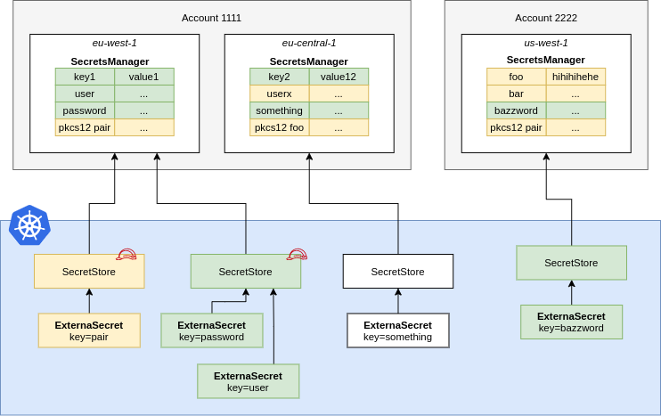

--8<-- "snippets/provider-aws-access.md"


## Secrets Manager

A `SecretStore` points to AWS Secrets Manager in a certain account within a defined region. You should define Roles that allow fine-grained access to individual secrets and pass them to ESO using `spec.provider.awssm.role`. This way users of the `SecretStore` can only access the secrets necessary.

``` yaml

```


Create a IAM Policy to pin down access to secrets matching `dev-*`.

``` json
{
  "Version": "2012-10-17",
  "Statement": [
    {
      "Effect": "Allow",
      "Action": [
        "secretsmanager:GetResourcePolicy",
        "secretsmanager:GetSecretValue",
        "secretsmanager:DescribeSecret",
        "secretsmanager:ListSecretVersionIds"
      ],
      "Resource": [
        "arn:aws:secretsmanager:us-west-2:111122223333:secret:dev-*",
      ]
    }
  ]
}
```
