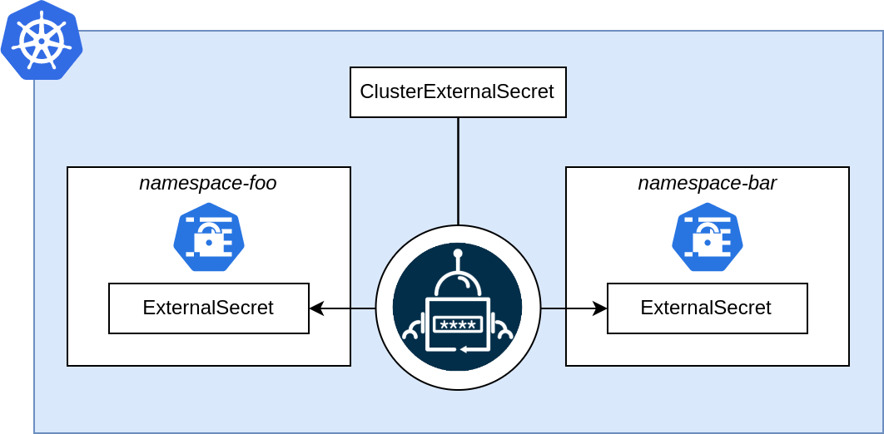

The `ClusterExternalSecret` is a cluster scoped resource that can be used to manage `ExternalSecret` resources in specific namespaces.

With `namespaceSelector` you can select namespaces in which the ExternalSecret should be created.
If there is a conflict with an existing resource the controller will error out.

## Example

Below is an example of the `ClusterExternalSecret` in use.

```yaml

```
