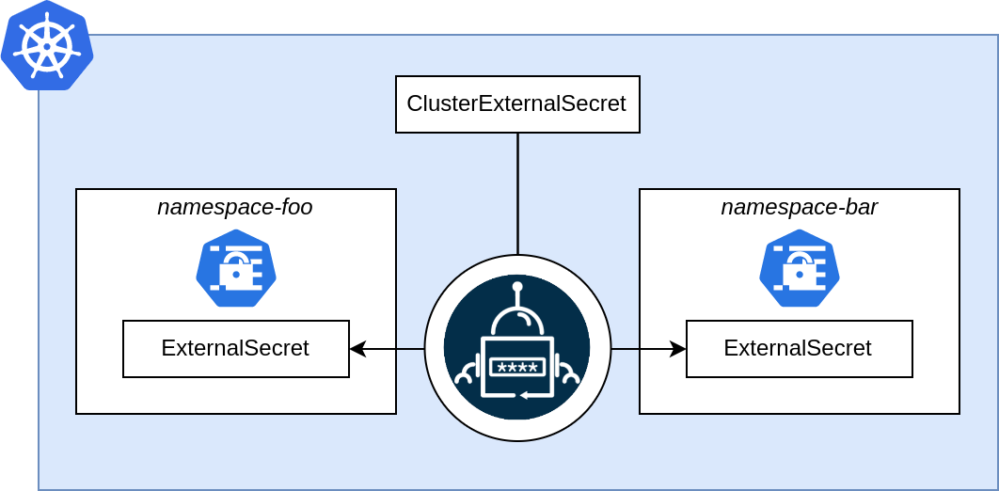
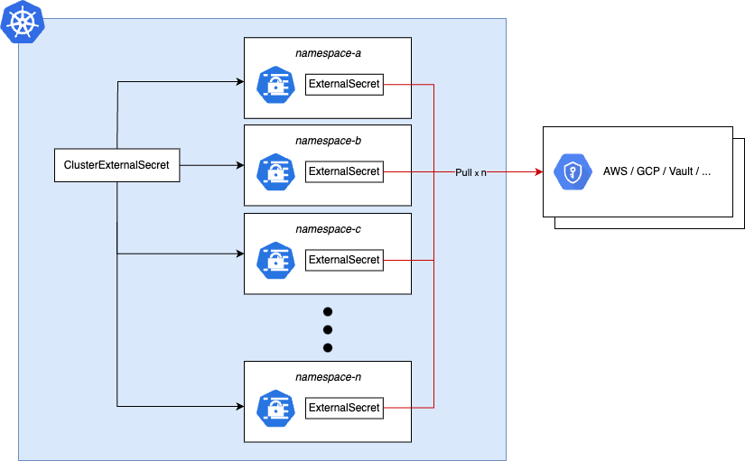
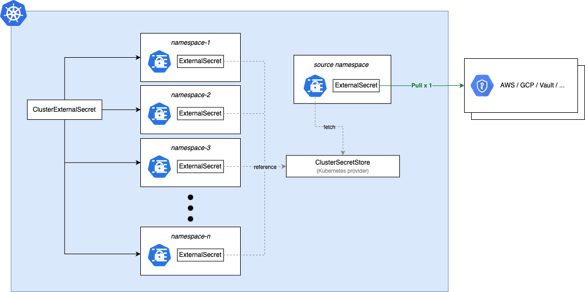

The `ClusterExternalSecret` is a cluster scoped resource that can be used to manage `ExternalSecret` resources in specific namespaces.

With `namespaceSelectors` you can select namespaces in which the ExternalSecret should be created.
If there is a conflict with an existing resource the controller will error out.

## Example

Below is an example of the `ClusterExternalSecret` in use.

```yaml

```

## Reducing provider calls for large namespace sets

A `ClusterExternalSecret` creates one `ExternalSecret` per matched namespace,
and **each of those `ExternalSecret`s independently polls the upstream
provider** on its own `refreshInterval`. Provider API calls and egress
therefore scale linearly with the number of matched namespaces, which can be
costly or hit rate limits when the selector matches many namespaces. This is
a known characteristic of the design — see
[`design/003-cluster-external-secret-spec.md`](https://github.com/external-secrets/external-secrets/blob/main/design/003-cluster-external-secret-spec.md#drawbacks).



When the namespace set is non-trivial, the recommended pattern is to pull
from the upstream provider **once** into a single in-cluster `Secret`, then
use the [Kubernetes provider](../provider/kubernetes.md) to fan that
`Secret` out via the `ClusterExternalSecret`:

1. A single namespace-scoped `ExternalSecret` pulls from the upstream
   provider and writes a `Secret` in a dedicated "source" namespace.
2. A `ClusterSecretStore` using the Kubernetes provider points at that
   source `Secret`.
3. A `ClusterExternalSecret` references that `ClusterSecretStore`,
   replicating the `Secret` into every matched namespace. Regardless of how
   many namespaces match, the upstream provider is only called by the single
   source `ExternalSecret` in step 1.



```yaml

```

The `ServiceAccount` and RBAC for the Kubernetes provider store are the same
as described in the [Kubernetes provider docs](../provider/kubernetes.md).

Direct use of `ClusterExternalSecret` against a cloud-backed store is still
appropriate for small namespace sets or when per-namespace refresh isolation
is intentional — this is a recommendation for minimizing provider load, not
a deprecation of the simpler pattern shown above.

## Synchronizing corresponding ExternalSecrets

Regular refreshes can be controlled using the `refreshPolicy` and
`refreshInterval` fields. Adhoc synchronizations can be triggered by
setting, updating or deleting the annotation `external-secrets.io/force-sync`
on the ClusterExternalSecret:

```
kubectl annotate ces my-ces external-secrets.io/force-sync=$(date +%s) --overwrite
```

Changes to this annotation will be synchronized to all ExternalSecrets
owned by the ClusterExternalSecret.

## Deprecations

### namespaceSelector

The field `namespaceSelector` has been deprecated in favor of `namespaceSelectors` and will be removed in a future
version.
