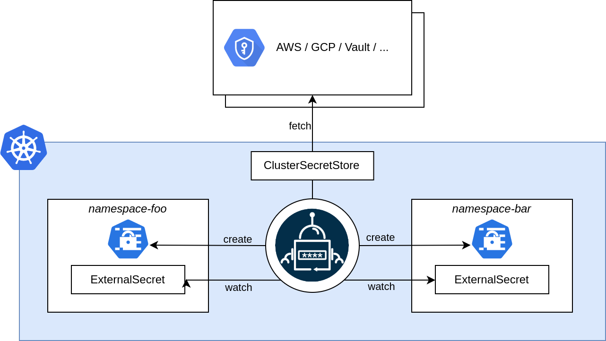

The `ClusterSecretStore` is a cluster scoped SecretStore that can be referenced by all
`ExternalSecrets` from all namespaces. Use it to offer a central gateway to your secret backend.


## Example

For a full list of supported fields see [spec](./spec.md) or dig into our [guides](../guides/introduction.md).

``` yaml

```
