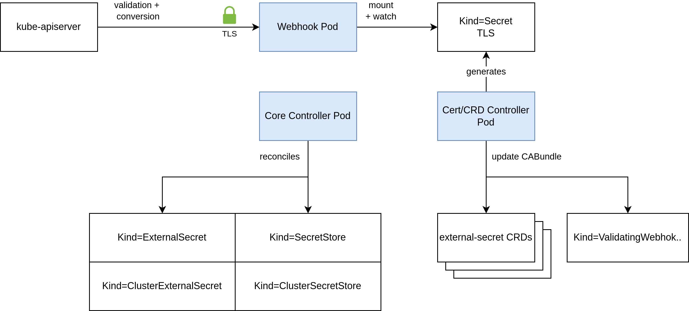

---
hide:
  - toc
---

# Components

## Overview

Exernal Secrets comes with three components: `Core Controller`, `Webhook` and `Cert Controller`.

This is due to the need to implement conversion webhooks in order to convert custom resources between api versions and
to provide a ValidatingWebhook for the `ExternalSecret` and `SecretStore` resources.

These features are optional but highly recommended. You can disable them with helm chart values `certController.create=false` and `webhook.create=false`.

 

### TLS Bootstrap

Cert-controller is responsible for (1) generating TLS credentials which will be used by the webhook component and (2) injecting the certificate as `caBundle` into `Kind=CustomResourceDefinition` for conversion webhooks and `Kind=ValidatingWebhookConfiguration` for validating admission webhook. The TLS credentials are stored in a `Kind=Secret` which is consumed by the webhook.

{: style="width:70%;"}