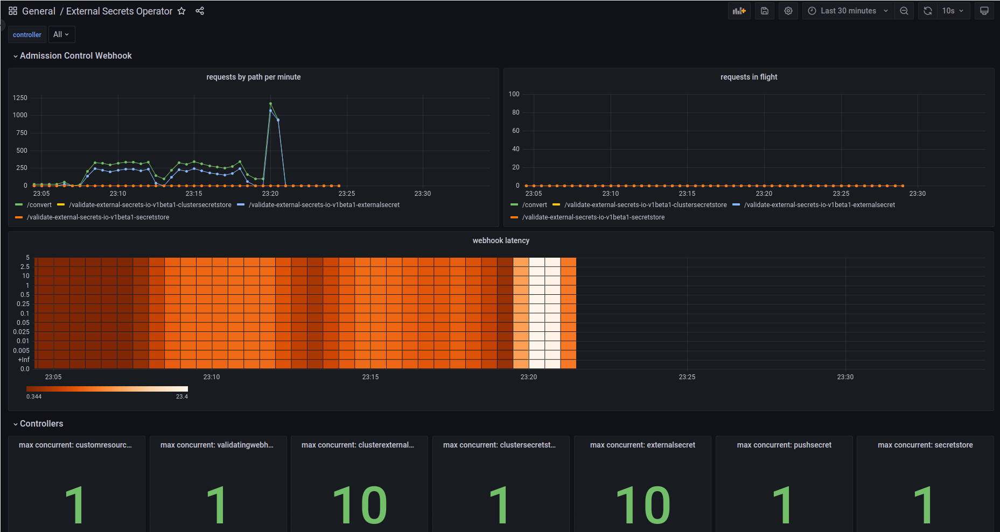
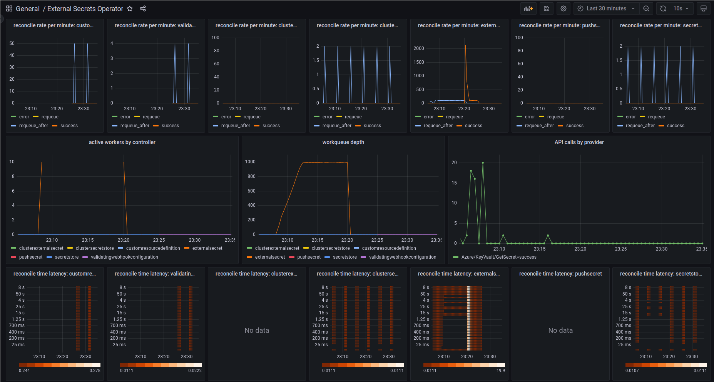

---
hide:
  - toc
---

# Metrics

The External Secrets Operator exposes its Prometheus metrics in the `/metrics` path. To enable it, set the `serviceMonitor.enabled` Helm flag to `true`.

If you are using a different monitoring tool that also needs a `/metrics` endpoint, you can set the `metrics.service.enabled` Helm flag to `true`. In addition you can also set `webhook.metrics.service.enabled` and `certController.metrics.service.enabled` to scrape the other components.

The Operator has [the controller-runtime metrics inherited from kubebuilder](https://book.kubebuilder.io/reference/metrics-reference.html) plus some custom metrics with a resource name prefix, such as `externalsecret_`.

## Cluster External Secret Metrics
| Name                                       | Type  | Description                                                |
|--------------------------------------------|-------|------------------------------------------------------------|
| `clusterexternalsecret_status_condition`   | Gauge | The status condition of a specific Cluster External Secret |
| `clusterexternalsecret_reconcile_duration` | Gauge | The duration time to reconcile the Cluster External Secret |

## External Secret Metrics
| Name                                           | Type      | Description                                                                                                                                                                                                             |
|------------------------------------------------|-----------|-------------------------------------------------------------------------------------------------------------------------------------------------------------------------------------------------------------------------|
| `externalsecret_provider_api_calls_count`      | Counter   | Number of API calls made to an upstream secret provider API. The metric provides a `provider`, `call` and `status` labels.                                                                                              |
| `externalsecret_sync_calls_total`              | Counter   | Total number of the External Secret sync calls                                                                                                                                                                          |
| `externalsecret_sync_calls_error`              | Counter   | Total number of the External Secret sync errors                                                                                                                                                                         |
| `externalsecret_status_condition`              | Gauge     | The status condition of a specific External Secret                                                                                                                                                                      |
| `externalsecret_reconcile_duration`            | Gauge     | The duration time to reconcile the External Secret                                                                                                                                                                      |

## Cluster Secret Store Metrics
| Name                                    | Type  | Description                                             |
|-----------------------------------------|-------|---------------------------------------------------------|
| `clustersecretstore_status_condition`   | Gauge | The status condition of a specific Cluster Secret Store |
| `clustersecretstore_reconcile_duration` | Gauge | The duration time to reconcile the Cluster Secret Store |

# Secret Store Metrics
| Name                             | Type  | Description                                     |
|----------------------------------|-------|-------------------------------------------------|
| `secretstore_status_condition`   | Gauge | The status condition of a specific Secret Store |
| `secretstore_reconcile_duration` | Gauge | The duration time to reconcile the Secret Store |

## Controller Runtime Metrics
See [the kubebuilder documentation](https://book.kubebuilder.io/reference/metrics-reference.html) on the default exported metrics by controller-runtime.

## Dashboard

We provide a [Grafana Dashboard](https://raw.githubusercontent.com/external-secrets/external-secrets/main/docs/snippets/dashboard.json) that gives you an overview of External Secrets Operator:





## Service Level Indicators and Alerts

We find the following Service Level Indicators (SLIs) useful when operating ESO. They should give you a good starting point and hints to develop your own Service Level Objectives (SLOs).

#### Webhook HTTP Status Codes
The webhook HTTP status code indicates that a HTTP Request was answered successfully or not.
If the Webhook pod is not able to serve the requests properly then that failure may cascade down to the controller or any other user of `kube-apiserver`.

SLI Example: request error percentage.
```
sum(increase(controller_runtime_webhook_requests_total{service=~"external-secrets.*",code="500"}[1m]))
/
sum(increase(controller_runtime_webhook_requests_total{service=~"external-secrets.*"}[1m]))
```

#### Webhook HTTP Request Latency
If the webhook server is not able to respond in time then that may cause a timeout at the client.
This failure may cascade down to the controller or any other user of `kube-apiserver`.

SLI Example: p99 across all webhook requests.
```
histogram_quantile(0.99,
  sum(rate(controller_runtime_webhook_latency_seconds_bucket{service=~"external-secrets.*"}[5m])) by (le)
)
```

#### Controller Workqueue Depth
If the workqueue depth is > 0 for a longer period of time then this is an indicator for the controller not being able to reconcile resources in time. I.e. delivery of secret updates is delayed.

Note: when a controller is restarted, then `queue length = total number of resources`. Make sure to measure the time it takes for the controller to fully reconcile all secrets after a restart. In large clusters this may take a while, make sure to define an acceptable timeframe to fully reconcile all resources.

```
sum(
  workqueue_depth{service=~"external-secrets.*"}
) by (name)
```

#### Controller Reconcile Latency
The controller should be able to reconcile resources within a reasonable timeframe. When latency is high secret delivery may impacted.

SLI Example: p99 across all controllers.
```
histogram_quantile(0.99,
  sum(rate(controller_runtime_reconcile_time_seconds_bucket{service=~"external-secrets.*"}[5m])) by (le)
)
```

#### Controller Reconcile Error
The controller should be able to reconcile resources without errors. When errors occurr secret delivery may be impacted which could cascade down to the secret consuming applications.

```
sum(increase(
  controller_runtime_reconcile_total{service=~"external-secrets.*",controller=~"$controller",result="error"}[1m])
) by (result)
```
