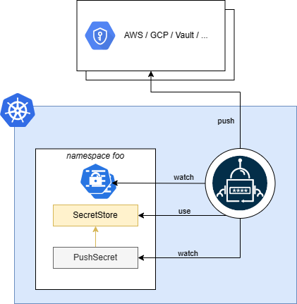

The `PushSecret` is namespaced and it describes what data should be pushed to the secret provider.

* tells the operator what secrets should be pushed by using `spec.selector`.
* you can specify what secret keys should be pushed by using `spec.data`.
* you can also template the resulting property values using [templating](#templating).

``` yaml

```

## Templating

When the controller reconciles the `PushSecret` it will use the `spec.template` as a blueprint to construct a new property.
You can use golang templates to define the blueprint and use template functions to transform the defined properties.
You can also pull in `ConfigMaps` that contain golang-template data using `templateFrom`.
See [advanced templating](../guides/templating.md) for details.
