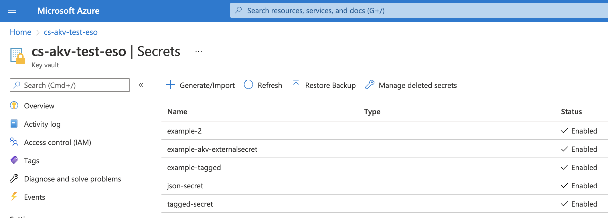

# Multiple secrets

In some escenarios, you may have different secrets in your Provider but you don't want to write an ExternalSecret for each of them. In that case, you can create a single ExternalSecret that will fetch many secrets and creates one single `Kind=Secret` with all of them.

Let's look an example on how to retrieve many different secrets.

In my Azure Key Vault I have all these secrets



You cannot see it in the picture but using the Azure CLI tool aI can easily query them and display the name and tags, which is what I'm mostly interested in right now. 

```sh
❯ az keyvault secret list --vault-name=cs-akv-test-eso --query '[].{Name:name,Tags:tags}'
```
```json
[
  {
    "Name": "example-2",
    "Tags": {}
  },
  {
    "Name": "example-akv-externalsecret",
    "Tags": {
      "author": "seb",
      "file-encoding": "utf-8"
    }
  },
  {
    "Name": "example-tagged",
    "Tags": {
      "author": "seb",
      "environment": "dev"
    }
  },
  {
    "Name": "json-secret",
    "Tags": {}
  },
  {
    "Name": "tagged-secret",
    "Tags": {
      "author": "seb",
      "environment": "dev"
    }
  }
]
```

### Creating dataFrom external secret

Now, when creating our ExternalSecret resource, instead of using the data field, we use the dataFrom field:

```yaml

```

To check both values we can run:

```sh
❯ kubectl get secret secret-to-be-created -o jsonpath='{.data}'
```
```json
{
  "example-2": "VGhpcyBpcyBhbm90aGVyIHNlY3JldA==",
  "example-akv-externalsecret": "VGhpcyBpcyBhIHZlcnkgc2VjdXJlIHNlY3JldA==",
  "example-tagged": "VGhpcyBpcyB0aGUgdGFnZ2VkIGV4YW1wbGU=",
  "tagged-secret": "VGhpcyBpcyBhIHRhZ2dlZCBzZWNyZXQ="
}
```
