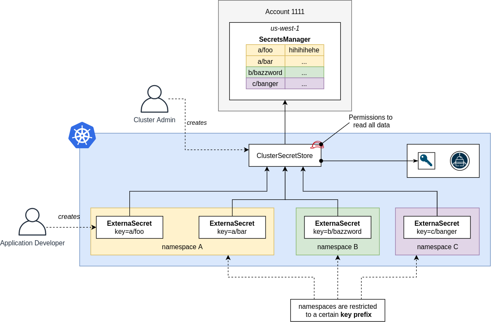
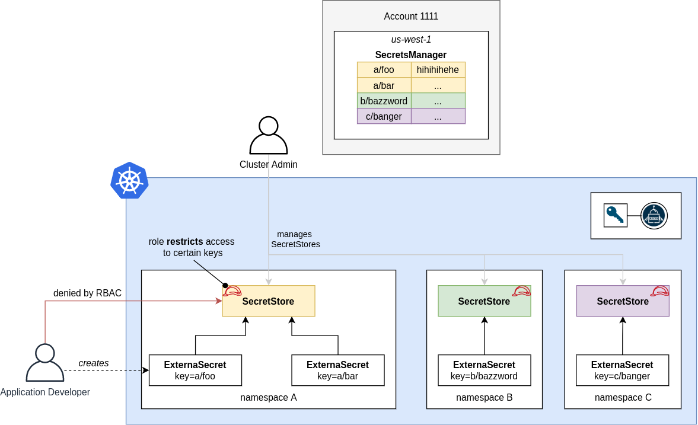
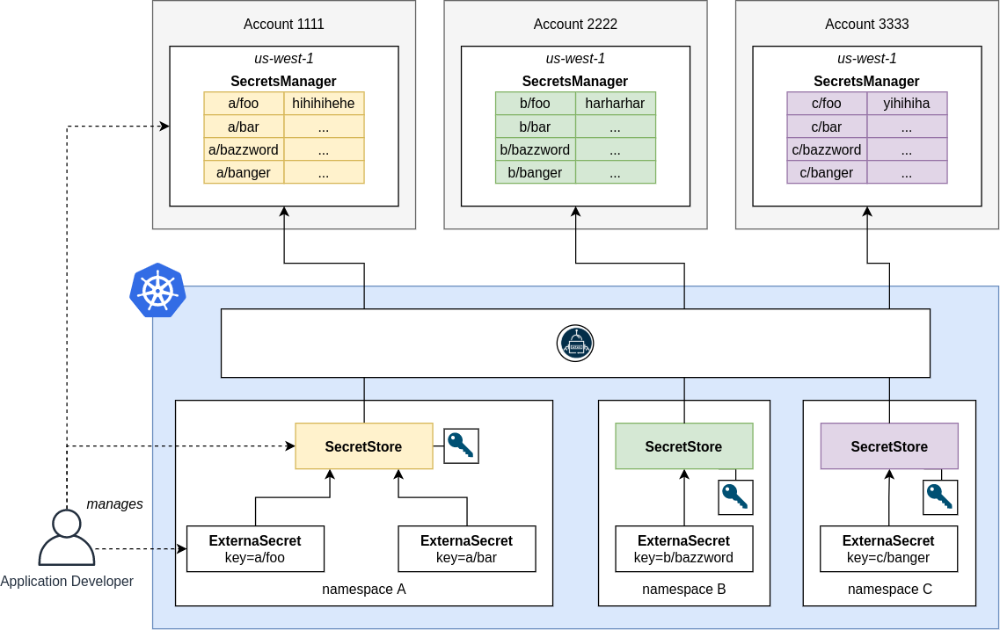

External Secrets Operator provides different modes of operation to fulfill
organizational needs. This guide outlines the flexibility of ESO and should give
you a first impression of how you can employ this operator in your organization.

For a multi-tenant deployment you should first examine your organizational
structure:

1. what roles (i.e. *Application Developers*, *Cluster Admins*, ...) do you have
   in your organization,
2. what responsibilities do they have and
3. how does that map to Kubernetes RBAC roles.

Further, you should examine how your external API provider manages access
control for your secrets. Can you limit access by secret names (e.g.
`db/dev/*`)? Or only on a bucket level? Please keep in mind that not all
external APIs provide fine-grained access management for secrets.

**Note:** The following examples should **not** be considered as best practice
but rather as a example to show how to combine different mechanics and
techniques for tenant isolation.

### Shared ClusterSecretStore

A Cluster Administrator deploys a `ClusterSecretStore` (CSS) and manages access
to the external API. The CSS is shared by all tenants within the cluster.
Application Developers do reference it in a `ExternalSecret` but can not create
a ClusterSecretStores or SecretStores on their own. Now all application
developers have access to all the secrets. You probably want to limit access to
certain keys or prefixes that should be used. ESO does not provide a mechanic
to limit access to certain keys per namespace. More advanced validation should be
done with an Admission Webhook, e.g. with [Kyverno](https://kyverno.io/) or
[Open Policy Agent](https://www.openpolicyagent.org/)).

This setup suites well if you have one central bucket that contains all of your
secrets and your Cluster Administrators should manage access to it. This setup
is very simple but does not scale very well.

### Managed SecretStore per Namespace

Cluster Administrators manage one or multiple `SecretStores` per Namespace. Each
SecretStore uses it's own *role* that limits access to a small set of keys. The
peculiarity of this is approach is, that **access is actually managed by the
external API** which provides the roles. The Cluster Administrator does just the
wiring. This approach may be desirable if you have an external entity - let's
call it **Secret Administrator** - that manages access and lifecycle of the
secrets.

### ESO as a Service

Every namespace is self-contained. Application developers manage `SecretStore`,
`ExternalSecret` and secret infrastructure on their own. Cluster Administrators
*just* provide the External Secrets Operator as a service.

This makes sense if application developers should be completely autonomous while
a central team provides common services.
