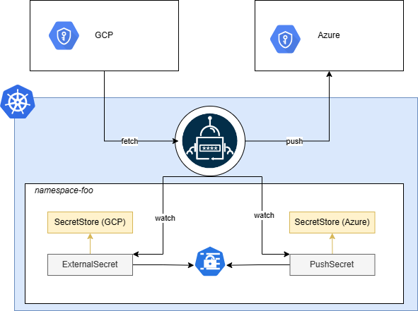

Contrary to what `ExternalSecret` does by pulling secrets from secret providers and creating `kind=Secret` in your cluster, `PushSecret` reads a local `kind=Secret` and pushes its content to a secret provider.

If there's already a secret in the secrets provided with the intended name of the secret to be created by the `PushSecret` you'll see the `PushSecret` in Error state, and when described you'll see a message saying `secret not managed by external-secrets`.

By default, the secret created in the secret provided will not be deleted even after deleting the `PushSecret`, unless you set `spec.deletionPolicy` to Delete. 

``` yaml

```

## Backup use case

An interesting use case for `kind=PushSecret` is backing up your current secret from one provider to another one.

Imagine you have your secrets in GCP and you want to back them up in Azure Key Vault. You would then create a `SecretStore` for each provider, and an `ExternalSecret` to pull the secrets from GCP. This will generate a `kind=Secret` in your cluster that you can use as the source of a `PushSecret` configured with the Azure `SecretStore`. 



## Pushing the whole secret

There are two ways to push an entire secret without defining all keys individually.

By leaving off the secret key and remote property options.

```yaml

```

This will result in all keys being pushed as they are into the remote location.

By leaving off the secret key but setting the remote property option.

```yaml

```

This will _marshal_ the entire secret data and push it into this single property as a JSON object.

!!! warning inline
    This should _ONLY_ be done if the secret data is marshal-able. Values like, binary data cannot be marshaled and will result in error or invalid secret data.
