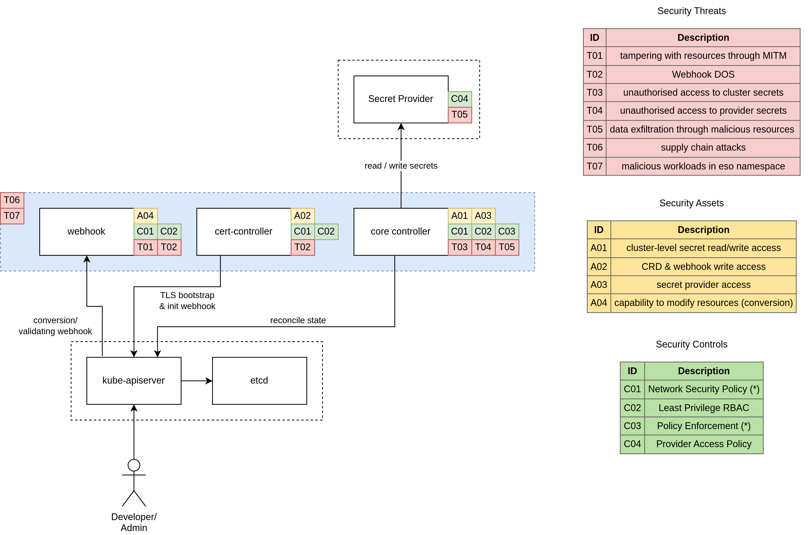

---
hide:
  - toc
---

## Background

The External Secrets Operator is a Kubernetes Operator that seamlessly incorporates external secret management systems into Kubernetes. This Operator retrieves data from the external API and generates Kubernetes Secret resources using the corresponding secret values. This process occurs continuously in the background through regular polling of the external API. Consequently, whenever a secret undergoes changes in the external API, the corresponding Kubernetes Secret will also be updated accordingly.

### Summary

| Purpose             | Description                  |
| ------------------- | ---------------------------- |
| Intended Usage      | Sync Secrets into Kubernetes |
| Data Classifiation  | Critical                     |
| Highest Risk Impact | Organisation takeover        |

### Components

ESO comprises three main components: `webhook`, `cert controller` and a `core controller`. For more detailed information, please refer to the documentation on [components](../api/components.md).

## Overview

This section provides an overview of the security aspects of the External Secrets Operator (ESO) and includes information on assets, threats, and controls involved in its operation.

The following diagram illustrates the security perspective of how ESO functions, highlighting the assets (items to protect), threats (potential risks), and controls (measures to mitigate threats).

### Scope

For the purpose of this threat model, we assume an ESO installation using helm and default settings on a public cloud provider. It is important to note that the [Kubernetes SIG Security](https://github.com/kubernetes/community/tree/master/sig-security) team has defined an [Admission Control Threat Model](https://github.com/kubernetes/sig-security/blob/main/sig-security-docs/papers/admission-control/kubernetes-admission-control-threat-model.md), which is recommended reading for a better understanding of the security aspects that partially apply to External Secrets Operator.

ESO utilizes the `ValidatingWebhookConfiguration` mechanism to validate `(Cluster)SecretStore` and `(Cluster)ExternalSecret` resources. However, it is essential to understand that this validation process does not serve as a security control mechanism. Instead, ESO performs validation by enforcing additional rules that go beyond the [CustomResourceDefinition OpenAPI v3 Validation schema](https://kubernetes.io/docs/tasks/extend-kubernetes/custom-resources/custom-resource-definitions/#validation).

### Assets

#### A01: Cluster-Level access to secrets

The controller possesses privileged access to the `kube-apiserver` and is authorized to read and write secret resources across all namespaces within a cluster.

#### A02: CRD and Webhook Write access

The cert-controller component has read/write access to `ValidatingWebhookConfigurations` and `CustomResourceDefinitions` resources. This access is necessary to inject/modify the caBundle property.

#### A03: secret provider access

The `core-controller` component accesses a secret provider using user-supplied credentials. These credentials can be derived from environment variables, mounted service account tokens, files within the controller container, or fetched from the Kubernetes API (e.g., `Kind=Secret`). The scope of these credentials may vary, potentially providing full access to a cloud provider.

#### A04: capability to modify resources

The webhook component validates and converts ExternalSecret and SecretStore resources. The conversion webhook is essential for migrating resources from the old version `v1alpha1` to the new version `v1beta1`. The webhook component possesses the ability to modify resources during runtime.

### Threats

#### T01: Tampering with resources through MITM

An adversary could launch a Man-in-the-Middle (MITM) attack to hijack the webhook pod, enabling them to manipulate the data of the conversion webhook. This could involve injecting malicious resources or causing a Denial-of-Service (DoS) attack. To mitigate this threat, a mutual authentication mechanism should be enforced for the connection between the Kubernetes API server and the webhook service to ensure that only authenticated endpoints can communicate.

#### T02: Webhook DOS

Currently, ESO generates an X.509 certificate for webhook registration without authenticating the kube-apiserver. Consequently, if an attacker gains network access to the webhook Pod, they can overload the webhook server and initiate a DoS attack. As a result, modifications to ESO resources may fail, and the ESO core controller may be impacted due to the unavailability of the conversion webhook.

#### T03: Unauthorized access to cluster secrets

An attacker can gain unauthorized access to secrets by utilizing the service account token of the ESO core controller Pod or exploiting software vulnerabilities. This unauthorized access allows the attacker to read secrets within the cluster, potentially leading to a cluster takeover.

#### T04: unauthorized access to secret provider credentials

An attacker can gain unauthorized access to credentials that provide access to external APIs storing secrets. If the credentials have overly broad permissions, this could result in an organization takeover.

#### T05: data exfiltration through malicious resources

An attacker can exfiltrate data from the cluster by utilizing maliciously crafted resources. Multiple attack vectors can be employed, e.g.:

1. copying data from a namespace to an unauthorized namespace
2. exfiltrating data to an unauthorized secret provider
3. exfiltrating data through an authorized secret provider to a malicious provider account

Successful data exfiltration can lead to intellectual property loss, information misuse, loss of customer trust, and damage to the brand or reputation.

#### T06: supply chain attacks

An attack can infiltrate the ESO container through various attack vectors. The following are some potential entry points, although this is not an exhaustive list. For a comprehensive analysis, refer to [SLSA Threats and mitigations](https://slsa.dev/spec/v0.1/threats) or [GCP software supply chain threats](https://cloud.google.com/software-supply-chain-security/docs/attack-vectors).

1. Source Threats: Unauthorized changes or inclusion of vulnerable code in ESO through code submissions.
2. Build Threats: Creation and distribution of malicious builds of ESO, such as in container registries, Artifact Hub, or Operator Hub.
3. Dependency Threats: Introduction of vulnerable code into ESO dependencies.
4. Deployment and Runtime Threats: Injection of malicious code through compromised deployment processes.

#### T07: malicious workloads in eso namespace

An attacker can deploy malicious workloads within the external-secrets namespace, taking advantage of the ESO service account with potentially cluster-wide privileges.

### Controls

#### C01: Network Security Policy

Implement a NetworkPolicy to restrict traffic in both inbound and outbound directions on all networks. Employ a "deny all" / "permit by exception" approach for inbound and outbound network traffic. The specific network policies for the core-controller depend on the chosen provider. The webhook and cert-controller have well-defined sets of endpoints they communicate with. Refer to the [Security Best Practices](./security-best-practices.md) documentation for inbound and outbound network requirements.

Please note that ESO does not provide pre-packaged network policies, and it is the user's responsibility to implement the necessary security controls.

#### C02: Least Privilege RBAC

Adhere to the principle of least privilege by configuring Role-Based Access Control (RBAC) permissions not only for the ESO workload but also for all users interacting with it. Ensure that RBAC permissions on provider side are appropriate according to your setup, by for example limiting which sensitive information a given credential can have access to. Ensure that  kubernetes RBAC are set up to grant access to ESO resources only where necessary. For example, allowing write access to `ClusterSecretStore`/`ExternalSecret` may be sufficient for a threat to become a reality.

#### C03: Policy Enforcement

Implement a Policy Engine such as Kyverno or OPA to enforce restrictions on changes to ESO resources. The specific policies to be enforced depend on the environment. Here are a few suggestions:

1. (Cluster)SecretStore: Restrict the allowed secret providers, disallowing unused or undesired providers (e.g. Webhook).
2. (Cluster)SecretStore: Restrict the permitted authentication mechanisms (e.g. prevent usage of `secretRef`).
3. (Cluster)SecretStore: Enforce limitations on modifications to provider-specific fields relevant for security, such as `caBundle`, `caProvider`, `region`, `role`, `url`, `environmentType`, `identityId`, and `others`.
4. ClusterSecretStore: Control the usage of `namespaceSelector`, such as forbidding or mandating the usage of the `kube-system` namespace.
5. ClusterExternalSecret: Restrict the usage of `namespaceSelector`.

Please note that ESO does not provide pre-packaged policies, and it is the user's responsibility to implement the necessary security controls.

#### C04: Provider Access Policy

Configure fine-grained access control on the HTTP endpoint of the secret provider to prevent data exfiltration across accounts or organizations. Consult the documentation of your specific provider (e.g.: [AWS Secrets Manager VPC Endpoint Policies](https://docs.aws.amazon.com/secretsmanager/latest/userguide/vpc-endpoint-overview.html), [GCP Private Service Connect](https://cloud.google.com/vpc/docs/private-service-connect), or [Azure Private Link](https://learn.microsoft.com/en-us/azure/key-vault/general/private-link-service)) for guidance on setting up access policies.

#### C05: Entirely disable CRDs

You should disable unused CRDs to narrow down your attack surface. Not all users require the use of `PushSecret`, `ClusterSecretStore` or `ClusterExternalSecret` resources.
