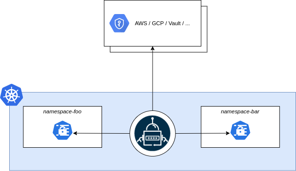

# Introduction

**External Secrets Operator** is a Kubernetes operator that integrates external
secret management systems like [AWS Secrets
Manager](https://aws.amazon.com/secrets-manager/), [HashiCorp
Vault](https://www.vaultproject.io/), [Google Secrets
Manager](https://cloud.google.com/secret-manager), [Azure Key
Vault](https://azure.microsoft.com/en-us/services/key-vault/), [IBM Cloud Secrets Manager](https://www.ibm.com/cloud/secrets-manager), [CyberArk Conjur](https://www.conjur.org) and many more. The
operator reads information from external APIs and automatically injects the
values into a [Kubernetes
Secret](https://kubernetes.io/docs/concepts/configuration/secret/).

### What is the goal of External Secrets Operator?

The goal of External Secrets Operator is to synchronize secrets from external
APIs into Kubernetes. ESO is a collection of custom API resources -
`ExternalSecret`, `SecretStore` and `ClusterSecretStore` that provide a
user-friendly abstraction for the external API that stores and manages the
lifecycle of the secrets for you.

### Where to get started

To get started, please read through [API overview](introduction/overview.md) this should
give you a high-level overview to understand the API and use-cases. After that
please follow one of our [guides](guides/introduction.md) to get a jump start
using the operator. See our [getting started guide](introduction/getting-started.md) for installation instructions.

For a complete reference of the API types please refer to our [API
Reference](api/spec.md).

### How to get involved

This project is driven by its users and contributors, and we welcome everybody
to get involved. Join our meetings, open issues or ask questions in Slack. The
success of this project depends on your input: No contribution is too small -
even opinions matter!

How to get involved:

- Bi-weekly Development Meeting every odd week at [8:00 PM Berlin Time](https://dateful.com/time-zone-converter?t=20:00&tz=Europe/Berlin) on Wednesday
  ([agenda](https://hackmd.io/GSGEpTVdRZCP6LDxV3FHJA), [jitsi call](https://meet.jit.si/eso-community-meeting))
- [Kubernetes Slack
  #external-secrets](https://kubernetes.slack.com/messages/external-secrets)
- [Contributing Process](contributing/process.md)
- [Twitter](https://twitter.com/ExtSecretsOptr)

### Kicked off by

### Sponsored by

