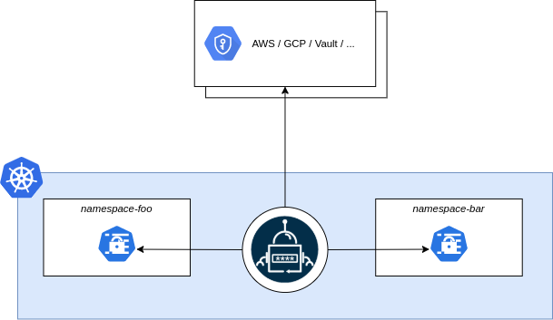
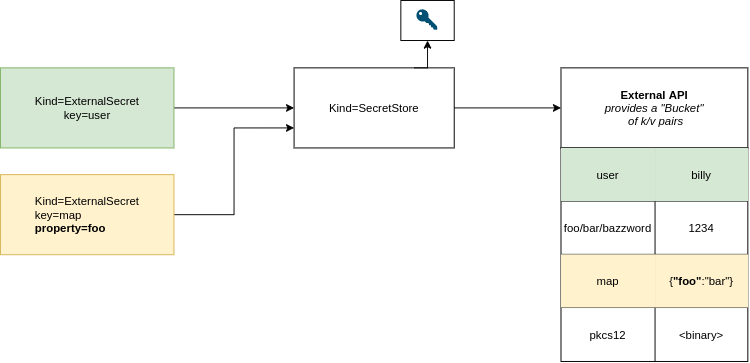

# API Overview

## Architecture


The External Secrets Operator extends Kubernetes with [Custom
Resources](https://kubernetes.io/docs/concepts/extend-kubernetes/api-extension/custom-resources/),
which define where secrets live and how to synchronize them. The controller
fetches secrets from an external API and creates Kubernetes
[secrets](https://kubernetes.io/docs/concepts/configuration/secret/). If the
secret from the external API changes, the controller will reconcile the state in
the cluster and update the secrets accordingly.


## Resource model

To understand the mechanics of the operator let's start with the data model. The
SecretStore references a bucket of key/value pairs. But because every external
API is slightly different this bucket may be e.g. an instance of an Azure
KeyVault or a AWS Secrets Manager in a certain AWS Account and region. Please
take a look at the provider documentation to see what the Bucket actually maps
to.



### SecretStore

The idea behind the [SecretStore](../api/secretstore.md) resource is to separate concerns of
authentication/access and the actual Secret and configuration needed for
workloads. The ExternalSecret specifies what to fetch, the SecretStore specifies
how to access. This resource is namespaced.

``` yaml

```
The `SecretStore` contains references to secrets which hold credentials to
access the external API.

### ExternalSecret
An [ExternalSecret](../api/externalsecret.md) declares what data to fetch. It has a reference to a
`SecretStore` which knows how to access that data. The controller uses that
`ExternalSecret` as a blueprint to create secrets.

``` yaml

```

### ClusterSecretStore

The [ClusterSecretStore](../api/clustersecretstore.md) is a global, cluster-wide SecretStore that can be
referenced from all namespaces. You can use it to provide a central gateway to your secret provider.

## Behavior

The External Secret Operator (ESO for brevity) reconciles `ExternalSecrets` in
the following manner:

1. ESO uses `spec.secretStoreRef` to find an appropriate `SecretStore`. If it
   doesn't exist or the `spec.controller` field doesn't match it won't further
   process this ExternalSecret.
2. ESO instanciates an external API client using the specified credentials from
   the `SecretStore` spec.
3. ESO fetches the secrets as requested by the `ExternalSecret`, it will decode
   the secrets if required
5. ESO creates an `Kind=Secret` based on the template provided by
   `ExternalSecret.target.template`. The `Secret.data` can be templated using
   the secret values from the external API.
6. ESO ensures that the secret values stay in sync with the external API

## Roles and responsibilities

The External Secret Operator is designed to target the following persona:

* **Cluster Operator**: The cluster operator is responsible for setting up the
  External Secret Operator, managing access policies and creating
  ClusterSecretStores.
* **Application developer**: The Application developer is responsible for
  defining ExternalSecrets and the application configuration

Each persona will roughly map to a Kubernetes RBAC role. Depending on your
environment these roles can map to a single user. **Note:** There is no Secret
Operator that handles the lifecycle of the secret, this is out of the scope of
ESO.

## Access Control

The External Secrets Operator runs as a deployment in your cluster with elevated
privileges. It will create/read/update secrets in all namespaces and has access
to secrets stored in some external API. Ensure that the credentials you provide
give ESO the least privilege necessary.

Design your `SecretStore`/`ClusterSecretStore` carefully! Be sure to restrict
access of application developers to read only certain
keys in a shared environment.

You should also consider using Kubernetes' admission control system (e.g.
[OPA](https://www.openpolicyagent.org/) or [Kyverno](https://kyverno.io/)) for
fine-grained access control.

## Running multiple Controller
You can run multiple controllers within the cluster. One controller can be
limited to only process `SecretStores` with a predefined `spec.controller`
field.

!!! note "Testers welcome"
    This is not widely tested. Please help us test the setup and/or document use-cases.
