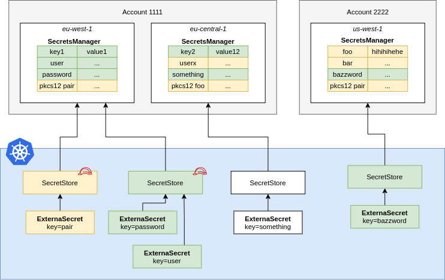

## Secrets Manager

A `SecretStore` points to AWS Secrets Manager in a certain account within a
defined region. You should define Roles that define fine-grained access to
individual secrets and pass them to ESO using `spec.provider.aws.role`. This
way users of the `SecretStore` can only access the secrets necessary.

``` yaml

```
**NOTE:** In case of a `ClusterSecretStore`, Be sure to provide `namespace` in `accessKeyIDSecretRef` and `secretAccessKeySecretRef`  with the namespaces where the secrets reside.
### IAM Policy

Create a IAM Policy to pin down access to secrets matching `dev-*`.

``` json
{
  "Version": "2012-10-17",
  "Statement": [
    {
      "Effect": "Allow",
      "Action": [
        "secretsmanager:GetResourcePolicy",
        "secretsmanager:GetSecretValue",
        "secretsmanager:DescribeSecret",
        "secretsmanager:ListSecretVersionIds"
      ],
      "Resource": [
        "arn:aws:secretsmanager:us-west-2:111122223333:secret:dev-*"
      ]
    }
  ]
}
```
### JSON Secret Values

SecretsManager supports *simple* key/value pairs that are stored as json. If you use the API you can store more complex JSON objects. You can access nested values or arrays using [gjson syntax](https://github.com/tidwall/gjson/blob/master/SYNTAX.md):

Consider the following JSON object that is stored in the SecretsManager key `my-json-secret`:
``` json
{
  "name": {"first": "Tom", "last": "Anderson"},
  "friends": [
    {"first": "Dale", "last": "Murphy"},
    {"first": "Roger", "last": "Craig"},
    {"first": "Jane", "last": "Murphy"}
  ]
}
```

This is an example on how you would look up nested keys in the above json object:

``` yaml

```

--8<-- "snippets/provider-aws-access.md"
