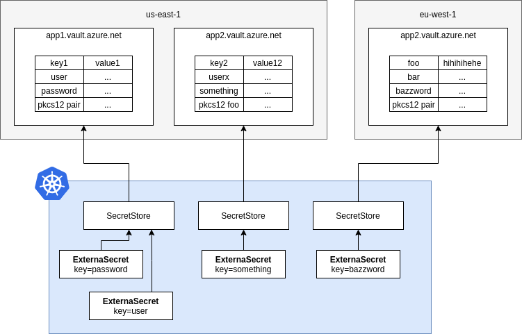

## Azure Key vault

External Secrets Operator integrates with [Azure Key vault](https://azure.microsoft.com/en-us/services/key-vault/) for secrets, certificates and Keys management.

### Authentication

We support Service Principals, Managed Identity and Workload Identity authentication.

To use Managed Identity authentication, you should use [aad-pod-identity](https://azure.github.io/aad-pod-identity/docs/) to assign the identity to external-secrets operator. To add the selector to external-secrets operator, use `podLabels` in your values.yaml in case of Helm installation of external-secrets.

#### Service Principal key authentication

A service Principal client and Secret is created and the JSON keyfile is stored in a `Kind=Secret`. The `ClientID` and `ClientSecret` should be configured for the secret. This service principal should have proper access rights to the keyvault to be managed by the operator

#### Managed Identity authentication

A Managed Identity should be created in Azure, and that Identity should have proper rights to the keyvault to be managed by the operator.

If there are multiple Managed Identitites for different keyvaults, the operator should have been assigned all identities via [aad-pod-identity](https://azure.github.io/aad-pod-identity/docs/), then the SecretStore configuration should include the Id of the idenetity to be used via the `identityId` field.

```yaml

```

#### Workload Identity

You can use [Azure AD Workload Identity Federation](https://docs.microsoft.com/en-us/azure/active-directory/develop/workload-identity-federation) to access Azure managed services like Key Vault **without needing to manage secrets**. You need to configure a trust relationship between your Kubernetes Cluster and Azure AD. This can be done in various ways, for instance using `terraform`, the Azure Portal or the `az` cli. We found the [azwi](https://azure.github.io/azure-workload-identity/docs/installation/azwi.html) cli very helpful. The Azure [Workload Identity Quick Start Guide](https://azure.github.io/azure-workload-identity/docs/quick-start.html) is also good place to get started.

This is basically a two step process:

1. Create a Kubernetes Service Account ([guide](https://azure.github.io/azure-workload-identity/docs/quick-start.html#5-create-a-kubernetes-service-account))

```sh
azwi serviceaccount create phase sa \
  --aad-application-name "${APPLICATION_NAME}" \
  --service-account-namespace "${SERVICE_ACCOUNT_NAMESPACE}" \
  --service-account-name "${SERVICE_ACCOUNT_NAME}"
```
2. Configure the trust relationship between Azure AD and Kubernetes ([guide](https://azure.github.io/azure-workload-identity/docs/quick-start.html#6-establish-federated-identity-credential-between-the-aad-application-and-the-service-account-issuer--subject))

```sh
azwi serviceaccount create phase federated-identity \
  --aad-application-name "${APPLICATION_NAME}" \
  --service-account-namespace "${SERVICE_ACCOUNT_NAMESPACE}" \
  --service-account-name "${SERVICE_ACCOUNT_NAME}" \
  --service-account-issuer-url "${SERVICE_ACCOUNT_ISSUER}"
```

With these prerequisites met you can configure `ESO` to use that Service Account. You have two options:

##### Mounted Service Account
You run the controller and mount that particular service account into the pod. That grants _everyone_ who is able to create a secret store or reference a correctly configured one the ability to read secrets. **This approach is usually not recommended**. But may make sense when you want to share an identity with multiple namespaces. Also see our [Multi-Tenancy Guide](guides-multi-tenancy.md) for design considerations.

```yaml

```

##### Referenced Service Account
You run the controller without service account (effectively without azure permissions). Now you have to configure the SecretStore and set the `serviceAccountRef` and point to the service account you have just created. **This is usually the recommended approach**. It makes sense for everyone who wants to run the controller withour Azure permissions and delegate authentication via service accounts in particular namespaces. Also see our [Multi-Tenancy Guide] for design considerations.

```yaml

```

### Update secret store
Be sure the `azurekv` provider is listed in the `Kind=SecretStore`

```yaml

```
**NOTE:** In case of a `ClusterSecretStore`, Be sure to provide `namespace` in `clientId` and `clientSecret`  with the namespaces where the secrets reside.

Or in case of Managed Idenetity authentication:

```yaml

```

### Object Types

Azure KeyVault manages different [object types](https://docs.microsoft.com/en-us/azure/key-vault/general/about-keys-secrets-certificates#object-types), we support `keys`, `secrets` and `certificates`. Simply prefix the key with `key`, `secret` or `cert` to retrieve the desired type (defaults to secret).

| Object Type   | Return Value                                                                                                                                                                                                                      |
| ------------- | --------------------------------------------------------------------------------------------------------------------------------------------------------------------------------------------------------------------------------- |
| `secret`      | the raw secret value.                                                                                                                                                                                                             |
| `key`         | A JWK which contains the public key. Azure KeyVault does **not** export the private key. You may want to use [template functions](guides-templating.md) to transform this JWK into PEM encoded PKIX ASN.1 DER format. |
| `certificate` | The raw CER contents of the x509 certificate. You may want to use [template functions](guides-templating.md) to transform this into your desired encoding                                                             |


### Creating external secret

To create a kubernetes secret from the Azure Key vault secret a `Kind=ExternalSecret` is needed.

You can manage keys/secrets/certificates saved inside the keyvault , by setting a "/" prefixed type in the secret name , the default type is a `secret`. other supported values are `cert` and `key`

to select all secrets inside the key vault , you can use the `dataFrom` directive

```yaml

```

The operator will fetch the Azure Key vault secret and inject it as a `Kind=Secret`
```
kubectl get secret secret-to-be-created -n <namespace> | -o jsonpath='{.data.dev-secret-test}' | base64 -d
```
