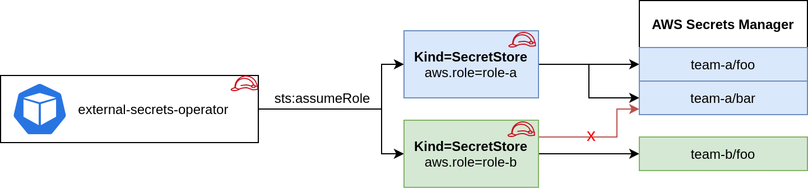
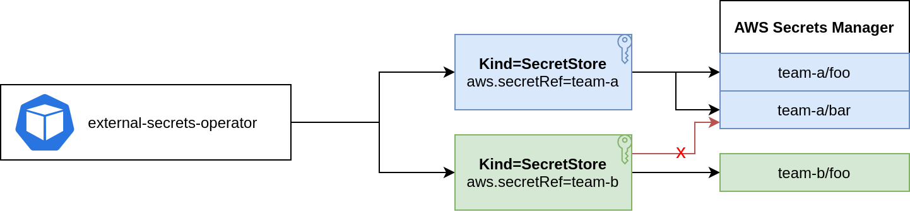
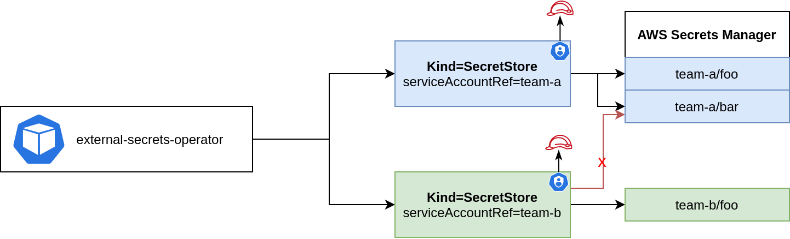

## AWS Authentication

### Controller's Pod Identity



Note: If you are using Parameter Store replace `service: SecretsManager` with `service: ParameterStore` in all examples below. For Certificate Manager use `service: CertificateManager`.

This is basically a zero-configuration authentication method that inherits the credentials from the runtime environment using the [aws sdk default credential chain](https://docs.aws.amazon.com/sdk-for-java/v1/developer-guide/credentials.html#credentials-default).

You can attach a role to the pod using [IRSA](https://docs.aws.amazon.com/eks/latest/userguide/iam-roles-for-service-accounts.html), [kiam](https://github.com/uswitch/kiam) or [kube2iam](https://github.com/jtblin/kube2iam). When no other authentication method is configured in the `Kind=SecretStore` this role is used to make all API calls against AWS Secrets Manager, SSM Parameter Store or Certificate Manager.

Based on the Pod's identity you can do a `sts:assumeRole` before fetching the secrets to limit access to certain keys in your provider. This is optional.

```yaml
apiVersion: external-secrets.io/v1
kind: SecretStore
metadata:
  name: team-b-store
spec:
  provider:
    aws:
      service: SecretsManager
      region: eu-central-1
      # optional: do a sts:assumeRole before fetching secrets
      role: team-b
```

### Access Key ID & Secret Access Key



You can store Access Key ID & Secret Access Key in a `Kind=Secret` and reference it from a SecretStore.

```yaml
apiVersion: external-secrets.io/v1
kind: SecretStore
metadata:
  name: team-b-store
spec:
  provider:
    aws:
      service: SecretsManager
      region: eu-central-1
      # optional: assume role before fetching secrets
      role: team-b
      auth:
        secretRef:
          accessKeyIDSecretRef:
            name: awssm-secret
            key: access-key
          secretAccessKeySecretRef:
            name: awssm-secret
            key: secret-access-key
          # optional: only when using temporary (STS) credentials
          sessionTokenSecretRef:
            name: awssm-secret
            key: session-token
```

The optional `sessionTokenSecretRef` supplies an AWS session token alongside the access key and secret, which is required when the credentials are temporary (STS) rather than long-lived.

**NOTE:** In case of a `ClusterSecretStore`, Be sure to provide `namespace` in `accessKeyIDSecretRef`, `secretAccessKeySecretRef` with the namespaces where the secrets reside.

### EKS Service Account credentials



This feature lets you use short-lived service account tokens to authenticate with AWS.
You must have [Service Account Volume Projection](https://kubernetes.io/docs/tasks/configure-pod-container/configure-service-account/#service-account-token-volume-projection) enabled - it is by default on EKS. See [EKS guide](https://docs.aws.amazon.com/eks/latest/userguide/iam-roles-for-service-accounts-technical-overview.html) on how to set up IAM roles for service accounts.

The big advantage of this approach is that ESO runs without any credentials.

```yaml
apiVersion: v1
kind: ServiceAccount
metadata:
  annotations:
    eks.amazonaws.com/role-arn: arn:aws:iam::123456789012:role/team-a
  name: my-serviceaccount
  namespace: default
```

Reference the service account from above in the Secret Store:

```yaml
apiVersion: external-secrets.io/v1
kind: SecretStore
metadata:
  name: secretstore-sample
spec:
  provider:
    aws:
      service: SecretsManager
      region: eu-central-1
      auth:
        jwt:
          serviceAccountRef:
            name: my-serviceaccount
```

**NOTE:** In case of a `ClusterSecretStore`, Be sure to provide `namespace` for `serviceAccountRef` with the namespace where the service account resides.

## Assuming Roles

The optional `role` field makes ESO call `sts:AssumeRole` before accessing secrets, the recommended way to scope access per store. Two related fields refine role assumption:

- `additionalRoles`: a chained list of Role ARNs the provider assumes sequentially *before* assuming `role`. Use it for cross-account role chaining.
- `externalID`: the [external ID](https://docs.aws.amazon.com/IAM/latest/UserGuide/id_roles_create_for-user_externalid.html) passed when assuming `role`, for third-party trust scenarios.

```yaml
apiVersion: external-secrets.io/v1
kind: SecretStore
metadata:
  name: team-b-store
spec:
  provider:
    aws:
      service: SecretsManager
      region: eu-central-1
      role: arn:aws:iam::222222222222:role/team-b
      # optional: assume these roles in order first (e.g. cross-account hops)
      additionalRoles:
        - arn:aws:iam::111111111111:role/hop
      # optional: external ID required by the target role's trust policy
      externalID: my-external-id
```

## EKS Pod Identity Setup

In order to use EKS Pod Identity Agent, create a role like this:

```json
{
    "Statement": [
        {
            "Action": [
                "secretsmanager:GetResourcePolicy",
                "secretsmanager:GetSecretValue",
                "secretsmanager:DescribeSecret",
                "secretsmanager:ListSecretVersionIds"
            ],
            "Effect": "Allow",
            "Resource": [
                "*"
            ]
        }
    ],
    "Version": "2012-10-17"
}
```

```json
{
    "Version": "2012-10-17",
    "Statement": [
        {
            "Sid": "AllowEksAuthToAssumeRoleForPodIdentity",
            "Effect": "Allow",
            "Principal": {
                "Service": "pods.eks.amazonaws.com"
            },
            "Action": [
                "sts:AssumeRole",
                "sts:TagSession"
            ]
        }
    ]
}

```


Install ESO using helm and define these values:

```yaml
serviceAccount:
  annotations:
  name: external-secrets
```

Create a pod association:

```
aws eks create-pod-identity-association --cluster-name my-cluster --role-arn arn:aws:iam::111122223333:role/my-role --namespace external-secrets --service-account external-secrets
```

Then create a secret store like this:

```yaml
apiVersion: external-secrets.io/v1
kind: SecretStore
metadata:
  name: store
spec:
  provider:
    aws:
      service: SecretsManager
      region: eu-central-1
```


_Note_: `serviceAccountRef` _cannot_ be used together with EKS Pod Identity. That's because ESO can not impersonate
service accounts which have iam roles bound using pod identity. Doing so will result in an error like this:
```
unable to create session: an IAM role must be associated with service account ...
```

_Note:_ No `auth` section is defined for the SecretStore.

_Note:_ For even more details you can follow this post for more setup and information using Terraform [here](https://containscloud.com/2024/03/24/integrating-aws-secrets-manager-to-eks-using-external-secrets/).


## Custom Endpoints

You can define custom AWS endpoints if you want to use regional, vpc or custom endpoints. See List of endpoints for [Secrets Manager](https://docs.aws.amazon.com/general/latest/gr/asm.html), [Secure Systems Manager](https://docs.aws.amazon.com/general/latest/gr/ssm.html), [Certificate Manager](https://docs.aws.amazon.com/general/latest/gr/acm.html) and [Security Token Service](https://docs.aws.amazon.com/general/latest/gr/sts.html).

Use the following environment variables to point the controller to your custom endpoints. Note: All resources managed by this controller are affected.

| ENV VAR                     | DESCRIPTION                                                                                                                                                          |
| --------------------------- | -------------------------------------------------------------------------------------------------------------------------------------------------------------------- |
| AWS_SECRETSMANAGER_ENDPOINT | Endpoint for the Secrets Manager Service. The controller uses this endpoint to fetch secrets from AWS Secrets Manager.                                               |
| AWS_SSM_ENDPOINT            | Endpoint for the AWS Secure Systems Manager. The controller uses this endpoint to fetch secrets from SSM Parameter Store.                                            |
| AWS_ACM_ENDPOINT            | Endpoint for the AWS Certificate Manager. The controller uses this endpoint to import and export certificates from ACM.                                              |
| AWS_RESOURCE_GROUPS_TAGGING_API_ENDPOINT | Endpoint for the AWS Resource Groups Tagging API. The controller uses this endpoint to locate ACM certificates by their ESO management tags.           |
| AWS_STS_ENDPOINT            | Endpoint for the Security Token Service. The controller uses this endpoint when creating a session and when doing `assumeRole` or `assumeRoleWithWebIdentity` calls. |
| AWS_ECR_ENDPOINT            | Endpoint for the ECR Service. The controller uses this endpoint to fetch authorization tokens from ECR.                                                              |
| AWS_ECR_PUBLIC_ENDPOINT     | Endpoint for the Public ECR Service. The controller uses this endpoint to fetch authorization tokens from ECR.                                                       |

## STS Session Tags

You can have ESO automatically include Kubernetes context data into [STS session tags](https://docs.aws.amazon.com/IAM/latest/UserGuide/id_session-tags.html) when assuming an IAM role. These tags can be used in IAM policy conditions to implement attribute-based access control (ABAC).

The behavior is controlled by setting the optional `spec.provider.aws.sessionTagsPolicy` field on a SecretStore, which can be set to one of the following values:

| Policy   | Description |
| -------- | ----------- |
| `None`   | Default. No session tags are added. |
| `Simple` | Automatically adds `esoNamespace`, `esoStoreName`, and `esoStoreKind` tags. |
| `Custom` | Adds the same three built-in tags plus any additional tags defined in `customSessionTags`. |

The automatically added tags are derived from the store configuration and the namespace of the ExternalSecret:

| Tag            | Value |
| -------------- | ----- |
| `esoNamespace` | The namespace of the `ExternalSecret` making the request. |
| `esoStoreName` | The name of the `SecretStore` or `ClusterSecretStore`. |
| `esoStoreKind` | The kind of the store (`SecretStore` or `ClusterSecretStore`). |

Session tags are configured per secret store. If using `spec.dataFrom[].sourceRef.storeRef` to reference secrets from multiple different stores, each store must be configured with the desired `sessionTagsPolicy` independently. Although the session tags for each secret will have the name and kind of the specified secret store, they'll all share the same namespace which comes from the ExternalSecret.

### Simple Policy

```yaml
apiVersion: external-secrets.io/v1
kind: SecretStore
metadata:
  name: team-b-store
  namespace: team-b
spec:
  provider:
    aws:
      service: SecretsManager
      region: eu-central-1
      role: team-b
      sessionTagsPolicy: Simple
```

Session tags will include `esoNamespace=team-b`, `esoStoreName=team-b-store`, and `esoStoreKind=SecretStore`.

### Custom Policy

```yaml
apiVersion: external-secrets.io/v1
kind: SecretStore
metadata:
  name: team-b-store
  namespace: team-b
spec:
  provider:
    aws:
      service: SecretsManager
      region: eu-central-1
      role: team-b
      sessionTagsPolicy: Custom
      customSessionTags:
        env: production
        team: platform
```

Session tags will include the three automatically added tags, plus `env=production` and `team=platform`.

**NOTE:** Custom tags with empty keys or empty values are silently ignored. Built-in tags (`esoNamespace`, `esoStoreName`, `esoStoreKind`) will always be included even when the sessionTagsPolicy is `Custom`. They cannot be overridden via `customSessionTags`.

### Manually specified session tags

Independent of `sessionTagsPolicy`, you can attach a fixed set of session tags to the assumed role with `spec.provider.aws.sessionTags`, and mark some of them transitive (kept across roles assumed afterwards in a chain) with `transitiveTagKeys`:

```yaml
apiVersion: external-secrets.io/v1
kind: SecretStore
metadata:
  name: team-b-store
spec:
  provider:
    aws:
      service: SecretsManager
      region: eu-central-1
      role: arn:aws:iam::222222222222:role/team-b
      sessionTags:
        - key: cost-center
          value: team-b
      # keys whose tags persist across roles assumed afterwards (additionalRoles)
      transitiveTagKeys:
        - cost-center
```

### Required IAM Permissions

When session tags are enabled, the role trust policy must allow `sts:TagSession`:

```json
{
  "Version": "2012-10-17",
  "Statement": [
    {
      "Effect": "Allow",
      "Principal": { "AWS": "arn:aws:iam::111122223333:role/eso-controller" },
      "Action": ["sts:AssumeRole", "sts:TagSession"]
    }
  ]
}
```

## Prefix

`spec.provider.aws.prefix` prepends a fixed string to every remote key the store resolves, for both reads and writes. No separator is added, so include any trailing delimiter yourself. For example, with `prefix: prod/`, a `remoteRef.key` of `db-password` resolves to `prod/db-password` in Secrets Manager or Parameter Store.

```yaml
apiVersion: external-secrets.io/v1
kind: SecretStore
metadata:
  name: team-b-store
spec:
  provider:
    aws:
      service: SecretsManager
      region: eu-central-1
      prefix: prod/
```
