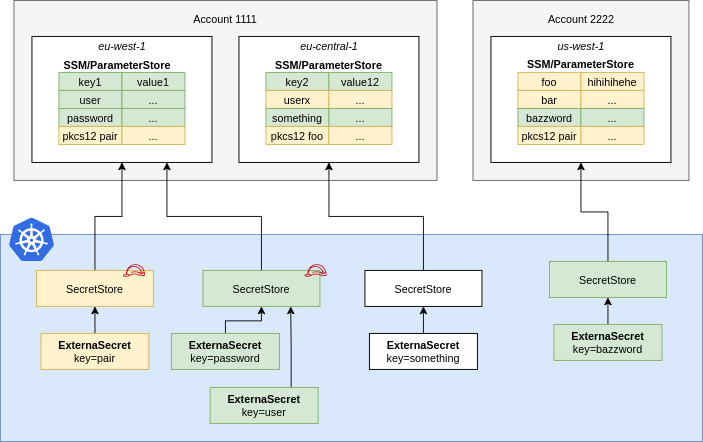

## Parameter Store

A `ParameterStore` points to AWS SSM Parameter Store in a certain account within a
defined region. You should define Roles that define fine-grained access to
individual secrets and pass them to ESO using `spec.provider.aws.role`. This
way users of the `SecretStore` can only access the secrets necessary.

``` yaml

```

**NOTE:** In case of a `ClusterSecretStore`, Be sure to provide `namespace` in `accessKeyIDSecretRef` and `secretAccessKeySecretRef`  with the namespaces where the secrets reside.

!!! warning "API Pricing & Throttling"
    The SSM Parameter Store API is charged by throughput and
    is available in different tiers, [see pricing](https://aws.amazon.com/systems-manager/pricing/#Parameter_Store).
    Please estimate your costs before using ESO. Cost depends on the RefreshInterval of your ExternalSecrets.

### IAM Policy

The example policy below shows the minimum required permissions for fetching SSM parameters. This policy permits pinning down access to secrets with a path matching `dev-*`. Other operations may require additional permission. For example, finding parameters based on tags will also require `ssm:DescribeParameters` and `tag:GetResources` permission with `"Resource": "*"`. Generally, the specific permission required will be logged as an error if an operation fails.

For further information see [AWS Documentation](https://docs.aws.amazon.com/systems-manager/latest/userguide/sysman-paramstore-access.html).

``` json
{
  "Version": "2012-10-17",
  "Statement": [
    {
      "Effect": "Allow",
      "Action": [
        "ssm:GetParameter*",
      ],
      "Resource": "arn:aws:ssm:us-east-2:1234567889911:parameter/dev-*"
    }
  ]
}
```

### JSON Secret Values

You can store JSON objects in a parameter. You can access nested values or arrays using [gjson syntax](https://github.com/tidwall/gjson/blob/master/SYNTAX.md):

Consider the following JSON object that is stored in the Parameter Store key `friendslist`:
``` json
{
  "name": {"first": "Tom", "last": "Anderson"},
  "friends": [
    {"first": "Dale", "last": "Murphy"},
    {"first": "Roger", "last": "Craig"},
    {"first": "Jane", "last": "Murphy"}
  ]
}
```

This is an example on how you would look up nested keys in the above json object:
``` yaml
apiVersion: external-secrets.io/v1beta1
kind: ExternalSecret
metadata:
  name: extract-data
spec:
  # [omitted for brevity]
  data:
  - secretKey: my_name
    remoteRef:
      key: friendslist
      property: name.first # Tom
  - secretKey: first_friend
    remoteRef:
      key: friendslist
      property: friends.1.first # Roger

  # metadataPolicy to fetch all the tags in JSON format
  - secretKey: tags
    remoteRef:
      metadataPolicy: Fetch
      key: database-credentials

  # metadataPolicy to fetch a specific tag (dev) from the source secret
  - secretKey: developer
    remoteRef:
      metadataPolicy: Fetch
      key: database-credentials
      property: dev
```
### Parameter Versions

ParameterStore creates a new version of a parameter every time it is updated with a new value. The parameter can be referenced via the `version` property

## SetSecret

The SetSecret method for the Parameter Store allows the user to set the value stored within the Kubernetes cluster to the remote AWS Parameter Store.

### Creating a Push Secret

```yaml

```

#### Check successful secret sync

To be able to check that the secret has been succesfully synced you can run the following command:

```bash
kubectl get pushsecret pushsecret-example
```

If the secret has synced successfully it will show the status as "Synced".

#### Test new secret using AWS CLI

To View your parameter on AWS Parameter Store using the AWS CLI, install and login to the AWS CLI using the following guide: [AWS CLI](https://aws.amazon.com/cli/).

Run the following commands to get your synchronized parameter from AWS Parameter Store:

```bash
aws ssm get-parameter --name=my-first-parameter --region=us-east-1
```

You should see something similar to the following output:

```json
{
    "Parameter": {
        "Name": "my-first-parameter",
        "Type": "String",
        "Value": "charmander",
        "Version": 4,
        "LastModifiedDate": "2022-09-15T13:04:31.098000-03:00",
        "ARN": "arn:aws:ssm:us-east-1:1234567890123:parameter/my-first-parameter",
        "DataType": "text"
    }
}
```

--8<-- "snippets/provider-aws-access.md"
