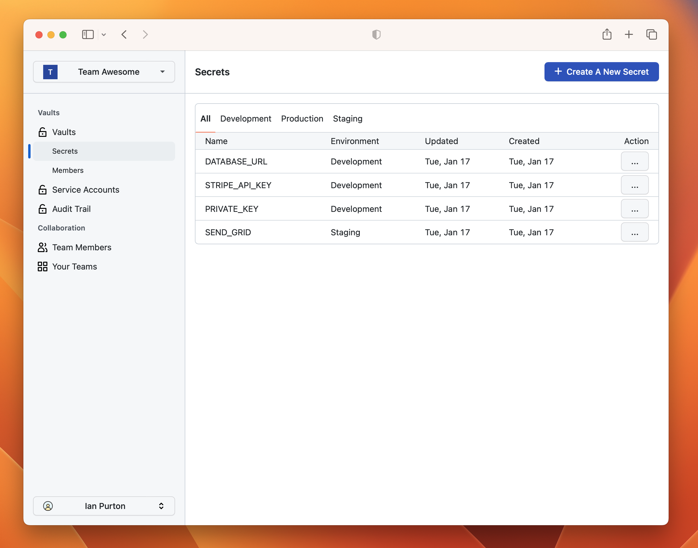

## Cloak

Sync secrets from the [Cloak Encrypted Secrets Platform](https://cloak.software) to Kubernetes using the External Secrets Operator.

Cloak uses the webhook provider built into the External Secrets Operator but also required a proxy service to handle decrypting secrets when they arrive into your cluster.

## Key Setup

From the Cloak user interface [create a service account](https://cloak.software/docs/getting-started/03-cli/) and store the private key on your file system.

Now create a kubernetes secret in the same namespace as the External Secrets Operator.

```sh
HISTIGNORE='*kubectl*' kubectl --namespace=external-secrets \
    create secret generic cloak-key \
    --from-file=ecdh_private_key=$LOCATION_OF_YOUR_PEM_FILE
```

## Deploy the decryption proxy

```yaml

```

And a Kubernetes Service so External Secrets Operator can access the proxy.

```yaml

```

## Create a secret store

You can now place the configuration in any Kubernetes Namespace.

```yaml

```

## Connect a secret to the provider

Each `secretKey` reference in the yaml should point to the name of the secret as it is stored in Cloak.

```yaml

```
