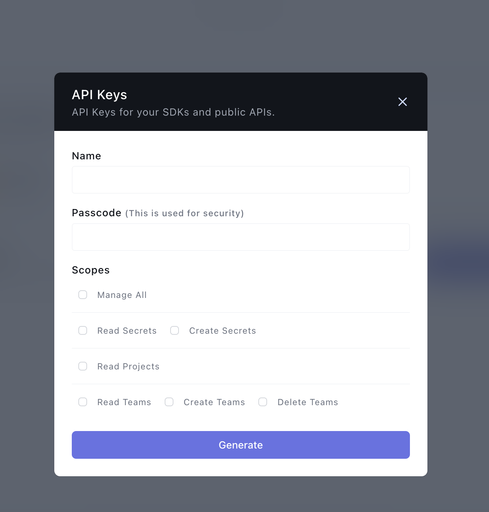

## Onboardbase Secret Manager

Pull secrets from the [Onboardbase](https://www.onboardbase.com/) to Kubernetes using the External Secrets Operator.

## Authentication

Generate an [API Key](https://docs.onboardbase.com/reference/api-auth#how-to-generate-an-api-key) from your team's information with the read permission scope.



You can create an API Key by clicking your avatar, and clicking on manag account then navigating to the tab bearing your organization's name.


Create the Onboardbase Authentication Kubernetes secret with your Service Token value:

---
```sh
kubectl create secret generic \
    onboardbase-auth-secret \
    --from-literal onboardbase-api-key="XXXXXXXXXXXXXXXXXX" \
    --from-literal onboardbase-passcode="********"
```
---

Then to create a generic `SecretStore`:

---
```yaml

```
---

> **NOTE:** In case of a `ClusterSecretStore`, be sure to set `namespace` in `secretRef.apiKey`.


## Use Cases

Onboardbase provider allows for a wide range of use cases:

1. [Fetch](#1-fetch)
2. [Fetch all](#2-fetch-all)
3. [Filter](#3-filter)

## 1. Fetch

To sync one or more individual secrets:

---
```

```
---

## 2. Fetch all

To sync every secret from a config:

---
```

```
---

## 3. Filter

To filter secrets by `key` (key prefix), `name` (regular expression) or a combination of both:

---
```

```
---

