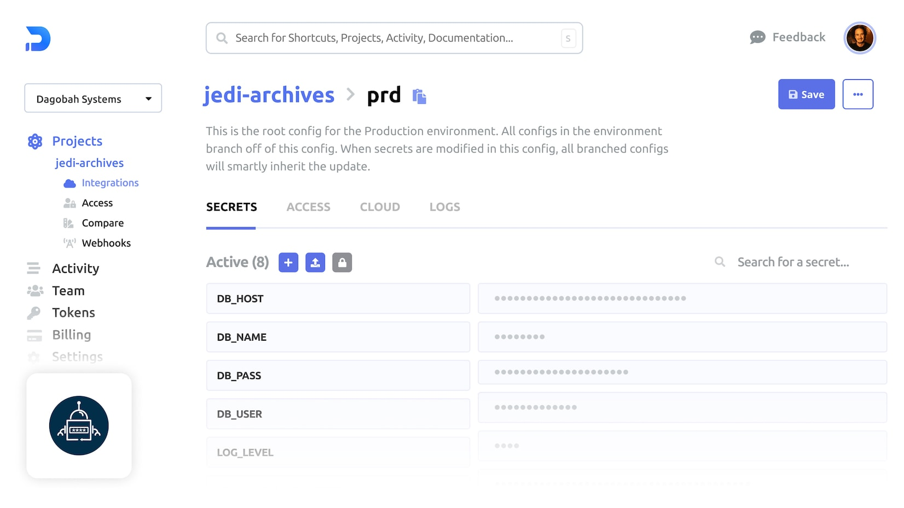
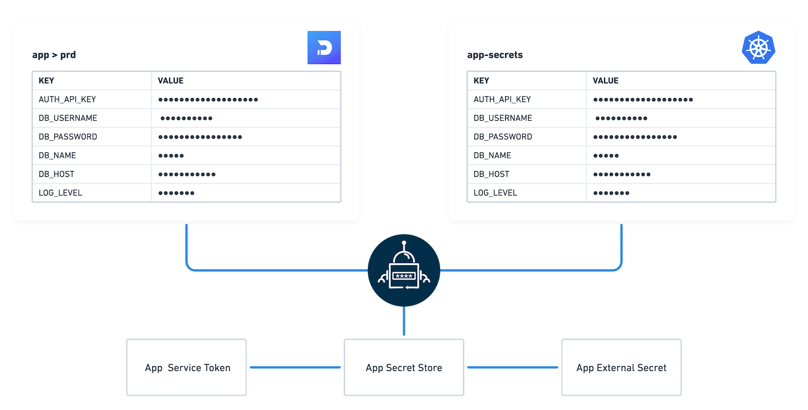
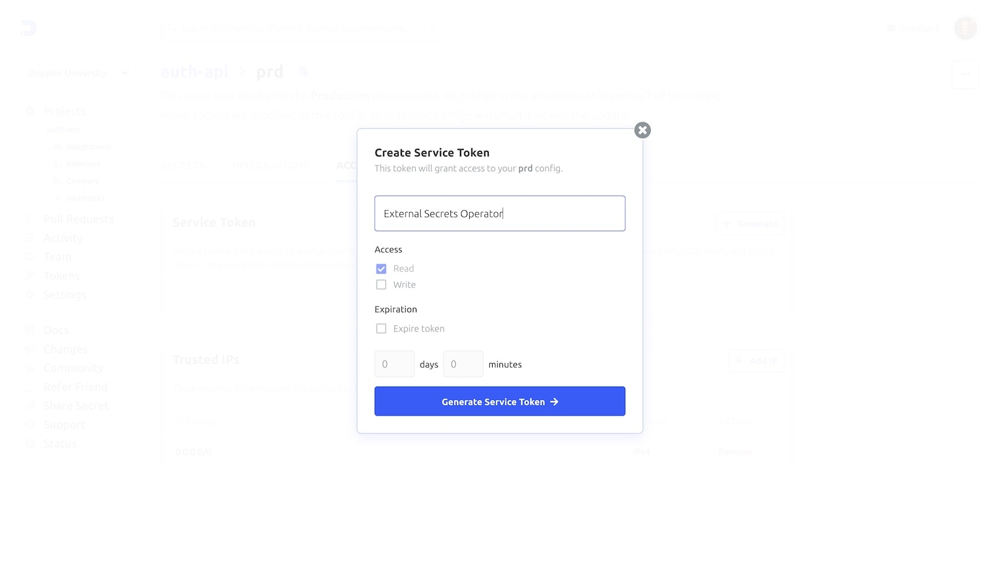
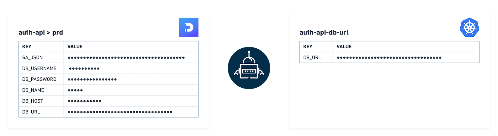
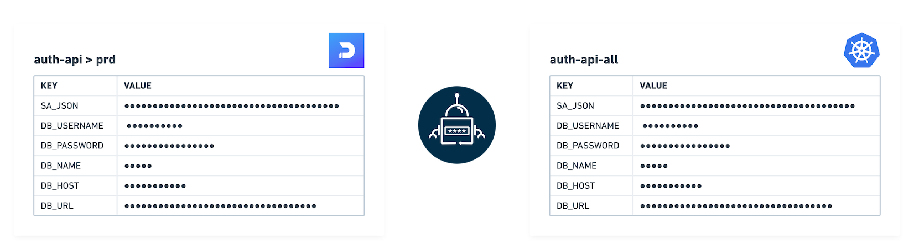
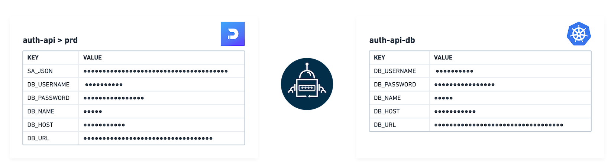
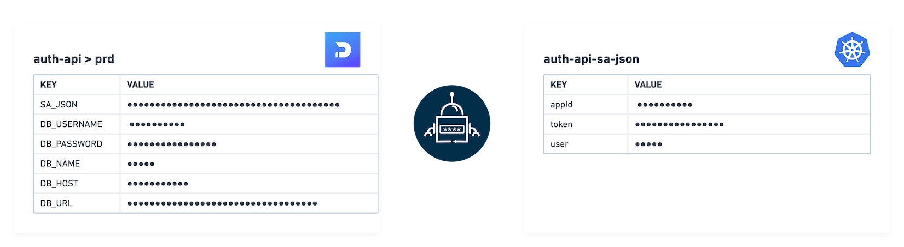
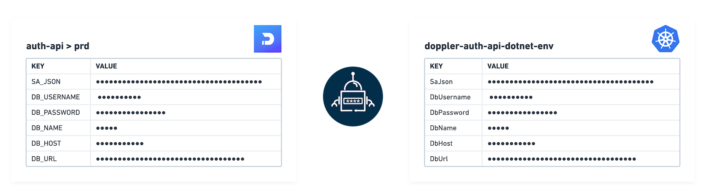
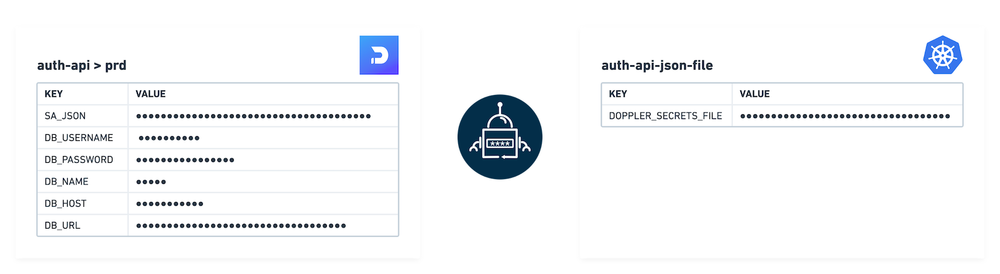

## Doppler SecretOps Platform

Sync secrets from the [Doppler SecretOps Platform](https://www.doppler.com/) to Kubernetes using the External Secrets Operator.

## Authentication

Doppler [Service Tokens](https://docs.doppler.com/docs/service-tokens) are recommended as they restrict access to a single config.



> NOTE: Doppler Personal Tokens are also supported but require `project` and `config` to be set on the `SecretStore` or `ClusterSecretStore`.

Create the Doppler Token secret by opening the Doppler dashboard and navigating to the desired Project and Config, then create a new Service Token from the **Access** tab:



Create the Doppler Token Kubernetes secret with your Service Token value:

```sh
HISTIGNORE='*kubectl*' kubectl create secret generic \
    doppler-token-auth-api \
    --from-literal dopplerToken="dp.st.xxxx"
```

Then to create a generic `SecretStore`:

```yaml

```

> **NOTE:** In case of a `ClusterSecretStore`, be sure to set `namespace` in `secretRef.dopplerToken`.


## Use Cases

The Doppler provider allows for a wide range of use cases:

1. [Fetch](#1-fetch)
2. [Fetch all](#2-fetch-all)
3. [Filter](#3-filter)
4. [JSON secret](#4-json-secret)
5. [Name transformer](#5-name-transformer)
6. [Download](#6-download)

Let's explore each use case using a fictional `auth-api` Doppler project.

## 1. Fetch

To sync one or more individual secrets:

``` yaml

```



## 2. Fetch all

To sync every secret from a config:

``` yaml

```



## 3. Filter

To filter secrets by `path` (path prefix), `name` (regular expression) or a combination of both:

``` yaml

```



## 4. JSON secret

To parse a JSON secret to its key-value pairs:

``` yaml

```



## 5. Name transformer

Name transformers format keys from Doppler's UPPER_SNAKE_CASE to one of the following alternatives:

- upper-camel
- camel
- lower-snake
- tf-var
- dotnet-env
- lower-kebab

Name transformers require a specifically configured `SecretStore`:

```yaml

```

Then an `ExternalSecret` referencing the `SecretStore`:

```yaml

```



### 6. Download

A single `DOPPLER_SECRETS_FILE` key is set where the value is the secrets downloaded in one of the following formats:

- json
- dotnet-json
- env
- env-no-quotes
- yaml

Downloading secrets requires a specifically configured `SecretStore`:

```yaml

```

Then an `ExternalSecret` referencing the `SecretStore`:

```yaml

```


