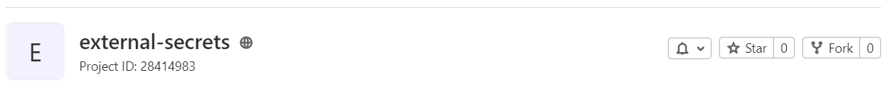

## Gitlab Project and Group Variables

External Secrets Operator integrates with Gitlab to sync [Gitlab Project Variables API](https://docs.gitlab.com/ee/api/project_level_variables.html) and/or [Gitlab Group Variables API](https://docs.gitlab.com/ee/api/group_level_variables.html) to secrets held on the Kubernetes cluster.

### Authentication

The API requires an access token and project ID/groupIDs. To create a new access token, go to your user settings and select 'access tokens'. Give your token a name, expiration date, and select the permissions required (Note 'api' is required).


Click 'Create personal access token', and your token will be generated and displayed on screen. Copy or save this token since you can't access it again.


### Access Token secret

Create a secret containing your access token:

```yaml

```

### Update secret store
Be sure the `gitlab` provider is listed in the `Kind=SecretStore` and the ProjectID is set. If you are not using `https://gitlab.com`, you must set the `url` field as well.

```yaml

```
**NOTE:** In case of a `ClusterSecretStore`, Be sure to provide `namespace` in `accessToken` with the namespace where the secret resides.

Your project ID can be found on your project's page.


### Creating external secret

To sync a Gitlab variable to a secret on the Kubernetes cluster, a `Kind=ExternalSecret` is needed.

```yaml

```

#### Using DataFrom

DataFrom can be used to get a variable as a JSON string and attempt to parse it.

```yaml

```

### Getting the Kubernetes secret
The operator will fetch the project variable and inject it as a `Kind=Secret`.
```
kubectl get secret gitlab-secret-to-create -o jsonpath='{.data.secretKey}' | base64 -d
```
