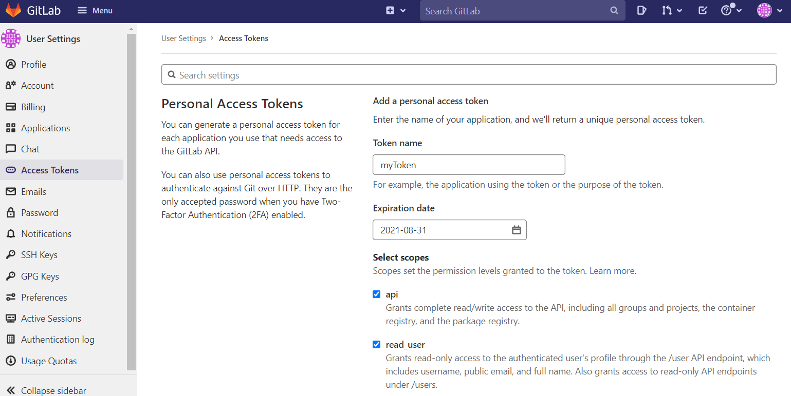
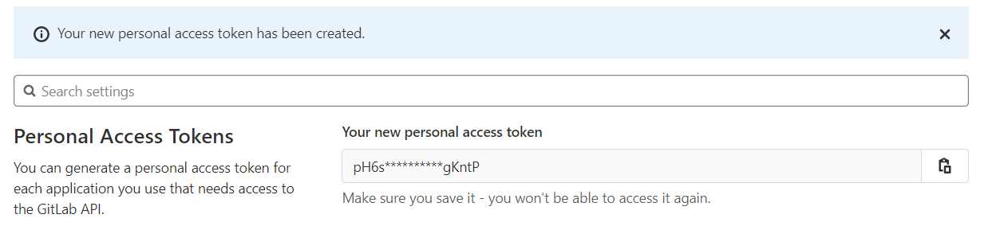
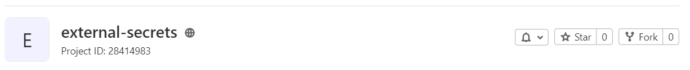

## GitLab Variables

External Secrets Operator integrates with GitLab to sync [GitLab Project Variables API](https://docs.gitlab.com/ee/api/project_level_variables.html) and/or [GitLab Group Variables API](https://docs.gitlab.com/ee/api/group_level_variables.html) to secrets held on the Kubernetes cluster.

> **Note**: The GitLab provider is read-only. PushSecret is not supported.

### Configuring GitLab
The GitLab API requires an access token, project ID and/or groupIDs.

To create a new access token, go to your user settings and select 'access tokens'. Give your token a name, expiration date, and select the permissions required (Note 'api' is required).



Click 'Create personal access token', and your token will be generated and displayed on screen. Copy or save this token since you can't access it again.


> **Note**: Project access tokens and group access tokens are also accepted in place of a personal access token.

### Access Token secret

Create a secret containing your access token:

```yaml

```

### Configuring the secret store
Be sure the `gitlab` provider is listed in the `Kind=SecretStore` and the ProjectID is set. If you are not using `https://gitlab.com`, you must set the `url` field as well.

In order to sync group variables `inheritFromGroups` must be true or `groupIDs` have to be defined.

> **Note**: `inheritFromGroups` and `groupIDs` are mutually exclusive. Setting both fields at the same time causes a validation error. Use `groupIDs` to sync from a fixed list of groups, or `inheritFromGroups: true` to automatically discover all parent groups of the project.

The values in `groupIDs` must be the numeric group ID, not the group path or slug. You can find the numeric ID on the group's General Settings page.

When `inheritFromGroups: true` is set, parent groups are discovered at secret-fetch time via the GitLab Projects API and sorted by full path length, shortest first. This gives the project's direct parent the highest priority among groups. Project variables always take precedence over group variables regardless of this order.

In case you have defined multiple environments in Gitlab, the secret store should be constrained to a specific `environment_scope`.

#### Environment Scope Fallback Behavior

The GitLab provider implements an intelligent fallback mechanism for environment scopes:

1. **Primary lookup**: When you configure a specific `environment` in your SecretStore (example: `environment: "production"`), the provider first tries to find variables with that exact environment scope.
2. **Automatic fallback**: If no variable is found with the specific environment scope, the provider automatically falls back to variables with "All environments" scope (`*` wildcard).
3. **Priority order**: Variables with specific environment scopes take precedence over wildcard variables when both exist.

**Example**: If your SecretStore has `environment: "production"` but your GitLab variable is set to "All environments", the variable will still be successfully retrieved through the fallback mechanism.

> **Implementation Note**: This fallback behavior is implemented in the `getVariables` function in `providers/v1/gitlab/provider.go`, where the provider automatically retries with `EnvironmentScope: "*"` when the initial lookup with the specific environment scope returns a 404 Not Found response. The same fallback applies to group variable lookups in `getGroupVariables`.

```yaml

```
**NOTE:** In case of a `ClusterSecretStore`, Be sure to provide `namespace` in `accessToken` with the namespace where the secret resides.

Your project ID can be found on your project's page.


#### Custom TLS certificates

If your GitLab instance uses a self-signed or private CA certificate, configure the provider to trust it using one of two options.

**Option 1 -- inline PEM via `caBundle`**: base64-encode your CA certificate and set it directly in the store spec.

```yaml
apiVersion: external-secrets.io/v1
kind: SecretStore
metadata:
  name: gitlab-secret-store
spec:
  provider:
    gitlab:
      url: https://gitlab.example.com
      auth:
        SecretRef:
          accessToken:
            name: gitlab-secret
            key: token
      projectID: "12345"
      caBundle: LS0tLS1CRUdJTi...  # base64-encoded PEM certificate
```

**Option 2 -- reference a Secret or ConfigMap via `caProvider`**: store the PEM certificate in a Kubernetes resource and point the store at it. This avoids embedding the certificate in the store spec and works well with cert-manager or manually provisioned CA bundles.

```yaml
apiVersion: external-secrets.io/v1
kind: SecretStore
metadata:
  name: gitlab-secret-store
spec:
  provider:
    gitlab:
      url: https://gitlab.example.com
      auth:
        SecretRef:
          accessToken:
            name: gitlab-secret
            key: token
      projectID: "12345"
      caProvider:
        type: Secret       # or ConfigMap
        name: gitlab-ca    # name of the Secret or ConfigMap
        key: ca.crt        # key inside the resource that holds the PEM certificate
        # namespace: ...   # required only for ClusterSecretStore
```

### Creating external secret

To sync a GitLab variable to a secret on the Kubernetes cluster, a `Kind=ExternalSecret` is needed.

```yaml

```

#### Key normalisation

When using `data:` to look up a single variable by name, hyphens in `remoteRef.key` are silently replaced with underscores before the GitLab API call. For example, `key: my-secret` will look up the GitLab variable named `my_secret`. This normalisation does not apply to `dataFrom`.

#### Extracting a JSON sub-key with `remoteRef.property`

If a GitLab variable holds a JSON string, you can extract a single nested value using `remoteRef.property`. The value is resolved using [GJSON path syntax](https://github.com/tidwall/gjson#path-syntax), so dot-separated paths and array indexing are both supported.

```yaml
apiVersion: external-secrets.io/v1
kind: ExternalSecret
metadata:
  name: gitlab-json-property-example
spec:
  refreshInterval: 1h0m0s
  secretStoreRef:
    kind: SecretStore
    name: gitlab-secret-store
  target:
    name: gitlab-secret-to-create
    creationPolicy: Owner
  data:
    - secretKey: db-password
      remoteRef:
        key: MY_JSON_CONFIG          # GitLab variable whose value is a JSON string
        property: database.password   # GJSON path into that JSON value
```

#### Using DataFrom

DataFrom can be used to get a variable as a JSON string and attempt to parse it, or to match multiple variables by name.

**Extracting all keys from a JSON variable** (`dataFrom.extract`):

```yaml

```

**Matching multiple variables by name regex** (`dataFrom.find`):

```yaml
apiVersion: external-secrets.io/v1
kind: ExternalSecret
metadata:
  name: gitlab-find-example
spec:
  refreshInterval: 1h0m0s
  secretStoreRef:
    kind: SecretStore
    name: gitlab-secret-store
  target:
    name: gitlab-secret-to-create
    creationPolicy: Owner
  dataFrom:
    - find:
        name:
          regexp: "^PROD_.*"            # required: regexp matched against variable names
        tags:
          environment_scope: production  # optional: also filter by environment scope
```

The following restrictions apply when using `find`:

- `find.name` is mandatory. The provider requires a name regexp to select which variables to sync.
- `find.tags` only supports the `environment_scope` key. Any other tag key causes an error. Setting `find.tags.environment_scope` while the SecretStore already has an `environment` configured also causes an error, as the two would conflict.
- `find.path` is not implemented in the GitLab provider and returns an error if set.

### Getting the Kubernetes secret
The operator will fetch the project variable and inject it as a `Kind=Secret`.
```
kubectl get secret gitlab-secret-to-create -o jsonpath='{.data.secretKey}' | base64 -d
```
