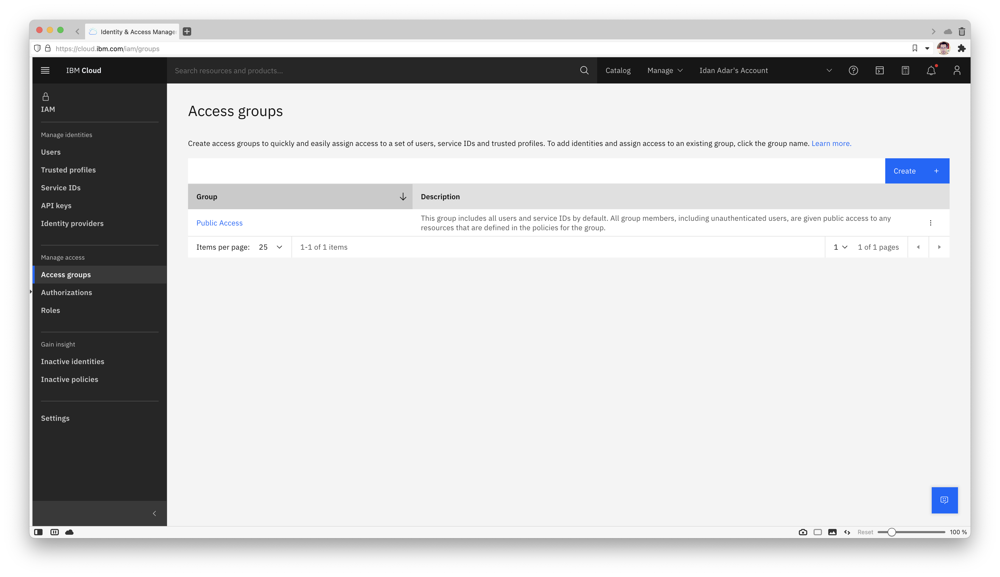
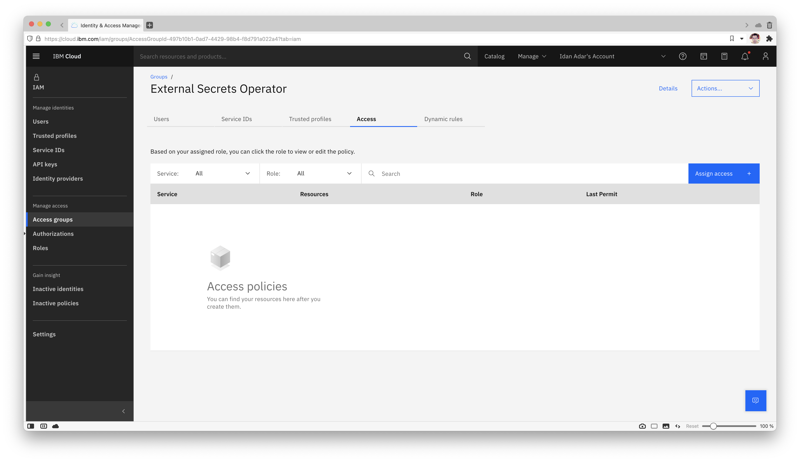
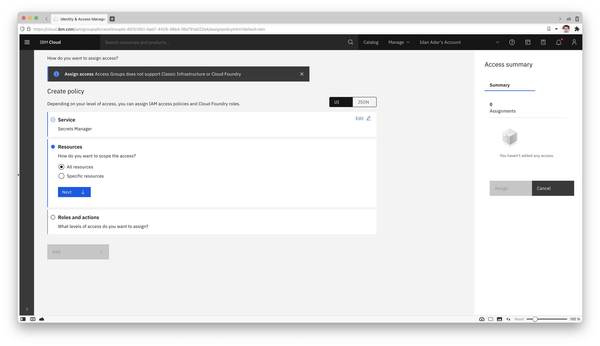
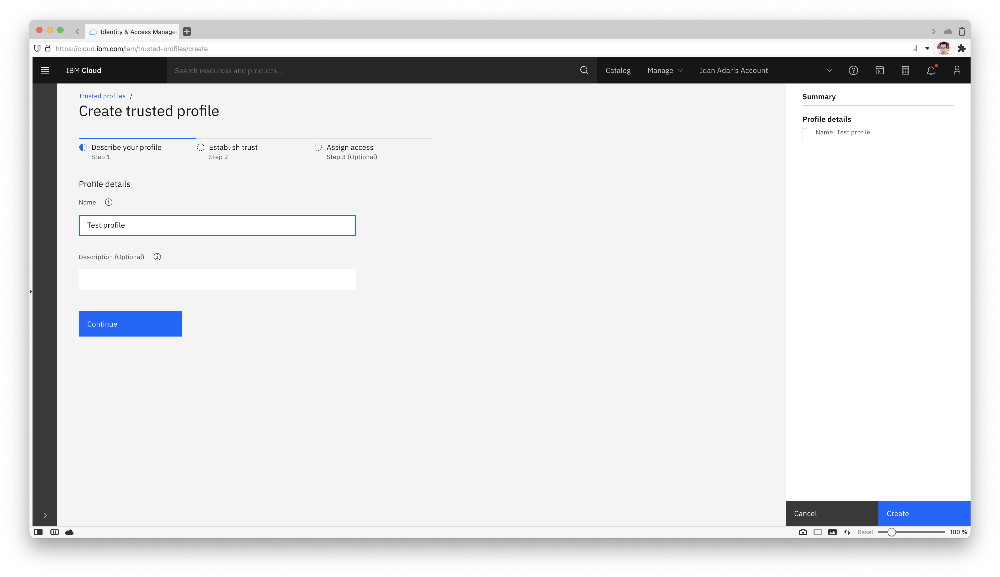

## IBM Cloud Secret Manager

External Secrets Operator integrates with [IBM Cloud Secret Manager](https://www.ibm.com/cloud/secrets-manager) for secret management.

### Authentication

We support API key and trusted profile container authentication for this provider.

#### API key secret

To generate your key (for test purposes we are going to generate from your user), first got to your (Access IAM) page:


On the left, click "API Keys", then click on "Create"


Pick a name and description for your key:


You have created a key. Press the eyeball to show the key. Copy or save it because keys can't be displayed or downloaded twice.


Create a secret containing your apiKey:

```shell
kubectl create secret generic ibm-secret --from-literal=apiKey='API_KEY_VALUE'
```

#### Trusted Profile Container Auth

To create the trusted profile, first got to your (Access IAM) page:


On the left, click "Access groups":



Pick a name and description for your group:


Click on "Access", and then on "Assign":



Click on "Assign Access", select "IAM services", and pick "Secrets Manager" from the pick-list:


Scope to "All resources" or "Resources based on selected attributes":



Select the "SecretsReader" service access policy:


Click "Add" and "Assign" to save the access group.

Next, on the left, click "Trusted profiles":


Press "Create" and pick a name and description for your profile:



Scope the profile's access.

The compute service type will be "Red Hat OpenShift on IBM Cloud".  Additional restriction can be configured based on cloud or cluster metadata, or if "Specific resources" is selected, restriction to a specific cluster.


Click "Add" next to the previously created access group and then "Create", to associate the necessary service permissions.


To use the container-based authentication, it is necessary to map the API server `serviceAccountToken` auth token to the "external-secrets" and "external-secrets-webhook" deployment descriptors. Example below:

```yaml

```

### Update secret store
Be sure the `ibm` provider is listed in the `Kind=SecretStore`

```yaml

```
**NOTE:** In case of a `ClusterSecretStore`, Be sure to provide `namespace` in `secretApiKeySecretRef` with the namespace where the secret resides.

**NOTE:** Only `secretApiKeySecretRef` or `containerAuth` should be specified, depending on authentication method being used.

To find your `serviceURL`, under your Secrets Manager resource, go to "Endpoints" on the left.

See here for a list of [publicly available endpoints](https://cloud.ibm.com/apidocs/secrets-manager#getting-started-endpoints).


### Secret Types
We support the following secret types of [IBM Secrets Manager](https://cloud.ibm.com/apidocs/secrets-manager):

* `arbitrary`
* `username_password`
* `iam_credentials`
* `service_credentials`
* `imported_cert`
* `public_cert`
* `private_cert`
* `kv`

To define the type of secret you would like to sync you need to prefix the secret id with the desired type. If the secret type is not specified it is defaulted to `arbitrary`:

```yaml


```

The behavior for the different secret types is as following:

#### arbitrary

* `remoteRef` retrieves a string from secrets manager and sets it for specified `secretKey`
* `dataFrom` retrieves a string from secrets manager and tries to parse it as JSON object setting the key:values pairs in resulting Kubernetes secret if successful

#### username_password
* `remoteRef` requires a `property` to be set for either `username` or `password` to retrieve respective fields from the secrets manager secret and set in specified `secretKey`
* `dataFrom` retrieves both `username` and `password` fields from the secrets manager secret and sets appropriate key:value pairs in the resulting Kubernetes secret

#### iam_credentials
* `remoteRef` retrieves an apikey from secrets manager and sets it for specified `secretKey`
* `dataFrom` retrieves an apikey from secrets manager and sets it for the `apikey` Kubernetes secret key

#### service_credentials
* `remoteRef` retrieves the credentials object from secrets manager and sets it for specified `secretKey`
* `dataFrom` retrieves the credential object as a map from secrets manager and sets appropriate key:value pairs in the resulting Kubernetes secret

#### imported_cert, public_cert, and private_cert
* `remoteRef` requires a `property` to be set for either `certificate`, `private_key` or `intermediate` to retrieve respective fields from the secrets manager secret and set in specified `secretKey`
* `dataFrom` retrieves all `certificate`, `private_key` and `intermediate` fields from the secrets manager secret and sets appropriate key:value pairs in the resulting Kubernetes secret

#### kv
* An optional `property` field can be set to `remoteRef` to select requested key from the KV secret. If not set, the entire secret will be returned
* `dataFrom` retrieves a string from secrets manager and tries to parse it as JSON object setting the key:values pairs in resulting Kubernetes secret if successful. It could be either used with the methods
  * `Extract` to extract multiple key/value pairs from one secret (with optional `property` field being supported as well)
  * `Find` to find secrets based on tags or regular expressions and allows finding multiple external secrets and map them into a single Kubernetes secret

```json
{
  "key1": "val1",
  "key2": "val2",
  "key3": {
    "keyA": "valA",
    "keyB": "valB"
  },
  "special.key": "special-content"
}
```

```yaml
data:
- secretKey: key3_keyB
  remoteRef:
    key: 'kv/aaaaa-bbbb-cccc-dddd-eeeeee'
    property: 'key3.keyB'
- secretKey: special_key
  remoteRef:
    key: 'kv/aaaaa-bbbb-cccc-dddd-eeeeee'
    property: 'special.key'
- secretKey: key_all
  remoteRef:
    key: 'kv/aaaaa-bbbb-cccc-dddd-eeeeee'
```

```yaml
dataFrom:
  - extract:
    key: 'kv/fffff-gggg-iiii-dddd-eeeeee' #mandatory
    decodingStrategy: Base64 #optional

```

```yaml
dataFrom:
  - find:
      name:  #matches any secret name ending in foo-bar
        regexp: "key" #assumption that secrets are stored like /comp/key1, key2/trigger, and comp/trigger/keygen within the secret manager
  - find:
      tags: #matches any secrets with the following metadata labels
        environment: "dev"
        application: "BFF"
```

results in

```yaml
data:
  # secrets from data
  key3_keyB: ... #valB
  special_key: ... #special-content
  key_all: ... #{"key1":"val1","key2":"val2", ..."special.key":"special-content"}

  # secrets from dataFrom with extract method
  keyA: ... #1st key-value pair from JSON object
  keyB: ... #2nd key-value pair from JSON object
  keyC: ... #3rd key-value pair from JSON object

  # secrets from dataFrom with find regex method
  _comp_key1: ... #secret value for /comp/key1
  key2_trigger: ... #secret value for key2/trigger
  _comp_trigger_keygen: ... #secret value for comp/trigger/keygen

  # secrets from dataFrom with find tags method
  bffA: ...
  bffB: ...
  bffC: ...


```

### Creating external secret

To create a kubernetes secret from the IBM Secrets Manager, a `Kind=ExternalSecret` is needed.
Below example creates a kubernetes secret based on ID of the secret in Secrets Manager.

```yaml

```

Alternatively, the secret name along with its secret group name can be specified instead of secret ID to fetch the secret.

```yaml

```

### Getting the Kubernetes secret
The operator will fetch the IBM Secret Manager secret and inject it as a `Kind=Secret`
```
kubectl get secret secret-to-be-created -n <namespace> | -o jsonpath='{.data.test}' | base64 -d
```

### Populating the Kubernetes secret with metadata from IBM Secrets Manager Provider
ESO can add metadata while creating or updating a Kubernetes secret to be reflected in its labels or annotations. The metadata could be any of the fields that are supported and returned in the response by IBM Secrets Manager.

In order for the user to opt in to adding metadata to secret, an existing optional field `spec.dataFrom.extract.metadataPolicy` can be set to `Fetch`, its default value being `None`. In addition to this, templating provided be ESO can be leveraged to specify the key-value pairs of the resultant secrets' labels and annotation.

In order for the required metadata to be populated in the Kubernetes secret, combination of below should be provided in the External Secrets resource:
1. The required metadata should be specified under `template.metadata.labels` or `template.metadata.annotations`.
2. The required secret data should be specified under `template.data`.
3. The spec.dataFrom.extract should be specified with details of the Secrets Manager secret with `spec.dataFrom.extract.metadataPolicy` set to `Fetch`.
Below is an example, where `secret_id` and `updated_at` are the metadata of a secret in IBM Secrets Manager:

```yaml

```

While the secret is being reconciled, it will have the secret data along with the required annotations. Below is the example of the secret after reconciliation:

```yaml
apiVersion: v1
data:
  secret: OHE0MFV5MGhQb2FmRjZTOGVva3dPQjRMeVZXeXpWSDlrSWgyR1BiVDZTMyc=
immutable: false
kind: Secret
metadata:
  annotations:
    reconcile.external-secrets.io/data-hash: 02217008d13ed228e75cf6d26fe74324
    creationTimestamp: "2023-05-04T08:41:24Z"
    secret_id: "1234"
    updated_at: 2023-05-04T08:57:19Z
  name: database-credentials
  namespace: external-secrets
  ownerReferences:
  - apiVersion: external-secrets.io/v1beta1
    blockOwnerDeletion: true
    controller: true
    kind: ExternalSecret
    name: database-credentials
    uid: c2a018e7-1ac3-421b-bd3b-d9497204f843
  #resourceVersion: "1803567" #immutable for a user
  #uid: f5dff604-611b-4d41-9d65-b860c61a0b8d #immutable for a user
type: Opaque
```
