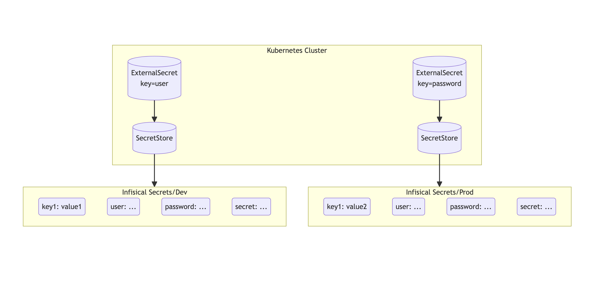

Sync secrets from [Infisical](https://www.infisical.com) to your Kubernetes cluster using External Secrets Operator.

## Authentication
In order for the operator to fetch secrets from Infisical, it needs to first authenticate with Infisical.

To authenticate, you can use [Universal Auth](https://infisical.com/docs/documentation/platform/identities/universal-auth) from [Machine identities](https://infisical.com/docs/documentation/platform/identities/machine-identities).

Follow the [guide here](https://infisical.com/docs/documentation/platform/identities/universal-auth) to learn how to create and obtain a pair of Client Secret and Client ID.

## Storing Your Machine Identity Secrets

Once you have generated a pair of `Client ID` and `Client Secret`, you will need to store these credentials in your cluster as a Kubernetes secret.

!!! note inline end
    Remember to replace with your own Machine Identity credentials.

```yaml
apiVersion: v1
kind: Secret
metadata:
  name: universal-auth-credentials
type: Opaque

stringData:
  clientId: <machine identity client id>
  clientSecret: <machine identity client secret>
```

### Secret Store

You will then need to create a generic `SecretStore`. An sample `SecretStore` has been is shown below.

!!! tip inline end
    To get your project slug from Infisical, head over to the project settings and click the button `Copy Project Slug`.

```yaml

```

!!! Note
    For `ClusterSecretStore`, be sure to set `namespace` in `universalAuthCredentials.clientId` and `universalAuthCredentials.clientSecret`.

## Fetch Individual Secret(s)

To sync one or more secrets individually, use the following YAML:

```yaml

```

## Fetch All Secrets

To sync all secrets from an Infisical , use the following YAML:

``` yaml

```

## Filter By Prefix/Name

To filter secrets by `path` (path prefix) and `name` (regular expression).

``` yaml

```

