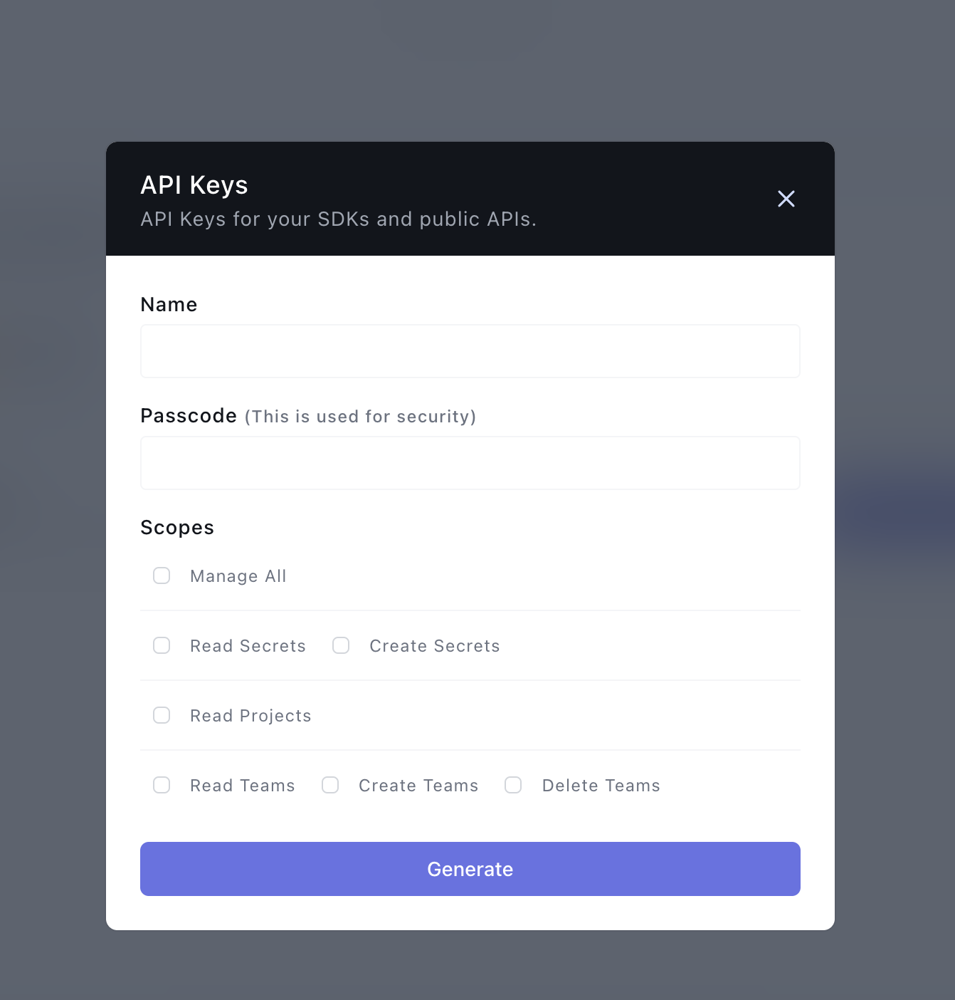
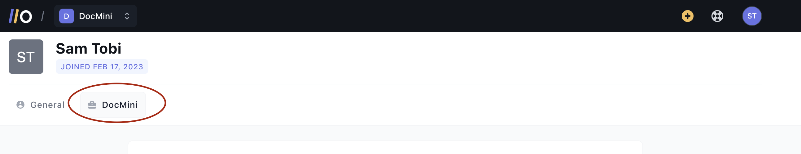

## Onboardbase Secret Management

Sync secrets from [Onboardbase](https://www.onboardbase.com/) to Kubernetes using the External Secrets Operator.

## Authentication

### Get an Onboardbase [API Key](https://docs.onboardbase.com/reference/api-auth).

Create the Onboardbase API by opening the organization tab under your account settings:




And view them under the team name in your Account settings




Create an Onboardbase API secret with your API Key and Passcode value:

```sh
HISTIGNORE='*kubectl*' \
  kubectl create secret generic onboardbase-auth-secret \
  --from-literal=API_KEY=*****VZYKYJNMMEMK***** \
  --from-literal=PASSCODE=api-key-passcode
```

Then to create a generic `SecretStore`:

```yaml

```

## Use Cases

The below operations are possible with the Onboardbase provider:

1. [Fetch](#1-fetch)
2. [Fetch all](#2-fetch-all)
3. [Filter](#3-filter)

Let's explore each use case using a fictional `auth-api` Onboardbase project.

### 1. Fetch

To sync one or more individual secrets:

```yaml

```

### 2. Fetch all

To sync every secret from a config:

```yaml

```

### 3. Filter

To filter secrets by `path` (path prefix), `name` (regular expression) or a combination of both:

```yaml

```
