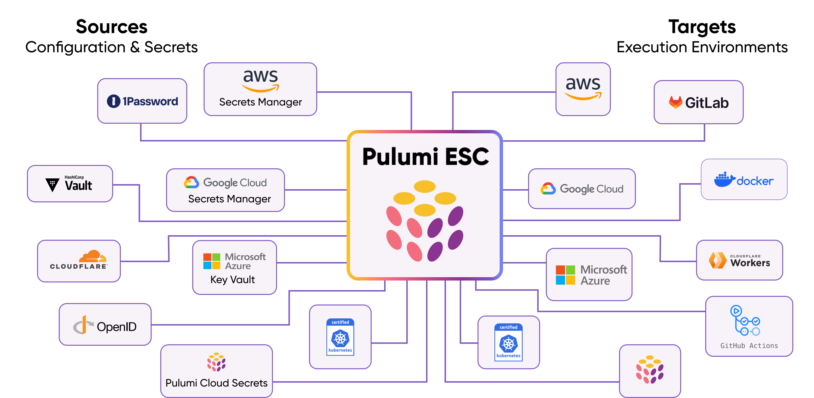

## Pulumi ESC

Sync environments, configs and secrets from [Pulumi ESC](https://www.pulumi.com/product/esc/) to Kubernetes using the External Secrets Operator.



More information about setting up [Pulumi](https://www.pulumi.com/) ESC can be found in the [Pulumi ESC documentation](https://www.pulumi.com/docs/esc/).

### Authentication

The Pulumi provider supports two authentication methods:

1. **Access Token** (recommended for most use cases): Use Pulumi [Access Tokens](https://www.pulumi.com/docs/pulumi-cloud/access-management/access-tokens/) stored in Kubernetes secrets.
2. **OIDC** (recommended for workload identity): Use Kubernetes ServiceAccount tokens to authenticate via OIDC, eliminating the need to store static credentials.

### Creating a SecretStore

#### Using Access Token

A Pulumi `SecretStore` can be created by specifying the `organization`, `project` and `environment` and referencing a Kubernetes secret containing the `accessToken`.

```yaml
apiVersion: external-secrets.io/v1
kind: SecretStore
metadata:
  name: secret-store
spec:
  provider:
    pulumi:
      organization: <NAME_OF_THE_ORGANIZATION>
      project: <NAME_OF_THE_PROJECT>
      environment: <NAME_OF_THE_ENVIRONMENT>
      auth:
        accessToken:
          secretRef:
            name: <NAME_OF_KUBE_SECRET>
            key: <KEY_IN_KUBE_SECRET>
```

**Note:** The deprecated `accessToken` field at the root level is still supported for backward compatibility, but using `auth.accessToken` is recommended.

#### Using OIDC

Alternatively, you can use OIDC authentication with Kubernetes ServiceAccount tokens. This method eliminates the need to store static credentials.

First, configure OIDC in your Pulumi organization by following the [Pulumi OIDC documentation](https://www.pulumi.com/docs/pulumi-cloud/access-management/oidc/).

Then create a ServiceAccount and SecretStore:

```yaml

```

The `expirationSeconds` field is optional and defaults to 600 seconds (10 minutes).

If required, the API URL (`apiUrl`) can be customized as well. If not specified, the default value is `https://api.pulumi.com/api/esc`.

### Creating a ClusterSecretStore

#### Using Access Token

Similarly, a `ClusterSecretStore` can be created by specifying the `namespace` and referencing a Kubernetes secret containing the `accessToken`.

```yaml
apiVersion: external-secrets.io/v1
kind: ClusterSecretStore
metadata:
  name: secret-store
spec:
  provider:
    pulumi:
      organization: <NAME_OF_THE_ORGANIZATION>
      project: <NAME_OF_THE_PROJECT>
      environment: <NAME_OF_THE_ENVIRONMENT>
      auth:
        accessToken:
          secretRef:
            name: <NAME_OF_KUBE_SECRET>
            key: <KEY_IN_KUBE_SECRET>
            namespace: <NAMESPACE>
```

#### Using OIDC

For ClusterSecretStore with OIDC, you need to specify the ServiceAccount namespace:

```yaml
apiVersion: v1
kind: ServiceAccount
metadata:
  name: pulumi-oidc-sa
  namespace: external-secrets
---
apiVersion: external-secrets.io/v1
kind: ClusterSecretStore
metadata:
  name: pulumi-oidc-cluster-store
spec:
  provider:
    pulumi:
      organization: my-org
      project: my-project
      environment: production
      auth:
        oidcConfig:
          organization: my-org
          serviceAccountRef:
            name: pulumi-oidc-sa
            namespace: external-secrets
          expirationSeconds: 600
```

### Referencing Secrets

Secrets can be referenced by defining the `key` containing the JSON path to the secret. Pulumi ESC secrets are internally organized as a JSON object.

```yaml
apiVersion: external-secrets.io/v1
kind: ExternalSecret
metadata:
  name: secret
spec:
  refreshInterval: 1h0m0s
  secretStoreRef:
    kind: SecretStore
    name: secret-store
  data:
  - secretKey: <KEY_IN_KUBE_SECRET>
    remoteRef:
      key: <PULUMI_PATH_SYNTAX>
```

**Note:** `key` is not following the JSON Path syntax, but rather the Pulumi path syntax.

#### Examples

* root
* root.nested
* root["nested"]
* root.double.nest
* root["double"].nest
* root["double"]["nest"]
* root.array[0]
* root.array[100]
* root.array[0].nested
* root.array[0][1].nested
* root.nested.array[0].double[1]
* root["key with \"escaped\" quotes"]
* root["key with a ."]
* ["root key with \"escaped\" quotes"].nested
* ["root key with a ."][100]
* root.array[*].field
* root.array["*"].field

See [Pulumi's documentation](https://www.pulumi.com/docs/concepts/options/ignorechanges/) for more information.

### PushSecrets

With the latest release of Pulumi ESC, secrets can be pushed to the Pulumi service. This can be done by creating a `PushSecrets` object.

Here is a basic example of how to define a `PushSecret` object:

```yaml
apiVersion: external-secrets.io/v1alpha1
kind: PushSecret
metadata:
  name: push-secret-example
spec:
  refreshInterval: 1h0m0s
  selector:
    secret:
      name: <NAME_OF_KUBE_SECRET>
  secretStoreRefs:
  - kind: ClusterSecretStore
    name: secret-store
  data:
  - match:
      secretKey: <KEY_IN_KUBE_SECRET>
      remoteRef:
        remoteKey: <PULUMI_PATH_SYNTAX>
```

This will then push the secret to the Pulumi service. If the secret already exists, it will be updated.

### Limitations

Currently, the Pulumi provider only supports nested objects up to a depth of 1. Any nested objects beyond this depth will be stored as a string with the JSON representation.

This Pulumi ESC example:

```yaml
values:
  backstage:
    my: test
    test: hello
    test22:
      my: hello
    test33:
      world: true
    x: true
    num: 42
```

Will result in the following Kubernetes secret:

```yaml
my: test
num: "42"
test: hello
test22: '{"my":{"trace":{"def":{"begin":{"byte":72,"column":11,"line":6},"end":{"byte":77,"column":16,"line":6},"environment":"tgif-demo"}},"value":"hello"}}'
test33: '{"world":{"trace":{"def":{"begin":{"byte":103,"column":14,"line":8},"end":{"byte":107,"column":18,"line":8},"environment":"tgif-demo"}},"value":true}}'
x: "true"
```
