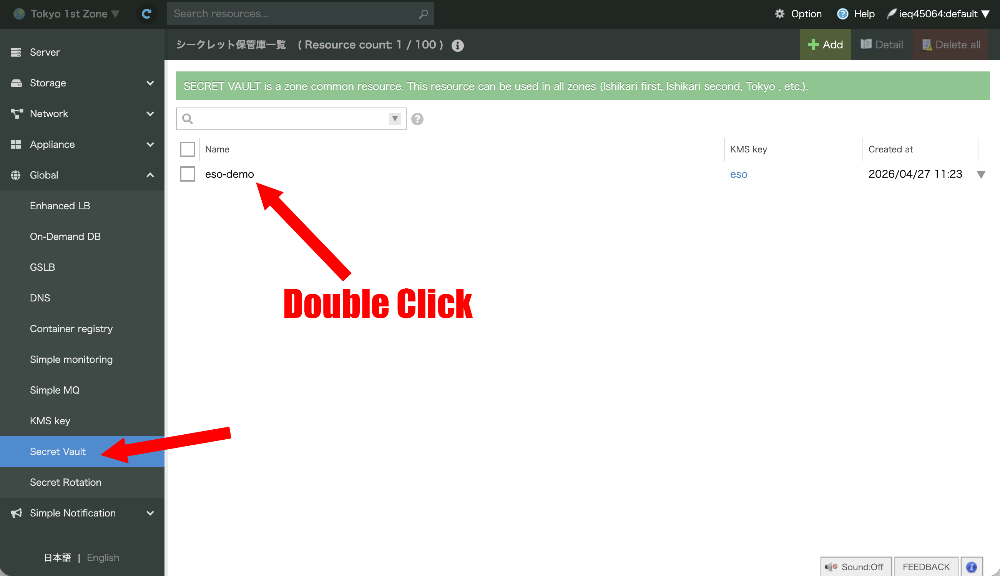
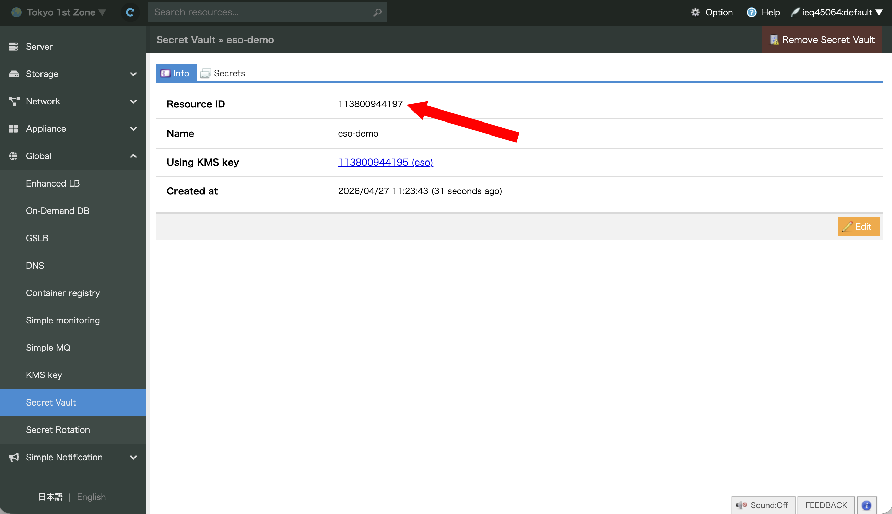
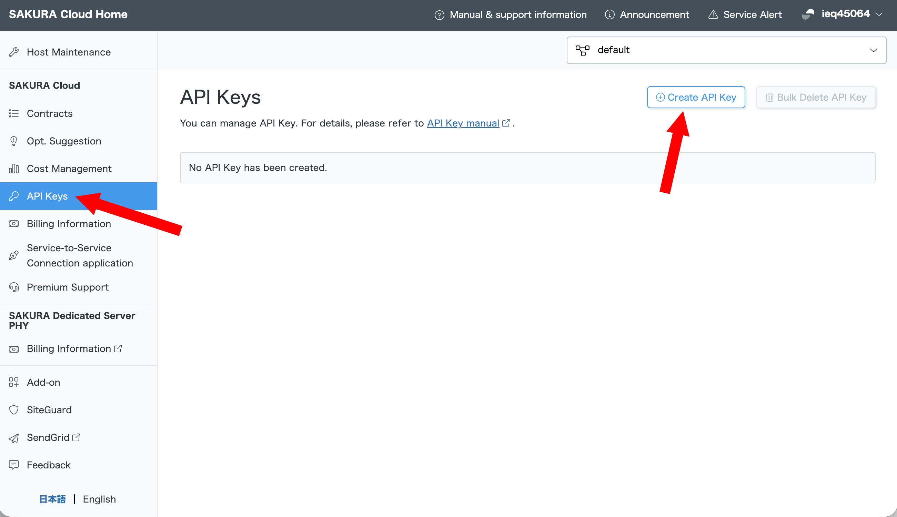
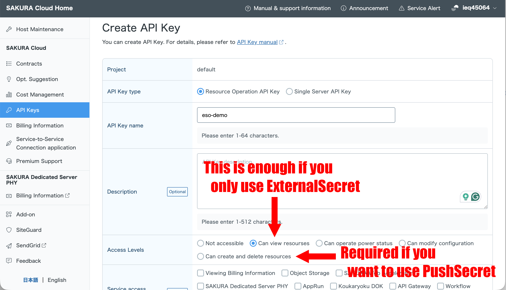
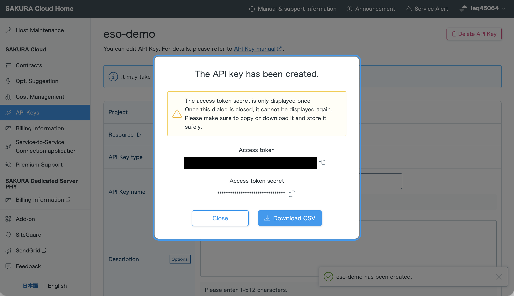

[Sakura Cloud](https://cloud.sakura.ad.jp/) is a leading cloud service provider in Japan, operated by [Sakura Internet Inc.](https://www.sakura.ad.jp/corporate/en/)

## Sakura Cloud Secret Manager

External Secrets Operator integrates with [Sakura Cloud Secret Manager](https://manual.sakura.ad.jp/cloud/appliance/secretsmanager/index.html) via `SecretStore` and `ClusterSecretStore` resources.  
This provider supports both read and write operations, so you can use it with `ExternalSecret` and `PushSecret` resources.

### Creating a SecretStore

Create a `SecretStore` or `ClusterSecretStore` and configure the Sakura provider with the vault resource ID and credentials.

```yaml
apiVersion: external-secrets.io/v1
kind: SecretStore
metadata:
  name: sakura-store
spec:
  provider:
    sakura:
      vaultResourceID: "123456789012"
      auth:
        secretRef:
          accessToken:
            name: sakura-credentials
            key: accessToken
          accessTokenSecret:
            name: sakura-credentials
            key: accessTokenSecret
```

You can find the vault resource ID in the [Sakura Cloud console](https://secure.sakura.ad.jp/cloud/iaas/) under **Global** > **Secret Vault**. Double-click the vault you want to use, then copy the **Resource ID**. It is a 12-digit number that uniquely identifies your vault.





### Authentication

Sakura Cloud Secret Manager requires both an access token and an access token secret. Both values must be stored in a Kubernetes `Secret` and referenced from the `SecretStore` configuration.

```yaml
apiVersion: v1
kind: Secret
metadata:
  name: sakura-credentials
type: Opaque
stringData:
  accessToken: "<SAKURA_ACCESS_TOKEN>"
  accessTokenSecret: "<SAKURA_ACCESS_TOKEN_SECRET>"
```

You can create API tokens in the [Sakura Cloud Home](https://secure.sakura.ad.jp/cloud/) under **SAKURA Cloud** > **API Keys** > **Create API Key**. Be sure to grant the token appropriate permissions.







### Remote secret reference

When retrieving secrets from Sakura Cloud, `remoteRef.key` must contain the secret name stored in Sakura Cloud Secret Manager.

```yaml
apiVersion: external-secrets.io/v1
kind: ExternalSecret
metadata:
  name: sakura-secret
spec:
  refreshInterval: 1h0m0s
  secretStoreRef:
    name: sakura-store
    kind: SecretStore
  target:
    name: my-secret
  data:
    - secretKey: password
      remoteRef:
        key: my-sakura-password-secret
```

If the secret value is JSON, you can use `property` to extract a nested field.

```yaml
apiVersion: external-secrets.io/v1
kind: ExternalSecret
metadata:
  name: sakura-json-secret
spec:
  refreshInterval: 1h0m0s
  secretStoreRef:
    name: sakura-store
    kind: SecretStore
  target:
    name: my-json-secret
  data:
    - secretKey: username
      remoteRef:
        key: my-sakura-secret
        property: username
```

### PushSecret support

The Sakura provider supports `PushSecret`, allowing you to write secrets from Kubernetes into Sakura Cloud Secret Manager.

```yaml
apiVersion: external-secrets.io/v1
kind: PushSecret
metadata:
  name: sakura-push
spec:
  refreshInterval: 1h0m0s
  secretStoreRef:
    name: sakura-store
    kind: SecretStore
  target:
    name: my-pushed-secret
  data:
    - secretKey: password
      remoteRef:
        key: my-sakura-secret
```

If the secret already exists and you specify `property`, the Sakura provider preserves existing JSON values and merges the specified property into the object.

### Supported features

- `SecretStore` / `ClusterSecretStore`
- `ExternalSecret` read operations
- `PushSecret` write operations
- JSON secret values via `property`
- `dataFrom.[*].find` using a name filter only

### Limitations

- Sakura provider does not support filtering by `path` in `dataFrom.[*].find`.
- Sakura provider does not support filtering by `tags` in `dataFrom.[*].find`.
