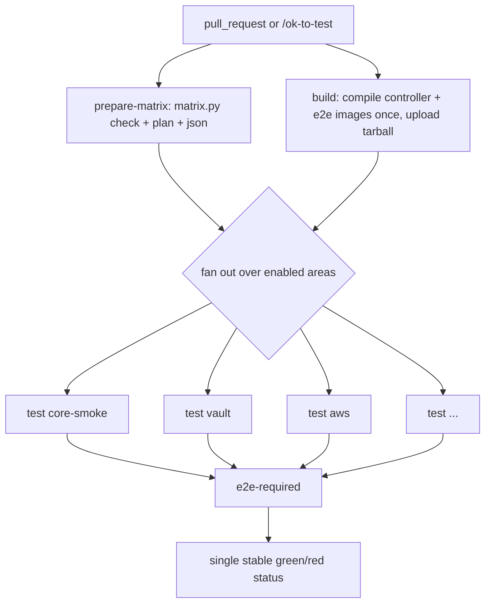

# End-to-end (e2e) tests and CI

This document explains how the e2e suite is built and run in CI after the
fan-out change: what the moving parts are, how a run flows, how credentials are
scoped per provider, and how to add or enable a provider.

## Goals

- Run the core controller behaviour and each provider as **separate CI legs**,
  so a flaky or broken addon in one provider fails only its own leg.
- Give CI a **single, stable required status** even though the set of legs
  changes over time.
- Give each leg **only the credentials it needs**, so a leg that tests one
  provider never has another provider's secrets in its environment.

## The pieces

| File | Role |
| ---- | ---- |
| `e2e/suites/<suite>/` | Ginkgo suites, compiled to `<suite>.test` binaries: `provider`, `generator`, `flux`, `argocd`. |
| `e2e/suites/provider/cases/import.go` | Blank-imports every provider case into the single `provider.test` binary. Providers are told apart at run time by Ginkgo label. |
| `e2e/matrix.yaml` | Source of truth for the fan-out: one `area` (leg) per provider, with its suite, label filter, secret groups, and trigger paths. |
| `e2e/matrix.py` | Validates the matrix (`check`), emits the CI matrix JSON (`json`), and prints the per-leg credential plan (`plan`). |
| `e2e/run.sh` | Host-side launcher. Runs `kubectl run` to start the e2e pod, forwarding `TEST_SUITES`, `GINKGO_LABELS`, and the (scoped) credentials as pod env. |
| `e2e/entrypoint.sh` | In-pod entry (image `CMD`). Loops over `TEST_SUITES` and runs `ginkgo -label-filter="$GINKGO_LABELS"` against each `<suite>.test`. |
| `.github/workflows/e2e.yml` | Non-managed e2e. Fans out into per-provider legs. Owns the `e2e-required` gate. |
| `.github/workflows/e2e-reusable.yml` | The reusable build + matrix-test pipeline that `e2e.yml` calls. |
| `.github/workflows/e2e-managed.yml` | Managed e2e (real cloud IRSA / workload-identity), run on demand via `/ok-to-test-managed`. Already per-provider. |

## How a run flows



1. **prepare-matrix** runs `matrix.py check` (fail early if the matrix is
   inconsistent), prints the credential `plan`, and emits the enabled-areas
   matrix as JSON. This job has no secrets in scope.
2. **build** compiles the controller and e2e images once and uploads them as a
   tarball artifact. The test legs load that tarball; they need no Go toolchain.
3. **test** is a `fail-fast: false` matrix over the enabled areas. Each leg gets
   its own runner and its own kind cluster, loads the shared image tarball, and
   runs one suite under one label filter (`TEST_SUITES` + `GINKGO_LABELS`).
4. **e2e-required** aggregates the result into one status (see below).

## The matrix (`e2e/matrix.yaml`)

Each `area` is one leg:

```yaml
- name: aws                       # leg id, shown as "test (aws)"
  suite: provider                 # which suite binary (TEST_SUITES)
  labels: "aws && !managed"       # Ginkgo -label-filter (GINKGO_LABELS)
  providers: [aws]                # for the coverage check only
  secret_groups: [aws]            # which credential groups this leg receives
  needs_secrets: true             # mirror of "secret_groups is non-empty"
  paths:                          # phase 2 seed (affected-only), unused today
    - "providers/v1/aws/**"
    - "e2e/suites/provider/cases/aws/**"
  enabled: true                   # whether the phase 1 matrix runs it now
```

Notes:

- **One suite per leg.** A label filter never has to span binaries that lack
  the labels. Provider legs use `suite: provider`; `generator`, `flux`, and
  `argocd` are their own suites.
- **`!managed` everywhere.** This workflow runs only the non-managed specs; the
  managed IRSA / workload-identity specs run in `e2e-managed.yml`.
- **`enabled`** lets the matrix grow gradually. Disabled areas still count for
  coverage and document the intended full matrix; flip to `true` to run them.

## Credential scoping (no secret spread)

A leg receives a provider's secrets only when its `secret_groups` lists that
group. In `e2e-reusable.yml` every secret is gated:

```yaml
GCP_SERVICE_ACCOUNT_KEY: ${{ contains(matrix.secret_groups, 'gcp') && secrets.GCP_SERVICE_ACCOUNT_KEY || '' }}
```

So a `vault` or `core-smoke` leg (`secret_groups: []`) gets empty strings for
every cloud credential, and the `aws` leg gets only the `aws` group. The
group -> variable mapping lives in `e2e-reusable.yml`.

Scoping is proven **without reading any secret**: `matrix.py plan` runs in
`prepare-matrix` (which has no secrets in scope) and derives each leg's
credential list from `matrix.yaml` plus the group mapping parsed out of the
workflow text. It never references the `secrets` context, so nothing depends on
GitHub's log masking. Example:

```
core-smoke: groups=[] -> (none: in-cluster only)
vault:      groups=[] -> (none: in-cluster only)
aws:        groups=['aws'] -> AWS_OIDC_ROLE_ARN, AWS_SA_NAME, AWS_SA_NAMESPACE
```

Which providers actually need external credentials: `fake`, `kubernetes`,
`template`, `vault`, `openbao`, `conjur`, and `infisical` run against in-cluster
addons and need none. The rest hit real APIs and are scoped to their group.

The `generator` suite is split across two legs by label. The `generator` leg
runs every generator except grafana (`!managed && !grafana`) and is scoped to
`aws`, because the ecr and sts generators mint tokens against real AWS. The
`grafana` leg (`grafana && !managed`, scoped to `grafana`) is isolated on its
own because the grafana generator depends on a live external Grafana Cloud
instance; keeping it separate means its external flakiness is attributable and
never masks the other generators.

## The `e2e-required` gate

The individual leg names change as the matrix grows, which makes them a poor
target for branch protection. `e2e-required` (in `e2e.yml`) is one job that
`needs` the trusted and fork callers and reports a single status:

- passes when the e2e path that ran for this event succeeded,
- treats the other (skipped) path as a non-failure,
- fails if any leg failed or was cancelled (a failed leg propagates up through
  its caller job).

Point branch protection at `e2e-required` and it stays stable regardless of how
many legs exist.

## Trusted vs fork runs

- **Same-repo PR** (`integration-trusted`): runs automatically with secrets.
- **Fork PR**: a maintainer comments `/ok-to-test sha=<40-char-sha>` (or submits
  a review whose body contains `/ok-to-test`, which pins the reviewed commit).
  `guard-fork` rejects a bare command without a pinned SHA; `integration-fork`
  then runs. Note that the fork path runs the workflow from `main`, not from the
  PR branch.
- **Managed** (`e2e-managed.yml`): `/ok-to-test-managed`, one job per cloud
  provider, `GINKGO_LABELS="<provider> && managed"`.

## Local usage

```bash
# validate the matrix (coverage, secret-scoping consistency, wiring)
make -C e2e matrix.check

# show which credentials each enabled leg will receive (reads no secrets)
make -C e2e matrix.plan

# run a single provider locally (overrides the Makefile defaults)
make -C e2e test.run TEST_SUITES=provider GINKGO_LABELS="vault && !managed"
```

## Adding or enabling a provider

1. Add the provider case under `e2e/suites/provider/cases/<name>/` and blank
   import it in `import.go`.
2. Add an `area` for it in `matrix.yaml` (its label, `providers: [<name>]`, and
   `paths`).
3. If it needs external credentials, add its secret group to `secret_groups`
   and wire that group's env vars in `e2e-reusable.yml`.
4. Set `enabled: true` when you want CI to run it.

`matrix.py check` (run in `prepare-matrix`) enforces steps 1-3: it fails the
build if a provider is compiled into the suite but not covered by an area, if
`needs_secrets` disagrees with `secret_groups`, or if an area names a secret
group that the workflow does not wire.
